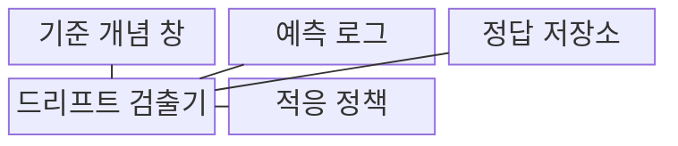
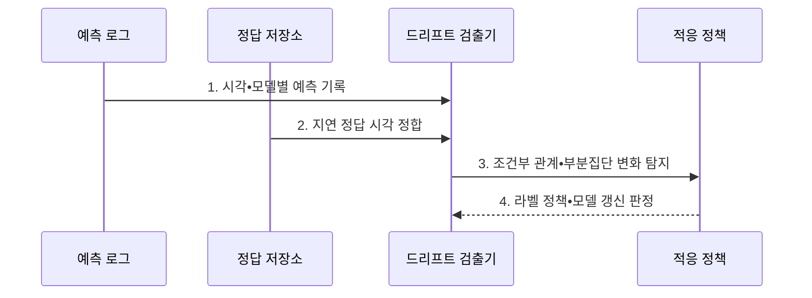

---
sidebar:
  order: 135
  label: "135. 개념 드리프트 (Concept Drift)"
  badge:
    text: "기출 • 50%"
    variant: note
title: "개념 드리프트 (Concept Drift)"
date: "2026-08-04T14:37:04+09:00"
tags:
  - "notes-latest-tech"
weight: 135
extra:
  question_no: "135"
  source_status: "기출"
  source_history: "135회"
  priority: 50
  priority_note: "개념 변화의 성능 저하•재학습 판단이 기출됨"
---

## Ⅰ. 개요

핵심 용어

- **개념 드리프트(Concept Drift)**: 같은 입력에서 정답이 달라지도록 조건부 분포 $P(Y\mid X)$가 변하는 현상이다.
- **조건부 분포 $P(Y\mid X)$**: 입력 $X$가 주어졌을 때 정답 $Y$가 나타날 확률 관계이다.

- 정의/개념: 시간이나 환경 변화로 입력과 정답 사이의 조건부 관계 $P(Y\mid X)$가 달라지는 **개념 드리프트 현상**
- 배경/필요성: 입력 분포 감시만으로 **행동•업무 규칙 변화** 탐지 곤란

#### 한줄 요약

- 같은 입력이라도 환경이 바뀌어 정답과의 관계가 달라지면 기존 판단 규칙이 맞지 않게 된다.

## Ⅱ. 특징

핵심 용어

- **부분집단 드리프트(Subgroup Drift)**: 전체 평균에는 가려지지만 특정 고객군•지역•시간대에서 발생하는 개념 변화이다.
- **정답 피드백**: 예측과 실제 결과를 연결해 조건부 관계가 유효한지 확인하는 정보이다.

- $P(Y\mid X)$ 변화와 **정답 피드백 의존**
- **부분집단 드리프트의 전체 평균 은폐**
- 라벨 정책 확인 후 **재학습 결정**

#### 한줄 요약

- 사용자 행동이나 정책 변화로 예전 판단 규칙이 맞지 않는지 실제 정답을 받아 확인한다.

## Ⅲ. 구조 및 구성요소

핵심 용어

- **기준 개념 창**: 학습 시점의 입력•정답 관계와 성능을 비교 기준으로 보관한 데이터 구간이다.
- **드리프트 검출기**: 예측과 정답을 결합해 조건부 관계와 오류 패턴의 변화를 분석하는 구성요소이다.

| 구성요소 | 책임 |
|:---|:---|
| **기준 개념 창** | 학습 시점의 입력-정답 및 성능 기준 |
| **예측 로그** | 시각 및 모델 정보를 포함한 예측 기록 |
| **정답 저장소** | 실제 결과 및 라벨 확정 시각 보관 |
| **드리프트 검출기** | 조건부 관계 변화 및 오류 패턴 분석 |
| **적응 정책** | 라벨 검토, 재학습, 재배포 실행 |

#### 한줄 요약

- 예측 기록과 뒤늦게 도착한 정답을 연결해 고객군•시간대별 판단 관계가 달라졌는지 찾는다.

## Ⅳ. 흐름도

핵심 용어

- **지연 정답(Delayed Label)**: 예측 이후 일정 시간이 지나야 확정되어 드리프트 영향을 검증하는 실제 결과이다.
- **적응 정책**: 관계 변화의 원인을 검토해 라벨 수정•재학습•재배포 여부를 정하는 규칙이다.

1. **시각•모델별 예측 기록**: 입력•버전•부분집단 정보 저장
2. **지연 정답 시각 정합**: 동일 사건의 확정 라벨과 예측 결합
3. **조건부 관계•부분집단 변화 탐지**: 오류•$P(Y\mid X)$ 변화 판정
4. **라벨 정책•모델 갱신 판정**: 재학습•재배포 여부 선택

#### 한줄 요약

- 정답이 도착한 뒤 예측 관계가 실제로 변했는지 확인하고 라벨 정책을 검토한 후 재학습한다.

## Ⅴ. 종류 및 비교

핵심 용어

- **데이터 드리프트**: 운영 입력 분포 $P(X)$가 학습 시점과 달라지는 현상이다.
- **라벨 드리프트**: 정답의 주변 분포 $P(Y)$가 시간에 따라 달라지는 현상이다.

| 분포 변화 | 개념 드리프트 | 데이터 드리프트 | 라벨 드리프트 |
|:---|:---|:---|:---|
| 적용 기준 | **입력•정답 관계** 감시 | **입력 분포** 감시 | **정답 비율** 감시 |
| 핵심 특징 | **$P(Y\mid X)$** 변화 | **$P(X)$** 변화 | **$P(Y)$** 변화 |
| 한계 | **정답 피드백** 필요 | **성능 저하** 직접 증명 불가 | **정책•표본 구성** 영향 |

#### 한줄 요약

- 입력 구성 변화와 정답 비율 변화 및 입력•정답 관계 변화를 구분해야 알맞은 대응을 선택할 수 있다.

## Ⅵ. 실무 고려사항 및 대책

핵심 용어

- **시각 정합**: 예측과 지연 정답을 동일 사건•기준 시점으로 정확히 연결하는 절차이다.
- **부분집단 분석**: 고객군•지역•시간대별 오류를 분리해 평균에 가려진 변화를 찾는 방법이다.

| 문제 | 대책 | 효과 |
|:---|:---|:---|
| 지연 정답 누락으로 **관계 변화 오판** | 예측•라벨의 **시각 정합**, 미확정 건 분리 | 개념 드리프트 **판정 정확도** 향상 |
| 전체 평균이 **부분집단 드리프트** 은폐 | **고객군•지역•시간대별 오류** 분석 | 국소 성능 저하 **조기 탐지** |

#### 한줄 요약

- 신용평가는 연체 결과가 확정된 뒤 고객군별 입력과 연체의 관계가 바뀌었는지 확인한다.

## Ⅶ. 결론

핵심 용어

- **라벨 정책**: 실제 결과를 정답으로 확정하는 업무 기준과 절차이다.
- **재학습**: 달라진 입력•정답 관계를 반영한 데이터로 모델 파라미터를 다시 최적화하는 과정이다.

- **라벨 정책** 변화면 정의를 수정하고 **부분집단 관계** 변화면 모델 재학습

#### 한줄 요약

- 입력 변화만 보고 재학습하지 않고 지연된 정답으로 판단 관계 변화를 확인한 뒤 필요한 조치만 수행한다.
