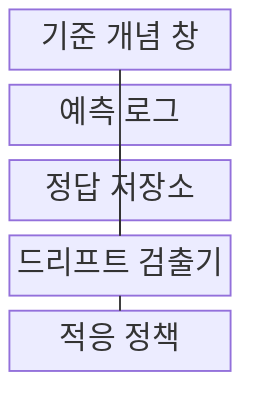
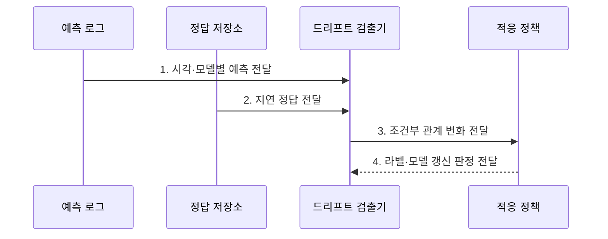

---
sidebar:
  order: 135
  label: "135. 개념 드리프트 (Concept Drift)"
  badge:
    text: "기출 · 50%"
    variant: note
title: "개념 드리프트 (Concept Drift)"
date: "2026-07-27T23:59:59+09:00"
tags:
  - "notes-latest-tech"
weight: 135
extra:
  question_no: "135"
  source_status: "기출"
  source_history: "135회"
  priority: 50
  priority_note: "개념 변화의 성능 저하·재학습 판단이 기출됨"
---

## 미리 알고가기

- **개념 드리프트(Concept Drift)**: 같은 입력에서 정답이 달라지도록 조건부 분포 $P(Y\mid X)$가 변하는 현상
- **조건부 분포 $P(Y\mid X)$**: 입력 $X$가 주어졌을 때 정답 $Y$가 나타날 확률 관계
- **지연 정답(Delayed Label)**: 예측 이후 일정 시간이 지나야 확정되어 드리프트 영향 검증에 사용하는 실제 결과
- **부분집단 드리프트(Subgroup Drift)**: 전체 평균에는 가려지지만 특정 고객군·지역·시간대에서 발생하는 개념 변화

## Ⅰ. 개요

- 정의/개념: 시간에 따른 **입력·정답 조건부 관계 $P(Y\mid X)$ 변화**
- 배경/필요성: 입력 분포 감시만으로 **행동·업무 규칙 변화** 탐지 곤란

### 쉽게 이해하기 (학습용)

- 같은 입력이라도 환경이 바뀌어 정답과의 관계가 달라지면 기존 판단 규칙이 맞지 않게 된다.

## Ⅱ. 특징

- $P(Y\mid X)$ 변화와 **정답 피드백 의존**
- 부분 집단 변화의 **전체 평균 은폐**
- 라벨 정책 확인 후 **재학습 결정**

### 쉽게 이해하기 (학습용)

- 사용자 행동이나 정책 변화로 예전 판단 규칙이 맞지 않는지 실제 정답을 받아 확인한다.

## Ⅲ. 구조 및 구성요소

| 구성요소 | 책임 |
|:---|:---|
| 기준 개념 창 | 학습 시점의 입력-정답 및 성능 기준 |
| 예측 로그 | 시각 및 모델 정보를 포함한 예측 기록 |
| 정답 저장소 | 실제 결과 및 라벨 확정 시각 보관 |
| 드리프트 검출기 | 조건부 관계 변화 및 오류 패턴 분석 |
| 적응 정책 | 라벨 검토, 재학습, 재배포 실행 |

> 요약: 예측·지연 정답으로 관계 변화를 찾아 적응한다

### 쉽게 이해하기 (학습용)

- 예측 기록과 뒤늦게 도착한 정답을 연결해 고객군·시간대별 판단 관계가 달라졌는지 찾는다.

## Ⅳ. 흐름도

### 동작 원리

- **1. 시각·모델별 예측 전달**: 예측 당시 입력·버전·부분집단 정보 기록
- **2. 지연 정답 전달**: 동일 사건의 확정 라벨과 예측 결합
- **3. 조건부 관계 변화 전달**: 부분집단별 오류·$P(Y\mid X)$ 변화 판정
- **4. 라벨·모델 갱신 판정 전달**: 정책 정의 검토 후 재학습·재배포 선택

> 요약: 지연 정답으로 관계를 판정해 정책·모델을 갱신한다

### 쉽게 이해하기 (학습용)

- 정답이 도착한 뒤 예측 관계가 실제로 변했는지 확인하고 라벨 정책을 검토한 후 재학습한다.

## Ⅴ. 종류 및 비교

| 분포 변화 | 개념 드리프트 | 데이터 드리프트 | 라벨 드리프트 |
|:---|:---|:---|:---|
| 적용 기준 | 입력·정답 관계 감시 | 입력 분포 감시 | 정답 비율 감시 |
| 핵심 특징 | $P(Y\mid X)$ 변화 | $P(X)$ 변화 | $P(Y)$ 변화 |
| 한계 | 정답 피드백 필요 | 성능 저하 직접 증명 불가 | 정책·표본 구성 영향 |

> 요약: 입력·정답·관계 변화별로 대응 방식이 다르다

### 쉽게 이해하기 (학습용)

- 입력 구성 변화와 정답 비율 변화 및 입력·정답 관계 변화를 구분해야 알맞은 대응을 선택할 수 있다.

## Ⅵ. 실무 고려사항 및 대책

| 고려사항 | 대책 | 효과 |
|:---|:---|:---|
| 지연 정답 누락으로 **관계 변화 오판** | 예측·라벨 시각 정합과 미확정 건 분리 | 개념 드리프트 **판정 정확도** 향상 |
| 전체 평균이 **부분집단 드리프트** 은폐 | 고객군·지역·시간대별 오류 분석 | 국소 성능 저하 **조기 탐지** |

### 쉽게 이해하기 (학습용)

- 신용평가는 연체 결과가 확정된 뒤 고객군별 입력과 연체의 관계가 바뀌었는지 확인한다.

## Ⅶ. 결론
- **지연 정답·부분집단 관계 변화**로 개념 드리프트의 정책·모델 갱신을 결정

### 쉽게 이해하기 (학습용)

- 입력 변화만 보고 재학습하지 않고 지연된 정답으로 판단 관계 변화를 확인한 뒤 필요한 조치만 수행한다.
