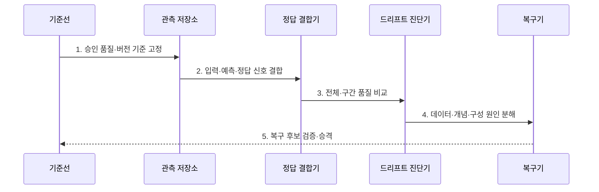

---
sidebar:
  order: 136
  label: "136. 모델 드리프트 (Model Drift)"
  badge:
    text: "기출 · 50%"
    variant: note
title: "모델 드리프트 (Model Drift)"
date: "2026-07-31T12:04:32+09:00"
tags:
  - "notes-latest_tech"
weight: 136
extra:
  question_no: "136"
  source_status: "기출"
  source_history: "135회"
  priority: 50
  priority_note: "모델 드리프트의 원인 분리·대응이 기출됨"
---

## Ⅰ. 개요

핵심 용어

- **모델 드리프트(Model Drift)**: 운영 데이터·입력과 정답의 관계·서빙 설정이 바뀌어 모델 품질이나 출력 특성이 승인 기준선에서 이탈하는 현상이다.
- **기준선(Baseline)**: 운영 품질 이탈을 비교하기 위해 승인 시점에 고정한 성능·분포·설정 값이다.

- 정의/개념: **모델 드리프트**는 데이터·개념·서빙 변화로 모델 품질·출력이 기준선에서 이탈하는 현상
- 배경/필요성: 단일 정확도만으로는 **데이터·개념·구성 변화** 중 품질 저하 원인 분리 곤란

### 쉽게 이해하기 (학습용)
- 내비게이션 안내가 나빠졌을 때 도로가 바뀐 것인지 지도 규칙이나 기기 설정이 바뀐 것인지 나누어 찾음

## Ⅱ. 특징

핵심 용어

- **확률 보정(Calibration)**: 모델이 출력한 확률과 실제 사건 발생 비율이 일치하는 정도이다.
- **부분집단 성능**: 전체 표본을 고객군·지역·시간대 등으로 나누어 측정한 모델 품질이다.

- 데이터·개념·서빙 설정의 **복합 이탈 원인**
- 분포 경보와 정답 기반 **품질 영향 분리**
- 전체 평균·부분 집단의 **구간별 성능 편차**

### 쉽게 이해하기 (학습용)
- 입력 모양이 달라졌다는 경보만으로 고장이라 단정하지 않고 실제 정답과 집단별 오류를 확인함

## Ⅲ. 구조 및 구성요소

핵심 용어

- **모델 계보(Model Lineage)**: 모델·데이터·코드·전처리·임계값의 버전과 변경 관계를 추적한 기록이다.
- **정답 결합기**: 운영 예측과 나중에 확정된 실제 결과를 동일 사건으로 연결하는 구성요소이다.

| 구성요소 | 책임 |
|:---|:---|
| 성능 기준선 | 승인 버전의 **품질·분포·출력 기준 보관** |
| 추론 관측 저장소 | 입력·예측·지연·오류의 **운영 로그 수집** |
| 정답 결합기 | 예측과 지연 도착 정답의 **동일 사건 연결** |
| 버전·설정 계보 | 모델·전처리·임계값의 **변경 이력 추적** |
| 진단·복구기 | 원인별 재학습·재보정·복원의 **조치 선택** |

### 쉽게 이해하기 (학습용)
- 출고 성적표와 운행 기록, 나중에 도착한 정답, 정비 이력을 모아 어느 변화가 품질을 떨어뜨렸는지 찾음

## Ⅳ. 흐름도

핵심 용어

- **드리프트 진단**: 성능·입력 분포·정답 관계·구성 이력을 대조해 품질 이탈 원인을 분리하는 과정이다.
- **복구 후보**: 원천 수정·재학습·재보정·설정 복원 중 원인에 맞춰 검증할 대안이다.

1. **승인 품질·버전 기준 고정**: 비교할 모델·전처리·지표의 **정상 상태** 등록
2. **입력·예측·정답 신호 결합**: 운영 사건별 분포·출력·실제 결과의 **관측 기록** 연결
3. **전체·구간 품질 비교**: 평균과 집단별 성능·확률 보정의 **실제 이탈** 확인
4. **데이터·개념·구성 원인 분해**: 입력 분포·정답 관계·계보 변화의 **원인 증거** 대조
5. **복구 후보 검증·승격**: 원천 수정·재학습·설정 복원의 **대안 효과** 비교

### 쉽게 이해하기 (학습용)
- 실제 정답으로 고장을 확인한 뒤 재료·규칙·설정 중 바뀐 곳에 맞는 수리만 시험함

## Ⅴ. 종류 및 비교

핵심 용어

- **데이터 드리프트(Data Drift)**: 운영 입력 특징의 분포가 학습·승인 시점의 입력 분포와 달라진 상태이다.
- **개념 드리프트(Concept Drift)**: 같은 입력에 대응하는 정답이나 의사결정 규칙이 시간에 따라 달라진 상태이다.
- **구성 드리프트**: 모델·전처리·임계값 등 서빙 구성의 변경으로 출력이 달라진 상태이다.

| 비교 기준 | 데이터 드리프트 | 개념 드리프트 | 구성 드리프트 |
|:---|:---|:---|:---|
| 적용 기준 | **입력 분포** 변화 확인 | **입력·정답 관계** 변화 확인 | **서빙 설정·버전** 변화 확인 |
| 핵심 특징 | 특징 통계의 **기준선 이탈** | 예측 규칙의 **유효성 변화** | 전처리·임계값의 **계보 변화** |
| 한계 | **성능 영향** 별도 검증 | **정답 도착** 지연 | **변경 기록** 누락 가능 |

### 쉽게 이해하기 (학습용)
- 재료가 달라진 경우, 조리법이 더는 맞지 않는 경우, 오븐 설정이 바뀐 경우는 수리 방법이 다름

## Ⅵ. 실무 고려사항 및 대책

핵심 용어

- **지연 정답**: 예측 뒤 일정 시간이 지나야 확정되어 실제 성능 검증에 사용하는 결과이다.
- **계보 추적**: 품질 변화 시점과 모델·전처리·임계값의 변경 이력을 연결해 원인을 찾는 방법이다.

| 문제 | 대책 | 효과 |
|:---|:---|:---|
| 분포 경보만으로 한 **성능 저하 오판** | **지연 정답·업무 지표 영향** 확인 | 불필요 재학습 **방지** |
| 전체 평균에 숨은 **부분 집단 드리프트** | **집단·구간별 오류·보정 편차** 측정 | 국소 품질 저하 **탐지** |
| 계보 누락의 **구성 원인 오진** | **모델·전처리·임계값 버전** 동시 기록 | 설정 복원·재학습 **정확한 선택** |

### 쉽게 이해하기 (학습용)
- 경고등만 보고 모델을 갈지 않고 실제 정답과 집단별 오류, 설정 변경 기록으로 고장 부위를 찾음

## Ⅶ. 결론

핵심 용어

- **원천 수정**: 데이터 생성·수집 과정에서 발생한 품질 문제를 입력 단계에서 바로잡는 조치이다.
- **설정 복원**: 잘못 변경된 전처리·임계값·서빙 버전을 검증된 상태로 되돌리는 조치이다.

- **데이터·개념·구성 원인**에 따라 **원천 수정·재학습·설정 복원** 선택

### 쉽게 이해하기 (학습용)
- 결과가 나빠진 원인이 데이터인지 규칙인지 설정인지 확인해 필요한 부분만 고침
