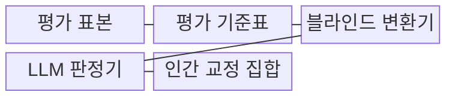
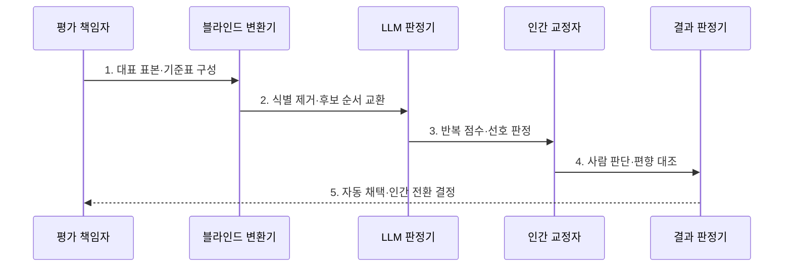

---
sidebar:
  order: 137
  label: "137. LLM 평가자 (LLM-as-a-Judge)"
  badge:
    text: "미출 · 60%"
    variant: note
title: "LLM 평가자 (LLM-as-a-Judge)"
date: "2026-07-25T01:30:00+09:00"
tags:
  - "notes-latest_tech"
weight: 137
extra:
  question_no: "137"
  source_status: "미출"
  source_history: ""
  priority: 60
  priority_note: "LLM 심판의 편향·일치도 보정 설계가 유력함"
---

## 미리 알고가기

- **LLM 평가자(Large Language Model as a Judge, LLM-as-a-Judge)**: 기준표와 평가 문맥을 받은 언어 모델이 다른 모델의 응답 점수·선호·판정 이유를 생성하는 평가 방식
- **평가 기준표(Rubric)**: 정확성·충실성·유용성 등 항목별 판정 조건과 점수 단계를 정의한 채점표
- **쌍대 비교(Pairwise Comparison)**: 두 후보 응답을 함께 제시하여 더 나은 응답이나 동점을 선택하는 판정 방식
- **위치 편향(Position Bias)**: 후보 내용보다 제시된 앞·뒤 순서에 따라 평가 결과가 달라지는 현상
- **자기 선호 편향(Self-Preference Bias)**: 평가 모델이 자신이나 유사한 계열이 만든 응답을 더 높게 판정하는 현상
- **블라인드 평가(Blind Evaluation)**: 모델 이름과 식별 정보를 숨기고 후보 순서를 무작위화하여 판정하는 방식

## Ⅰ. 개요

- 정의/개념: **LLM 평가자**는 평가 기준표에 따라 다른 모델의 응답 점수·선호·이유를 생성하는 자동 평가 방식
- 배경/필요성: 개방형 응답의 반복 인간 평가는 **비용·평가자 편차** 증가

### 쉽게 이해하기 (학습용)
- 이름을 가린 서술형 답안과 채점표를 다른 AI에게 주고 사람 채점과 맞는지 확인해 초벌 평가에 사용함

## Ⅱ. 특징

- 기준표·문맥·참조 답안 기반 **판정 범위 고정**
- 점수화·쌍대 비교 기반 **대량 의미 평가**
- 위치·길이·자기 선호에 따른 **판정 편향**

### 쉽게 이해하기 (학습용)
- 같은 답도 앞자리에 놓이거나 길게 쓰였다는 이유로 점수가 달라질 수 있어 순서를 바꿔 다시 채점함

## Ⅲ. 구조 및 구성요소

| 구성요소 | 책임 |
|:---|:---|
| 평가 표본 | 질문·문맥·후보·참조 답의 **판정 입력 보관** |
| 평가 기준표 | 항목·단계·동점의 **평가 조건 정의** |
| 블라인드 변환기 | 모델 식별 제거와 **후보 순서 교환** |
| LLM 판정기 | 기준표 기반 **점수·선호·이유 생성** |
| 인간 교정 집합 | 사람 판정과의 **일치도·편향 검증** |

### 쉽게 이해하기 (학습용)
- 답안 이름과 순서를 가리고 AI가 채점한 결과를 사람이 미리 채점한 표본과 대조함

## Ⅳ. 흐름도

1. **대표 표본·기준표 구성**: 정상·실패·고위험 사례와 **판정 조건** 정의
2. **식별 제거·후보 순서 교환**: 모델 이름·위치를 가려 **선입견 요인** 통제
3. **반복 점수·선호 판정**: 같은 표본을 순서별로 평가해 **판정 일관성** 측정
4. **사람 판단·편향 대조**: 인간 교정 집합과 일치도·불일치 유형의 **신뢰도** 검증
5. **자동 채택·인간 전환 결정**: 임계 일치도와 위험도에 따라 **최종 평가 주체** 선택

### 쉽게 이해하기 (학습용)
- 답안 자리를 바꿔도 같은 결과인지 보고 사람 채점과 어긋나는 중요한 사례는 사람에게 넘김

## Ⅴ. 종류 및 비교

| 비교 기준 | 규칙 기반 평가 | LLM 평가자 | 인간 평가 |
|:---|:---|:---|:---|
| 적용 기준 | 정답·형식 판정 | 개방형 응답 대량 평가 | 고위험·모호 사례 |
| 핵심 특징 | 결정 규칙의 **자동 대조** | 의미 기반 **점수·선호 생성** | 전문가의 **직접 판단** |
| 한계 | 의미·맥락 판정 한계 | 위치·자기 선호 편향 | 시간·비용·평가자 편차 |

### 쉽게 이해하기 (학습용)
- 객관식은 규칙, 서술형 초벌은 AI, 애매하고 중요한 답은 사람이 채점함

## Ⅵ. 실무 고려사항 및 대책

| 고려사항 | 대책 | 효과 |
|:---|:---|:---|
| 후보 순서의 **위치 편향** | 순서 교환 반복·불일치 인간 전환 | 쌍대 판정 **안정성 확보** |
| 평가 모델의 **자기 선호 편향** | 모델 식별 블라인드·이종 평가자 대조 | 생성 계열 편향 **완화** |
| 사람과 낮은 **판정 일치도** | 항목별 기준표 보정·고위험 사례 수동 판정 | 자동 평가 **적용 경계 확정** |

### 쉽게 이해하기 (학습용)
- 답안 순서와 작성 모델 이름을 숨기고 사람과 다른 판정은 자동 통과시키지 않음

## Ⅶ. 결론

- 순서 안정성·자기 선호·인간 일치도를 기준으로 **자동 판정과 인간 전환 경계** 결정

### 쉽게 이해하기 (학습용)
- AI 채점이 자리와 모델 이름에 흔들리지 않고 사람과 맞는 범위까지만 자동화함
