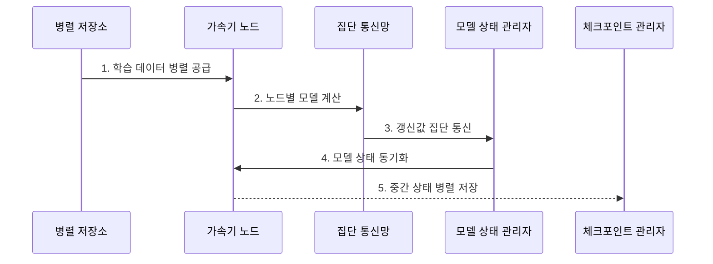

---
sidebar:
  order: 138
  label: "138. AI 슈퍼컴퓨팅 (AI Supercomputing)"
  badge:
    text: "기출 · 70%"
    variant: note
title: "AI 슈퍼컴퓨팅 (AI Supercomputing)"
date: "2026-07-31T12:05:06+09:00"
tags:
  - "notes-latest_tech"
weight: 138
extra:
  question_no: "138"
  source_status: "기출"
  source_history: "138회"
  priority: 70
  priority_note: "AI 슈퍼컴퓨팅 자원·통신 설계가 138회 출제됨"
---

## Ⅰ. 개요

핵심 용어

- **AI 슈퍼컴퓨팅(AI Supercomputing)**: 대규모 AI 학습·추론을 위해 가속기·고속망·병렬 저장소·스케줄러·전력·냉각을 하나의 시스템으로 통합한 인프라이다.
- **확장 효율(Scaling Efficiency)**: 가속기 수를 늘렸을 때 이상적인 처리량 증가 대비 실제 처리량 증가의 비율이다.

- 정의/개념: **AI 슈퍼컴퓨팅**은 대규모 AI 병렬 처리를 위해 연산·통신·저장·전력·냉각을 통합한 인프라
- 배경/필요성: 단일 서버는 대형 모델의 **연산량·가속기 메모리·데이터 공급량** 충족 곤란

#### 한줄 요약
- 계산기만 늘리지 않고 계산기 사이 도로와 자료 창고, 전기와 냉방까지 하나의 학습 공장으로 맞춤

## Ⅱ. 특징

핵심 용어

- **집단 통신(Collective Communication)**: 여러 가속기가 갱신값을 합산·분배·교환하여 동일 모델 상태를 만드는 통신 연산이다.
- **랙 전력 밀도(Rack Power Density)**: 한 랙의 장비가 요구하는 총 전력과 냉각 용량이다.

- 고속 연결망 기반 **가속기·메모리 병렬 통합**
- 집단 통신·저장 대역폭 기반 **분산 학습 효율**
- 전력·냉각 한도 기반 **배치 밀도·지속 성능 제한**

#### 한줄 요약
- 일꾼이 많아도 답을 맞추는 통로와 자료 창고, 전기와 냉방이 막히면 전체 학습은 빨라지지 않음

## Ⅲ. 구조 및 구성요소

핵심 용어

- **병렬 파일 시스템(Parallel File System)**: 여러 노드가 학습 데이터와 체크포인트를 동시에 읽고 쓰도록 분산한 저장 구조이다.
- **작업 스케줄러**: 통신 토폴로지와 가용 자원을 고려해 가속기 노드를 배치하고 복구하는 구성요소이다.

| 구성요소 | 책임 |
|:---|:---|
| 가속기 노드 | 모델 연산과 **장치 메모리 제공** |
| 고속 연결망 | 갱신값 집단 통신의 **노드 간 전송** |
| 병렬 저장소 | 학습 데이터·체크포인트의 **동시 입출력** |
| 작업 스케줄러 | 토폴로지 기반 **노드 배치·장애 복구** |
| 전력·냉각 계층 | 랙별 전력 공급과 **열 제거 한도 관리** |

#### 한줄 요약
- 계산 교실과 복도, 창고, 자리 배정표, 전기·냉방 설비가 모두 맞아야 학생 수를 늘린 효과가 남음

## Ⅳ. 흐름도

핵심 용어

- **순전파·역전파(Forward·Backward Propagation)**: 입력에서 예측을 계산하고 오차 기울기를 반대 방향으로 전달하는 학습 연산이다.
- **옵티마이저(Optimizer)**: 모델의 기울기를 이용해 가중치 갱신 방향과 크기를 계산하는 학습 구성요소이다.
- **체크포인트(Checkpoint)**: 장애 복구를 위해 학습 중간의 모델·옵티마이저 상태를 저장한 시점 파일이다.

1. **학습 데이터 병렬 공급**: 작업자별 데이터 조각을 **저장 대역폭**에 맞춰 전달
2. **노드별 모델 계산**: 각 가속기가 순전파·역전파로 **로컬 갱신값** 생성
3. **갱신값 집단 통신**: 노드별 값을 합산·분배해 **공동 갱신값** 구성
4. **모델 상태 동기화**: 모든 노드가 같은 파라미터로 **다음 반복 상태** 전환
5. **중간 상태 병렬 저장**: 장애 복구 지점의 모델·옵티마이저를 **체크포인트**로 보존

#### 한줄 요약
- 문제를 나눠 풀고 답을 합쳐 같은 정답지로 맞춘 뒤 일정 간격으로 현재 정답지를 창고에 저장함

## Ⅴ. 종류 및 비교

핵심 용어

- **과학 계산 슈퍼컴퓨터**: CPU 중심의 대규모 수치 해석과 시뮬레이션에 최적화한 고성능 컴퓨팅 시스템이다.
- **가속기 클라우드**: GPU 등 가속기 자원을 필요할 때 임대해 탄력적으로 사용하는 서비스이다.

| 비교 기준 | 과학 계산 슈퍼컴퓨터 | AI 슈퍼컴퓨팅 | 가속기 클라우드 |
|:---|:---|:---|:---|
| 적용 기준 | 검증된 **수치 해석 코드** | 다중 노드 **AI 동기화** | 변동 작업의 **주문형 자원** |
| 핵심 특징 | CPU 중심 **수치 시뮬레이션** | 가속기·고속망 **AI 병렬화** | 탄력적 **가속기 임대** |
| 한계 | **AI 생태계·가속 효율** | **구축·전력·냉각 비용** | **전송·종속·장기 비용** |

#### 한줄 요약
- 과학 계산 공장, AI 학습 전용 공장, 필요할 때 빌리는 계산 공장은 최적화 대상이 다름

## Ⅵ. 실무 고려사항 및 대책

핵심 용어

- **통신 토폴로지**: 가속기와 스위치가 연결되어 데이터가 이동하는 물리·논리 경로 구조이다.
- **데이터 샤딩**: 학습 데이터를 여러 노드가 병렬로 읽고 처리하도록 조각내어 분산하는 방법이다.

| 문제 | 대책 | 효과 |
|:---|:---|:---|
| 노드 증가의 **집단 통신 병목** | **통신 토폴로지 인접 배치·계산 중첩** | 확장 효율 **향상** |
| 저장 대역폭 부족의 **가속기 유휴** | **데이터 샤딩·캐시·병렬 체크포인트** 적용 | 연산 자원 대기 **감소** |
| 랙 전력·냉각 초과의 **성능 제한** | **전력 밀도별 노드 배치·열 기반 속도 제어** | 지속 처리량 **확보** |

#### 한줄 요약
- 일꾼을 늘리기 전에 통로와 창고, 전기와 냉방이 늘어난 작업량을 감당하는지 확인함

## Ⅶ. 결론

핵심 용어

- **병목 자원**: 전체 처리량을 제한해 다른 자원의 대기 시간을 만드는 연산·통신·저장·전력 요소이다.
- **지속 처리량**: 전력·열·통신 제한을 넘지 않으면서 장시간 유지할 수 있는 실제 처리 성능이다.

- **집단 통신·저장 대역폭**과 **전력 밀도** 중 병목 자원 우선 확장

#### 한줄 요약
- 계산기를 더 놓기보다 실제 학습을 막는 통신·저장·전력·냉각부터 넓힘
