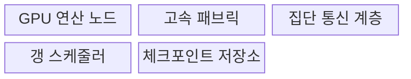
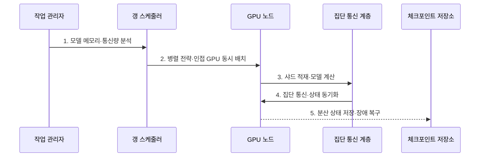

---
sidebar:
  order: 139
  label: "139. GPU 클러스터 (GPU Cluster)"
  badge:
    text: "기출 · 70%"
    variant: note
title: "GPU 클러스터 (GPU Cluster)"
date: "2026-07-27T23:59:59+09:00"
tags:
  - "notes-latest_tech"
weight: 139
extra:
  question_no: "139"
  source_status: "기출"
  source_history: "138회"
  priority: 70
  priority_note: "GPU 클러스터의 통신·장애 설계가 138회 출제됨"
---

## 미리 알고가기

- **GPU 클러스터(Graphics Processing Unit Cluster)**: 여러 GPU 서버를 고속망·공유 저장소로 연결하여 분산 학습·대규모 추론을 수행하는 인프라
- **데이터 병렬화(Data Parallelism)**: 각 GPU가 다른 데이터 조각으로 같은 모델을 계산하고 기울기를 합치는 방식
- **텐서 병렬화(Tensor Parallelism)**: 하나의 큰 텐서 연산을 여러 GPU에 나누어 동시에 계산하는 방식
- **파이프라인 병렬화(Pipeline Parallelism)**: 모델 층을 여러 GPU 단계로 나누고 작은 배치를 연속 전달하는 방식
- **갱 스케줄링(Gang Scheduling)**: 분산 작업에 필요한 GPU를 같은 시점에 모두 확보하여 함께 실행하는 방식
- **고속 패브릭(High-Speed Fabric)**: GPU 노드 사이의 기울기·파라미터를 낮은 지연으로 전송하는 연결망
- **샤드(Shard)**: 모델·데이터·학습 상태를 분산 배치하기 위해 나눈 조각

## Ⅰ. 개요

- 정의/개념: **GPU 클러스터**는 여러 GPU 서버를 고속망·저장소로 연결한 분산 AI 병렬 인프라
- 배경/필요성: 단일 서버는 대형 모델의 **장치 메모리·학습 처리량** 충족 곤란

### 쉽게 이해하기 (학습용)
- 한 작업대에 올릴 수 없는 큰 모형을 여러 작업대에 나누고 부품 전달 시간까지 함께 설계함

## Ⅱ. 특징

- 데이터·텐서·파이프라인의 **모델·작업 병렬 분할**
- 계산·집단 통신 중첩과 **토폴로지 인접 배치**
- 갱 스케줄링·체크포인트 기반 **동시 실행·장애 복구**

### 쉽게 이해하기 (학습용)
- 가까운 작업대를 한꺼번에 배정하고 계산 중에 결과를 전달하며 중간 저장본으로 고장을 복구함

## Ⅲ. 구조 및 구성요소

| 구성요소 | 책임 |
|:---|:---|
| GPU 연산 노드 | 모델 샤드의 **연산·장치 메모리 제공** |
| 고속 패브릭 | 노드 간 기울기·파라미터의 **전송 경로 제공** |
| 집단 통신 계층 | 병렬 전략별 **분산 데이터 교환** |
| 갱 스케줄러 | 통신 인접 GPU의 **동시 할당** |
| 체크포인트 저장소 | 일관된 분산 상태의 **저장·복구 지점 제공** |

### 쉽게 이해하기 (학습용)
- 작업대와 전달 통로, 작업 분담 규칙, 동시 배정표, 복구 창고가 한 묶음으로 움직임

## Ⅳ. 흐름도

### 동작 원리

1. **모델 메모리·통신량 분석**: 모델·배치가 요구하는 **분할 규모** 산정
2. **병렬 전략·인접 GPU 동시 배치**: 통신 패턴에 맞는 노드를 **동일 실행 시점**에 확보
3. **샤드 적재·모델 계산**: 데이터·모델 조각을 장치에 올려 **병렬 연산** 수행
4. **집단 통신·상태 동기화**: 계산과 전송을 겹쳐 모든 노드의 **공동 모델 상태** 생성
5. **분산 상태 저장·장애 복구**: 일관된 체크포인트로 실패 작업의 **재개 지점** 확보

### 쉽게 이해하기 (학습용)
- 작업 크기와 전달량을 계산해 가까운 작업대를 함께 잡고 중간 저장본부터 고장 난 작업을 다시 시작함

## Ⅴ. 종류 및 비교

| 비교 기준 | 단일 GPU 서버 | GPU 클러스터 | 전용 가속기 클러스터 |
|:---|:---|:---|:---|
| 적용 기준 | 서버 내부 자원으로 처리 | 분산 이득이 통신 비용 초과 | 고정 규모·전용 생태계 |
| 핵심 특징 | 서버 내부 **고속 연결** | 다중 서버 **고속망 분산** | 특정 가속기·컴파일러 **통합** |
| 한계 | 메모리·처리량 상한 | 통신·스케줄링 병목 | 워크로드·생태계 제약 |

### 쉽게 이해하기 (학습용)
- 한 방에서 끝낼지, 여러 방을 고속 통로로 이을지, 전용 작업장으로 고정할지의 차이임

## Ⅵ. 실무 고려사항 및 대책

| 고려사항 | 대책 | 효과 |
|:---|:---|:---|
| 병렬 분할의 **통신량 폭증** | 모델 크기·연산/통신비 기반 병렬 전략 선택 | 단계 시간 **최소화** |
| 비인접 GPU 배치의 **패브릭 병목** | 토폴로지 인지 갱 스케줄링 | 집단 통신 지연 **완화** |
| 노드 장애의 **분산 상태 불일치** | 일관된 체크포인트·샤드 무결성 검증 | 학습 재개 **정합성 확보** |

### 쉽게 이해하기 (학습용)
- 작업 분담이 전달량을 너무 늘리지 않게 하고 가까운 작업대를 묶어 같은 저장 시점에서 복구함

## Ⅶ. 결론

- 모델 분할·통신 토폴로지·복구 비용을 기준으로 **GPU 병렬 전략과 확장 규모** 결정

### 쉽게 이해하기 (학습용)
- 작업대를 늘린 이득이 전달과 복구 비용보다 큰 범위까지만 클러스터를 확장함
