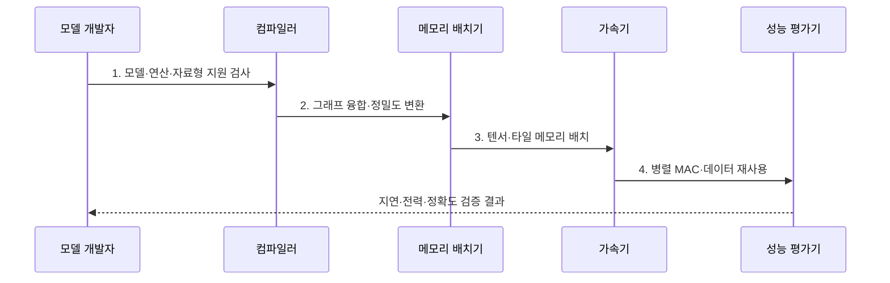

---
sidebar:
  order: 140
  label: "140. AI 가속기 (AI Accelerator)"
  badge:
    text: "기출 · 80%"
    variant: note
title: "AI 가속기 (AI Accelerator)"
date: "2026-07-31T08:53:01+09:00"
tags:
  - "notes-latest_tech"
weight: 140
extra:
  question_no: "140"
  source_status: "기출"
  source_history: "126회, 134회, 137회"
  priority: 80
  priority_note: "AI 가속기 구조·용도 비교가 여러 회차 반복됨"
---

## 미리 알고가기

- **AI 가속기(AI Accelerator)**: 신경망의 텐서 연산과 데이터 이동을 특화하여 처리량·전력 효율을 높이는 하드웨어
- **곱셈-누산(Multiply-Accumulate, MAC)**: 두 값을 곱한 결과를 누적하여 행렬·합성곱을 계산하는 신경망 핵심 연산
- **온칩 메모리(On-Chip Memory)**: 가속기 칩 내부에서 가중치·활성값·부분합을 가까이 보관하는 고속 메모리
- **데이터 흐름(Dataflow)**: 연산 배열과 메모리 사이에서 가중치·활성값·부분합을 이동·재사용하는 순서
- **신경망 처리장치(Neural Processing Unit, NPU)**: 신경망 텐서 연산과 저정밀 데이터 흐름에 특화한 프로세서
- **현장 프로그래머블 게이트 배열(Field-Programmable Gate Array, FPGA)**: 배포 후에도 논리 회로와 데이터 경로를 재구성할 수 있는 가속기
- **주문형 반도체(Application-Specific Integrated Circuit, ASIC)**: 특정 연산·데이터 흐름을 제조 단계에서 고정한 전용 반도체
- **중앙 처리장치(Central Processing Unit, CPU)**: 미지원 가속기 연산을 대신 실행할 수 있지만 텐서 처리 효율이 낮은 범용 프로세서
- **타일링(Tiling)**: 큰 텐서를 온칩 메모리에 맞는 작은 블록으로 나누어 반복 계산하는 기법

## Ⅰ. 개요

- 정의/개념: **AI 가속기**는 텐서 연산·데이터 이동을 특화하여 AI 처리량·전력 효율을 높이는 하드웨어
- 배경/필요성: 범용 CPU는 대량 MAC과 **가중치·활성값 데이터 이동**의 처리 효율 부족

### 쉽게 이해하기 (학습용)
- 모든 요리를 하는 범용 주방 대신 반복되는 썰기·섞기와 재료 배치에 맞춘 전용 조리대를 사용함

## Ⅱ. 특징

> 500 ops/byte 이전 **메모리 대역폭**, 이후 **MAC 성능** 병목
>
> **100 TOPS·200 GB/s** 가정의 이론적 루프라인

- 저정밀 텐서의 **대규모 병렬 MAC**
- 온칩 데이터 흐름 기반 **가중치·활성값 재사용**
- 컴파일러·연산 지원과 **유연성·전력 효율 절충**

### 쉽게 이해하기 (학습용)
- 계산기를 많이 두는 것뿐 아니라 재료를 가까운 선반에 오래 두어 외부 창고 왕복을 줄여야 빠르고 전력도 적게 듦

## Ⅲ. 구조 및 구성요소

| 구성요소 | 책임 |
|:---|:---|
| 컴파일러·런타임 | 모델 그래프의 **지원 연산·장치 명령 변환** |
| MAC·텐서 배열 | 행렬·벡터의 **병렬 곱셈-누산 수행** |
| 온칩 메모리 | 가중치·활성값·부분합의 **근거리 재사용** |
| 외부 메모리 인터페이스 | 대용량 텐서의 **전송 대역폭 제공** |
| 전력·열 제어기 | 전력·온도에 따른 **클록·자원 한도 조절** |

### 쉽게 이해하기 (학습용)
- 조리 감독이 전용 조리대와 가까운 선반, 외부 창고, 전기·온도 한도를 함께 조정함

## Ⅳ. 흐름도

1. **모델·연산·자료형 지원 검사**: 장치가 전체 그래프를 실행할 **호환 범위** 확인
2. **그래프 융합·정밀도 변환**: 연산 호출·메모리 이동을 줄이는 **실행 그래프** 생성
3. **텐서·타일 메모리 배치**: 재사용률에 맞춰 온칩·외부 메모리의 **데이터 위치** 결정
4. **병렬 MAC·데이터 재사용**: 연산 배열에서 부분합과 입력을 재사용해 **텐서 계산** 수행
### 쉽게 이해하기 (학습용)
- 조리법을 장치 언어로 바꾸고 재료를 가까운 선반에 놓은 뒤 실제 시간·전력·맛을 함께 시험함

## Ⅴ. 종류 및 비교

| 비교 기준 | GPU | NPU·ASIC | FPGA |
|:---|:---|:---|:---|
| 적용 기준 | **모델 변경·범용성** | **고정 모델·전력 효율** | **맞춤 입출력·저지연** |
| 핵심 특징 | 범용 병렬 코어·**텐서 유닛** | 전용 MAC·**고정 데이터 흐름** | 재구성 논리·**맞춤 파이프라인** |
| 한계 | **전력·제어 오버헤드** | **연산 지원·이식성** 제한 | **설계·합성 시간** |

### 쉽게 이해하기 (학습용)
- 메뉴가 자주 바뀌면 GPU, 같은 메뉴를 대량 생산하면 NPU·ASIC, 조리대 배선을 바꿔야 하면 FPGA가 맞음

## Ⅵ. 실무 고려사항 및 대책

| 고려사항 | 대책 | 효과 |
|:---|:---|:---|
| 미지원 연산의 **CPU 우회 지연** | 연산자·자료형 커버리지와 종단 프로파일 측정 | 실효 처리량 **검증** |
| 외부 메모리의 **데이터 이동 병목** | 타일링·연산 융합·온칩 재사용 최적화 | 대역폭·전력 소모 **절감** |
| 저정밀 변환의 **모델 정확도 저하** | 계층별 양자화·원본 대비 회귀 시험 | 성능·품질 **절충** |

### 쉽게 이해하기 (학습용)
- 전용 조리대가 못 하는 단계와 외부 창고 왕복, 낮은 정밀도로 바뀐 맛까지 전체 과정에서 확인함

## Ⅶ. 결론

- 모델 변경은 **GPU**, 고정 저전력은 **NPU·ASIC**, 맞춤 입출력은 FPGA 선택

### 쉽게 이해하기 (학습용)
- 최고 속도 숫자보다 실제 모델 전체를 정한 시간·전력·정확도로 처리하는 장치를 고름
