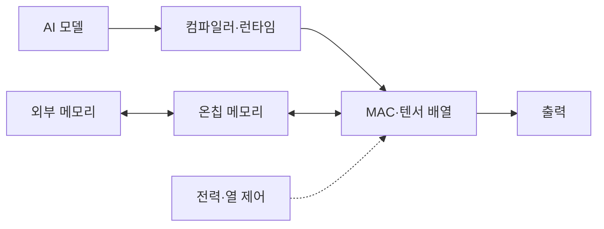

---
sidebar:
  order: 140
  label: "140. AI Accelerator AI 가속기 (AI Accelerator)"
  badge:
    text: "기출 · 80%"
    variant: note
title: "AI Accelerator AI 가속기 (AI Accelerator)"
date: "2026-07-27T23:59:59+09:00"
tags:
  - "notes-latest-tech"
weight: 140
extra:
  question_no: "140"
  source_status: "기출"
  source_history: "126회, 134회, 137회"
  priority: 80
  priority_note: "AI 가속기 구조·용도 비교가 여러 회차 반복됨"
---

## 미리 알고가기

- **AI 가속기(AI Accelerator)**: AI 연산의 처리량·전력 효율을 높이는 특화 하드웨어
- **곱셈-누산(Multiply-Accumulate, MAC)**: 곱셈 결과를 누적하는 신경망 핵심 연산
- **신경망 처리장치(Neural Processing Unit, NPU)**: 신경망 텐서 연산에 특화한 프로세서
- **가속기 유형**: GPU는 소프트웨어 병렬, FPGA는 회로 재구성, ASIC은 제조 시 회로 고정을 뜻함
- **약어 읽기·표기**: AI·MAC·NPU·GPU·FPGA·ASIC은 ‘에이아이·맥·엔피유·지피유·에프피지에이·에이식’으로 읽고 연산·장치 유형을 구분함

## Ⅰ. 개요

- 정의/개념: AI 연산의 처리량·전력 효율을 높이는 가속 장치
- 기존 한계: 범용 CPU는 대량 MAC·데이터 이동 효율이 낮음

### 쉽게 이해하기 (학습용)

- 여러 요리를 모두 만드는 범용 주방 대신 반복되는 썰기·섞기 작업에 맞춘 전용 조리대를 고르되, 메뉴와 조리법을 실제로 처리할 수 있는지도 확인하는 것과 같음

## Ⅱ. 특징

- **병렬 MAC**: 저정밀 텐서 연산을 대량 병렬 처리한다
- **데이터 재사용**: 온칩 메모리·데이터흐름으로 이동을 줄인다
- **공동 최적화**: 컴파일러 지원과 유연성·효율을 함께 본다

### 쉽게 이해하기 (학습용)

- 전용 조리대는 같은 요리를 적은 전력으로 많이 만들지만 새 메뉴를 못 만들 수 있고, 지원하지 않는 단계가 일반 주방으로 돌아가면 전체 시간이 길어짐

## Ⅲ. 구성요소 및 구조

| 설계 요소 | 설명 |
|:---|:---|
| 연산 배열 | 행렬·벡터 곱셈·누산 동시 수행 |
| 데이터 흐름 | 가중치·활성값·부분합 재사용 경로 |
| 외부 메모리 | 온칩 인터페이스와의 용량·대역폭 경계 |
| 컴파일러 | 그래프를 장치 명령으로 변환하는 계층 |
| 전력·열 제어 | 전력·온도에 따른 클록·자원 상태 |

> 요약: 컴파일러 배치와 메모리 재사용이 실효 처리량을 정한다.

### 쉽게 이해하기 (학습용)

- 조리 감독인 컴파일러가 재료를 가까운 선반인 온칩 메모리에 두고 전용 조리대인 연산 배열의 순서를 정하며, 전력·온도 한도가 생산 속도를 제한함

## Ⅳ. 원리 및 절차 흐름도

| 절차 | 설명 |
|:---|:---|
| 모델·연산지원검사 | 연산·자료형·컴파일 지원 확인 |
| 그래프·정밀도변환 | 연산 융합·양자화·타일 결정 |
| 텐서·타일메모리배치 | 온칩·외부 메모리 위치 결정 |
| 병렬연산·데이터재사용 | MAC 배열 실행·부분합 재사용 |
| 성능·전력·정확도측정 | 우회 포함 종단 성능 검증 |
| 실행프로파일확정 | 기준 충족 설정 저장 |

> 요약: 모델 지원 범위와 호스트 우회 성능까지 확인 후 확정함

### 쉽게 이해하기 (학습용)

- 새 조리법을 장치가 이해하는지 먼저 확인하고 재료를 가까운 선반에 배치한 뒤, 실제 조리 시간·전력·맛이 기준을 만족하는 설정만 저장함

## Ⅴ. AI 가속기 유형 비교

| 비교 기준 | GPU | NPU·ASIC | FPGA |
|:---|:---|:---|:---|
| 적용 기준 | 모델 변경·범용성 필요 시 | 고정 모델의 전력 효율 중요 시 | 맞춤 입출력·저지연 필요 시 |
| 핵심 특징 | 병렬 코어·텐서 유닛 | 전용 MAC·데이터흐름 | 재구성 논리·맞춤 파이프라인 |
| 한계 | 전력·범용 제어 오버헤드 | 연산 지원·이식성 제한 | 설계·합성 시간 |

> 요약: 범용·고정·재구성에 GPU·ASIC·FPGA를 고른다.

### 쉽게 이해하기 (학습용)

- 메뉴가 자주 바뀌면 범용 조리대인 GPU, 같은 메뉴를 대량 생산하면 전용 조리대인 NPU·ASIC, 조리대 배선 자체를 바꿔야 하면 FPGA가 맞음

## Ⅵ. 실무 사례

1. 생성형 AI: **컴파일 지원·지연**으로 장치 선택

### 쉽게 이해하기 (학습용)

- 실시간 서비스는 조리법을 전부 처리하면서 제시간에 답하는 장치를 고르고, 같은 작업을 반복하면 재료를 내부에서 재사용하는 전용 장치가 유리함

## Ⅶ. 결론

- AI 연산 효율을 높이기 위해 **연산자 지원·메모리 대역폭·지연·전력·모델 변경성**을 검토하고, 변화가 잦으면 GPU, 고정 대량 처리는 ASIC을 선택한다

### 쉽게 이해하기 (학습용)

- 최고 속도 숫자보다 실제 메뉴를 빠짐없이 처리하고 정한 시간·전력·정확도를 만족하는지가 장치 선택 기준임
