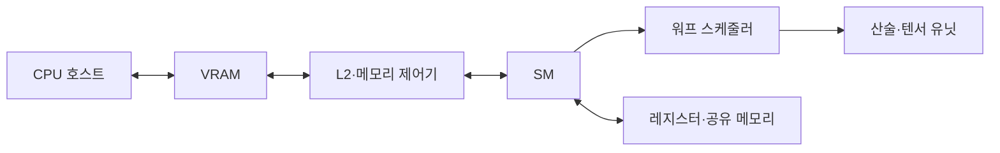

---
sidebar:
  order: 141
  label: "141. GPU (Graphics Processing Unit)"
  badge:
    text: "기출 · 80%"
    variant: note
title: "GPU (Graphics Processing Unit)"
date: "2026-07-27T23:59:59+09:00"
tags:
  - "notes-latest-tech"
weight: 141
extra:
  question_no: "141"
  source_status: "기출"
  source_history: "126회, 134회, 137회"
  priority: 80
  priority_note: "GPU 병렬 구조·가속 원리가 여러 회차 반복됨"
---

## 미리 알고가기

- **그래픽 처리장치(Graphics Processing Unit, GPU)**: 동일 연산을 대량 데이터에 병렬 적용하는 프로세서
- **단일 명령 다중 스레드(Single Instruction, Multiple Threads, SIMT)**: 스레드 묶음이 같은 명령을 실행하는 GPU 방식
- **스트리밍 멀티프로세서(Streaming Multiprocessor, SM)**: 워프·연산·온칩 자원을 관리하는 실행 단위
- **비디오 메모리(Video RAM, VRAM)**: GPU가 직접 접근하는 장치 메모리
- **주문형 집적회로(Application-Specific Integrated Circuit, ASIC)**: 특정 AI 데이터흐름을 제조 시 고정한 칩
- **약어 읽기·표기**: GPU·SIMT·SM·VRAM·ASIC은 ‘지피유·심트·에스엠·브이램·에이식’으로 읽고 처리장치·실행방식·코어군·메모리·전용 칩을 구분함

## Ⅰ. 개요

- 정의/개념: 워프 기반 SIMT 대량 병렬 프로세서
- 기존 한계: CPU는 규칙적 대량 연산의 처리량이 제한

### 쉽게 이해하기 (학습용)

- 한 명이 복잡한 주문을 차례로 처리하기보다 많은 작업자가 같은 조리법으로 서로 다른 재료를 동시에 다루는 생산 라인과 같음

## Ⅱ. 특징

- **SIMT 실행**: 워프가 같은 명령을 여러 데이터에 적용한다
- **지연 은닉**: 준비된 워프 교대로 메모리 대기를 숨긴다
- **메모리 최적화**: 병합 접근·타일링으로 전송을 줄인다

### 쉽게 이해하기 (학습용)

- 같은 줄의 작업자는 같은 지시를 받을 때 빠르지만 서로 다른 길로 갈라지면 차례로 기다리고, 가까운 작업대에 재료를 재사용할수록 창고 왕복이 줄어듦

## Ⅲ. 구성요소 및 구조

| 설계 요소 | 설명 |
|:---|:---|
| 스트리밍 멀티프로세서 | 스레드·워프 배치 및 자원 할당 단위 |
| 워프 스케줄러 | 준비된 워프를 명령 발행하는 제어부 |
| 산술·텐서 유닛 | 정수·부동소수·행렬 연산 병렬 자원 |
| 메모리 계층 | 레지스터·공유 메모리·캐시 온칩 보관 |
| VRAM 제어기 | 외부 메모리 대역폭 경계 대용량 저장 |

> 요약: 워프 실행과 온칩 재사용·VRAM 접근이 성능을 정한다.

### 쉽게 이해하기 (학습용)

- 감독자인 워프 스케줄러가 일할 수 있는 조를 골라 계산대에 보내고, 가까운 선반인 공유 메모리를 잘 쓰면 먼 창고인 VRAM을 기다리는 시간이 줄어듦

## Ⅳ. 원리 및 절차 흐름도

| 절차 | 설명 |
|:---|:---|
| 커널·격자구성 | 격자·블록·스레드 수 결정 |
| 입력VRAM전송 | 호스트 입력을 장치 메모리로 이동 |
| 블록SM할당 | 자원 요구량에 따라 블록 배치 |
| 워프SIMT실행 | 같은 명령 실행·분기 경로 직렬화 |
| 공유메모리타일재사용 | 입력 타일의 전역 메모리 접근 절감 |
| 결과동기화·반환 | 결과를 VRAM·호스트에 전달 |

> 요약: 블록·워프·메모리를 조정해 VRAM 대기를 줄인다.

### 쉽게 이해하기 (학습용)

- 작업량에 맞는 조 수를 정해 같은 길의 재료를 한꺼번에 가져오고 가까운 선반에서 재사용하며, 갈림길에서는 조가 차례로 움직이는 과정임

## Ⅴ. CPU·GPU·AI ASIC 비교

| 비교 기준 | CPU | GPU | AI ASIC |
|:---|:---|:---|:---|
| 적용 기준 | 분기·순차 의존·짧은 단일 작업이 많을 때 | 같은 연산을 큰 데이터 묶음에 반복할 때 | 지원 연산이 고정되고 성능 대비 전력이 우선일 때 |
| 핵심 특징 | 강한 제어·낮은 지연 | SIMT·대량 병렬 처리 | 고정 텐서 데이터흐름 |
| 한계 | 대량 연산 처리량 제한 | 분기·메모리 전송 병목 | 연산 지원·이식성 제한 |

> 요약: 제어는 CPU, 병렬은 GPU, 고정 연산은 가속기다.

### 쉽게 이해하기 (학습용)

- 다양한 주문을 빠르게 판단하면 CPU, 같은 주문을 대량 처리하면 GPU, 메뉴가 고정된 초대량 생산이면 전용 가속기가 적합함

## Ⅵ. 실무 사례

1. LLM 추론: **공유 메모리 타일링**으로 VRAM 절감
2. 열 분석: **반복 산술**은 GPU, 분기 제어는 CPU

### 쉽게 이해하기 (학습용)

- 생성형 AI는 자주 쓰는 행렬 조각을 가까운 선반에 두고 반복 사용하며, 데이터 분석은 같은 계산이 많은 부분만 GPU에 맡기고 복잡한 판단은 CPU가 담당함

## Ⅶ. 결론

- 규칙적 대량 연산은 **GPU**, 분기 중심은 CPU

### 쉽게 이해하기 (학습용)

- 같은 일을 많이 나눌수록 GPU가 유리하지만 갈림길과 창고 왕복이 많으면 이점이 줄어드므로, 규칙적인 작업만 맡기고 가까운 메모리를 재사용해야 함
