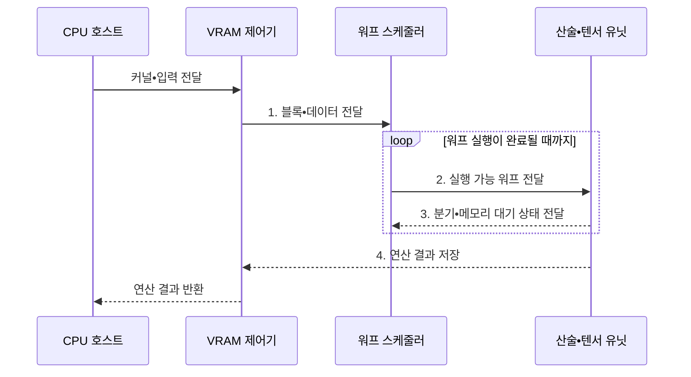

---
sidebar:
  order: 141
  label: "141. GPU (Graphics Processing Unit)"
  badge:
    text: "기출 • 80%"
    variant: note
title: "GPU (Graphics Processing Unit)"
date: "2026-08-03T08:48:47+09:00"
tags:
  - "notes-latest-tech"
weight: 141
extra:
  question_no: "141"
  source_status: "기출"
  source_history: "126회, 134회, 137회"
  priority: 80
  priority_note: "GPU 병렬 구조•가속 원리가 여러 회차 반복됨"
---

## Ⅰ. 개요

핵심 용어

- **그래픽 처리장치(Graphics Processing Unit, GPU)**: 동일 연산을 대량 데이터에 병렬 적용하는 프로세서이다.
- **단일 명령 다중 스레드(Single Instruction, Multiple Threads, SIMT)**: 스레드 묶음이 같은 명령을 실행하는 GPU 방식이다.

- 정의/개념: 그래픽 처리장치(Graphics Processing Unit, GPU)가 단일 명령 다중 스레드(Single Instruction, Multiple Threads, SIMT) 방식으로 동일 연산을 대량 데이터에 병렬 적용하는 **병렬 프로세서 구조**
- 배경/필요성: 중앙처리장치(Central Processing Unit, CPU)의 **규칙적 행렬•벡터 연산 처리량 한계** 극복

#### 한줄 요약

- 한 명이 복잡한 주문을 차례로 처리하기보다 많은 작업자가 같은 조리법으로 서로 다른 재료를 동시에 다루는 생산 라인과 같음

## Ⅱ. 특징

핵심 용어

- **워프(Warp)**: 같은 명령을 함께 실행하도록 묶은 GPU 스레드의 기본 스케줄링 단위이다.
- **메모리 지연 은닉**: 한 워프가 데이터를 기다릴 때 다른 준비된 워프를 실행해 연산기 유휴를 줄이는 방식이다.

- **실행 축**: 워프 단위 단일 명령 다중 스레드(Single Instruction, Multiple Threads, SIMT) 데이터 병렬 처리
- **지연 축**: 준비된 워프 교대로 메모리 지연 은닉
- **전송 축**: 병합 접근•타일링으로 비디오 메모리(Video RAM, VRAM) 전송 감소

#### 한줄 요약

- 같은 줄의 작업자는 같은 지시를 받을 때 빠르지만 서로 다른 길로 갈라지면 차례로 기다리고, 가까운 작업대에 재료를 재사용할수록 창고 왕복이 줄어듦

## Ⅲ. 구조 및 구성요소

핵심 용어

- **스트리밍 멀티프로세서(Streaming Multiprocessor, SM)**: 워프•연산•온칩 자원을 관리하는 실행 단위이다.
- **워프 스케줄러(Warp Scheduler)**: 같은 명령을 실행할 스레드 묶음인 워프의 준비 상태를 보고 실행 순서를 선택한다.
- **산술•텐서 유닛**: 스칼라•벡터 산술과 행렬 곱셈•누산을 대량 병렬로 수행하는 연산부이다.
- **메모리 계층**: 레지스터•공유 메모리•캐시•비디오 메모리를 통해 지연과 용량이 다른 데이터 재사용 경로를 제공한다.
- **비디오 메모리(Video RAM, VRAM)**: GPU가 직접 접근하는 장치 메모리이다.

그래픽 처리장치(Graphics Processing Unit, GPU)의 스트리밍 멀티프로세서(Streaming Multiprocessor, SM)는 비디오 메모리(Video RAM, VRAM)에서 받은 데이터를 병렬 처리한다.

| 구성요소 | 책임 |
|:---|:---|
| 스트리밍 멀티프로세서 | **스레드•워프 배치•자원 할당** 단위 |
| 워프 스케줄러 | 준비된 워프의 **명령 발행** 제어 |
| 산술•텐서 유닛 | **정수•부동소수•행렬 연산** 병렬 처리 |
| 메모리 계층 | **레지스터•공유 메모리•캐시** 보관 |
| VRAM 제어기 | **외부 메모리 대역폭•용량** 관리 |

#### 한줄 요약

- 감독자인 워프 스케줄러가 일할 수 있는 조를 골라 계산대에 보내고, 가까운 선반인 공유 메모리를 잘 쓰면 먼 창고인 VRAM을 기다리는 시간이 줄어듦

## Ⅳ. 흐름도

핵심 용어

- **커널(Kernel)**: CPU가 GPU에 전달해 여러 스레드가 병렬 실행하는 함수이다.
- **블록(Block)**: 같은 SM에 배치되어 공유 메모리와 동기화 기능을 함께 사용하는 스레드 묶음이다.

중앙처리장치(Central Processing Unit, CPU)가 그래픽 처리장치(Graphics Processing Unit, GPU)에 커널을 전달하면 스트리밍 멀티프로세서(Streaming Multiprocessor, SM)가 실행하고 비디오 메모리(Video RAM, VRAM)에 결과를 기록한다.

1. **블록•데이터 전달**: SM 자원에 맞는 블록•타일 공급
2. **실행 가능 워프 전달**: 준비된 워프의 동일 명령 발행
3. **분기•메모리 대기 상태 전달**: 다른 워프로 지연 은닉
4. **연산 결과 저장**: 완료 결과를 VRAM에 기록

#### 한줄 요약

- 작업량에 맞는 조 수를 정해 같은 길의 재료를 한꺼번에 가져오고 가까운 선반에서 재사용하며, 갈림길에서는 조가 차례로 움직이는 과정임

## Ⅴ. 종류 및 비교

핵심 용어

- **중앙처리장치(Central Processing Unit, CPU)**: 복잡한 제어와 순차 의존 작업을 낮은 단일 지연으로 처리하는 범용 프로세서이다.
- **주문형 집적회로(Application-Specific Integrated Circuit, ASIC)**: 특정 AI 데이터 흐름을 제조할 때 고정한 전용 칩이다.

그래픽 처리장치(Graphics Processing Unit, GPU), 중앙처리장치(Central Processing Unit, CPU), 인공지능(Artificial Intelligence, AI) 주문형 집적회로(Application-Specific Integrated Circuit, ASIC)는 최적화 대상이 다르다.

| 프로세서 | GPU | CPU | AI ASIC |
|:---|:---|:---|:---|
| 적용 기준 | **규칙적 데이터 병렬 연산** | **분기•순차 의존 작업** | **고정 AI 연산•전력 효율** |
| 핵심 특징 | **SIMT•대량 병렬 처리** | **강한 제어•낮은 단일 지연** | **고정 텐서 데이터흐름** |
| 한계 | **분기 발산•메모리 병목** | **대량 연산 처리량 제한** | **연산 지원•이식성 제한** |

> 요약: 중앙처리장치는 **제어**, 그래픽 처리장치는 **병렬**, 인공지능 주문형 집적회로는 **고정 연산** 중심

#### 한줄 요약

- 다양한 주문을 빠르게 판단하면 CPU, 같은 주문을 대량 처리하면 GPU, 메뉴가 고정된 초대량 생산이면 전용 가속기가 적합함

## Ⅵ. 실무 고려사항 및 대책

핵심 용어

- **분기 발산**: 한 워프의 스레드가 서로 다른 제어 경로를 실행해 경로별로 직렬 처리되는 현상이다.
- **병합 접근**: 인접 스레드의 메모리 요청을 연속 전송으로 묶어 VRAM 대역폭을 효율적으로 쓰는 방법이다.

단일 명령 다중 스레드(Single Instruction, Multiple Threads, SIMT) 효율과 비디오 메모리(Video RAM, VRAM) 전송량을 함께 관리한다.

| 문제 | 대책 | 효과 |
|:---|:---|:---|
| 워프 분기로 **SIMT 직렬화** 발생 | 동일 제어 흐름별 스레드•커널 분리 | 워프 **실행 효율** 향상 |
| 비병합 접근으로 **VRAM 대역폭** 낭비 | 병합 접근•공유 메모리 타일링 | 외부 메모리 **전송량 감소** |

#### 한줄 요약

- 생성형 인공지능(Artificial Intelligence, AI)은 자주 쓰는 행렬 조각을 가까운 선반에 두고 반복 사용하며, 데이터 분석은 같은 계산이 많은 부분만 그래픽 처리장치(Graphics Processing Unit, GPU)에 맡기고 복잡한 판단은 중앙처리장치(Central Processing Unit, CPU)가 담당함

## Ⅶ. 결론

핵심 용어

- **데이터 병렬 연산**: 같은 연산을 서로 다른 데이터 원소에 동시에 적용하는 계산 방식이다.
- **순차 의존**: 앞선 연산 결과가 나와야 다음 연산을 시작할 수 있는 실행 관계이다.

- 규칙적 대량 병렬은 **그래픽 처리장치(Graphics Processing Unit, GPU)**, 분기•순차 의존은 **중앙처리장치(Central Processing Unit, CPU)** 선택

#### 한줄 요약

- 같은 일을 많이 나눌수록 GPU가 유리하지만 갈림길과 창고 왕복이 많으면 이점이 줄어드므로, 규칙적인 작업만 맡기고 가까운 메모리를 재사용해야 함
