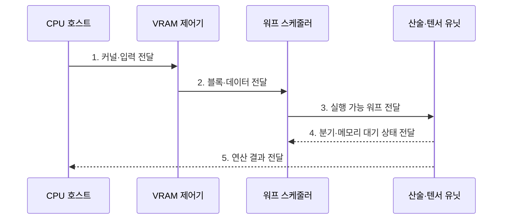

---
sidebar:
  order: 141
  label: "141. GPU (Graphics Processing Unit)"
  badge:
    text: "기출 · 80%"
    variant: note
title: "GPU (Graphics Processing Unit)"
date: "2026-07-27T23:59:59+09:00"
tags:
  - "notes-latest-tech"
weight: 141
extra:
  question_no: "141"
  source_status: "기출"
  source_history: "126회, 134회, 137회"
  priority: 80
  priority_note: "GPU 병렬 구조·가속 원리가 여러 회차 반복됨"
---

## 미리 알고가기

- **그래픽 처리장치(Graphics Processing Unit, GPU)**: 동일 연산을 대량 데이터에 병렬 적용하는 프로세서
- **단일 명령 다중 스레드(Single Instruction, Multiple Threads, SIMT)**: 스레드 묶음이 같은 명령을 실행하는 GPU 방식
- **스트리밍 멀티프로세서(Streaming Multiprocessor, SM)**: 워프·연산·온칩 자원을 관리하는 실행 단위
- **비디오 메모리(Video RAM, VRAM)**: GPU가 직접 접근하는 장치 메모리
- **주문형 집적회로(Application-Specific Integrated Circuit, ASIC)**: 특정 AI 데이터흐름을 제조 시 고정한 칩

## Ⅰ. 개요

- 정의/개념: **워프 기반 SIMT**로 대량 데이터 연산을 처리하는 병렬 프로세서
- 배경/필요성: CPU의 **규칙적 행렬·벡터 연산 처리량** 한계 극복

### 쉽게 이해하기 (학습용)

- 한 명이 복잡한 주문을 차례로 처리하기보다 많은 작업자가 같은 조리법으로 서로 다른 재료를 동시에 다루는 생산 라인과 같음

## Ⅱ. 특징

- 워프 단위 동일 명령의 **SIMT 데이터 병렬 실행**
- 준비된 워프 교대 기반 **메모리 지연 은닉**
- 병합 접근·타일링 기반 **VRAM 전송 감소**

### 쉽게 이해하기 (학습용)

- 같은 줄의 작업자는 같은 지시를 받을 때 빠르지만 서로 다른 길로 갈라지면 차례로 기다리고, 가까운 작업대에 재료를 재사용할수록 창고 왕복이 줄어듦

## Ⅲ. 구조 및 구성요소

| 구성요소 | 책임 |
|:---|:---|
| 스트리밍 멀티프로세서 | 스레드·워프 배치 및 자원 할당 단위 |
| 워프 스케줄러 | 준비된 워프를 명령 발행하는 제어부 |
| 산술·텐서 유닛 | 정수·부동소수·행렬 연산 병렬 자원 |
| 메모리 계층 | 레지스터·공유 메모리·캐시 온칩 보관 |
| VRAM 제어기 | 외부 메모리 대역폭 경계 대용량 저장 |

### 쉽게 이해하기 (학습용)

- 감독자인 워프 스케줄러가 일할 수 있는 조를 골라 계산대에 보내고, 가까운 선반인 공유 메모리를 잘 쓰면 먼 창고인 VRAM을 기다리는 시간이 줄어듦

## Ⅳ. 흐름도

- **1. 커널·입력 전달**: 격자·블록 구성과 장치 메모리 입력 배치
- **2. 블록·데이터 전달**: SM 자원에 맞는 블록 할당과 타일 공급
- **3. 실행 가능 워프 전달**: 준비된 워프의 동일 명령 병렬 발행
- **4. 분기·메모리 대기 상태 전달**: 다른 워프 교대로 지연 은닉
- **5. 연산 결과 전달**: 공유 메모리 재사용 결과의 호스트 반환

### 쉽게 이해하기 (학습용)

- 작업량에 맞는 조 수를 정해 같은 길의 재료를 한꺼번에 가져오고 가까운 선반에서 재사용하며, 갈림길에서는 조가 차례로 움직이는 과정임

## Ⅴ. 종류 및 비교

| 프로세서 | GPU | CPU | AI ASIC |
|:---|:---|:---|:---|
| 적용 기준 | 대규모 규칙적 데이터 병렬 연산 | 분기·순차 의존 작업 | 고정 AI 연산·전력 효율 |
| 핵심 특징 | SIMT·대량 병렬 처리 | 강한 제어·낮은 단일 지연 | 고정 텐서 데이터흐름 |
| 한계 | 분기 발산·메모리 전송 병목 | 대량 연산 처리량 제한 | 연산 지원·이식성 제한 |

> 요약: 제어는 CPU, 병렬은 GPU, 고정 연산은 가속기다.

### 쉽게 이해하기 (학습용)

- 다양한 주문을 빠르게 판단하면 CPU, 같은 주문을 대량 처리하면 GPU, 메뉴가 고정된 초대량 생산이면 전용 가속기가 적합함

## Ⅵ. 실무 고려사항 및 대책

| 고려사항 | 대책 | 효과 |
|:---|:---|:---|
| 워프 분기로 **SIMT 직렬화** 발생 | 동일 제어 흐름별 스레드·커널 분리 | 워프 **실행 효율** 향상 |
| 비병합 접근으로 **VRAM 대역폭** 낭비 | 병합 접근·공유 메모리 타일링 | 외부 메모리 **전송량 감소** |

### 쉽게 이해하기 (학습용)

- 생성형 AI는 자주 쓰는 행렬 조각을 가까운 선반에 두고 반복 사용하며, 데이터 분석은 같은 계산이 많은 부분만 GPU에 맡기고 복잡한 판단은 CPU가 담당함

## Ⅶ. 결론

- **분기 발산·메모리 집약도**로 GPU의 워프·타일 구성을 결정

### 쉽게 이해하기 (학습용)

- 같은 일을 많이 나눌수록 GPU가 유리하지만 갈림길과 창고 왕복이 많으면 이점이 줄어드므로, 규칙적인 작업만 맡기고 가까운 메모리를 재사용해야 함
