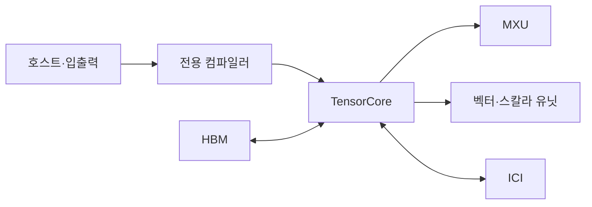

---
sidebar:
  order: 142
  label: "142. TPU (Tensor Processing Unit)"
  badge:
    text: "기출 · 60%"
    variant: note
title: "TPU (Tensor Processing Unit)"
date: "2026-07-27T23:59:59+09:00"
tags:
  - "notes-latest-tech"
weight: 142
extra:
  question_no: "142"
  source_status: "기출"
  source_history: "126회, 134회"
  priority: 60
  priority_note: "TPU 행렬 연산·GPU 비교가 반복 출제됨"
---

## 미리 알고가기

- **텐서 처리장치(Tensor Processing Unit, TPU)**: Google이 신경망 텐서 연산용으로 설계한 ASIC
- **행렬 곱셈장치(Matrix Multiply Unit, MXU)**: 시스톨릭 배열로 행렬 곱을 수행하는 TPU 핵심 연산기
- **시스톨릭 배열(Systolic Array)**: 데이터가 인접 MAC 사이를 박동처럼 흐르는 연산 배열
- **칩 간 상호연결(Inter-Chip Interconnect, ICI)**: TPU 칩의 집합 통신·파티션 연결망
- **약어 읽기·표기**: CPU·GPU·TPU·MXU·ICI·HBM은 ‘시피유·지피유·티피유·엠엑스유·아이시아이·에이치비엠’으로 읽고 범용·병렬·전용 연산과 연결·메모리를 구분함

## Ⅰ. 개요

- **정의/개념**: 시스톨릭 MXU 기반 Google 전용 AI 칩
- **기존 한계**: 범용 프로세서는 행렬 곱의 이동·제어 비용이 큼

### 쉽게 이해하기 (학습용)

- 큰 곱셈표를 계산할 때 숫자를 매번 창고에 되돌리지 않고 옆 계산 칸으로 전달해 여러 곱셈과 덧셈을 이어서 처리하는 공장과 같음

## Ⅱ. 특징

- **시스톨릭 MXU**: MAC 간 데이터 재사용으로 행렬을 처리한다
- **전용 메모리·연결**: HBM·ICI로 모델 병렬성을 확장한다
- **그래프 컴파일**: 연산 융합·타일·칩 배치를 사전 결정한다

### 쉽게 이해하기 (학습용)

- 같은 크기의 행렬 계산을 오래 반복하면 계산 칸을 빈틈없이 쓰지만, 모양이 자주 바뀌는 작은 작업은 계산 칸이 놀아 전용 공장의 이점이 줄어듦

## Ⅲ. 구성요소 및 구조

| 설계 요소 | 설명 |
|:---|:---|
| 호스트·입출력 | 모델 제어, 입력 전달 및 결과 회수 |
| 전용 컴파일러 | 모델을 TPU 맞춤 실행 코드로 변환 |
| HBM | 가중치·활성값 저장 및 연산 유닛 공급 |
| 텐서 코어 | 행렬 곱 장치·벡터·스칼라 연산 분담 |
| 칩 간 상호연결 | TPU 간 집합 통신·파티션 데이터 교환 |

> 요약: 컴파일러 매핑과 HBM·텐서 연산·다칩 연결이 핵심이다.

### 쉽게 이해하기 (학습용)

- 전용 실행 코드가 작업 위치를 정하고, HBM 창고가 재료를 대며, 텐서 코어가 계산하고, 칩 간 통로가 여러 작업장을 이어줌

## Ⅳ. 원리 및 절차 흐름도

| 절차 | 설명 |
|:---|:---|
| 모델그래프입력 | 모델·입력 형상 전달 |
| 컴파일·파티션 | 융합·타일링·칩 배치 |
| HBM텐서적재 | 입력·가중치·활성값 저장 |
| MXU·벡터연산 | 행렬 곱·비행렬 연산 분담 |
| ICI집합통신 | 데이터·그래디언트 칩 간 교환 |
| 출력큐·호스트반환 | 연산 결과를 호스트로 전달 |

> 요약: HBM·텐서 연산·상호연결로 모델을 실행한다.

### 쉽게 이해하기 (학습용)

- 모델을 전용 작업표로 바꾸고 재료를 HBM에 놓은 뒤 행렬 작업과 작업장 간 결과 교환을 끝내야 호스트가 최종 결과를 받음

## Ⅴ. CPU·GPU·TPU 비교

| 비교 기준 | CPU | GPU | TPU |
|:---|:---|:---|:---|
| 적용 기준 | 제어·비정형 연산 비중이 클 때 | 모델 변경과 다양한 연산이 잦을 때 | 반복 행렬 연산과 고정 형상 비중이 클 때 |
| 핵심 특징 | 범용 코어·독립 제어 | SIMT·텐서 코어 | 시스톨릭 MXU·그래프 컴파일 |
| 한계 | 행렬 처리량 제한 | 분기·전송 오버헤드 | 지원 연산·형상 제약 |

> 요약: 제어 CPU, 병렬 GPU, 행렬 TPU를 고른다.

### 쉽게 이해하기 (학습용)

- CPU는 무엇이든 맡는 기술자, GPU는 작업 지시를 바꿀 수 있는 병렬 작업반, TPU는 행렬 작업에 맞춘 전용 생산라인에 가까움

## Ⅵ. 실무 사례

1. LLM 학습: **행렬 타일·칩 파티션**을 TPU 배치
2. 모델 서빙: **입력 형상별 실행파일**을 사전 컴파일

### 쉽게 이해하기 (학습용)

- 대형 언어 모델은 행렬 크기와 칩 배치를 전용 생산라인에 맞추고, 서빙은 자주 쓰는 입력 모양의 작업표를 미리 준비해 둠

## Ⅶ. 결론

- 규칙적 행렬은 **TPU**, 비정형 연산은 GPU·CPU

### 쉽게 이해하기 (학습용)

- 행렬 공장이 계속 가동될 만큼 일이 규칙적이면 TPU가 유리하지만, 작업 모양이 자주 바뀌면 범용 장비가 더 나음
