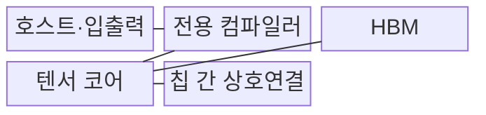
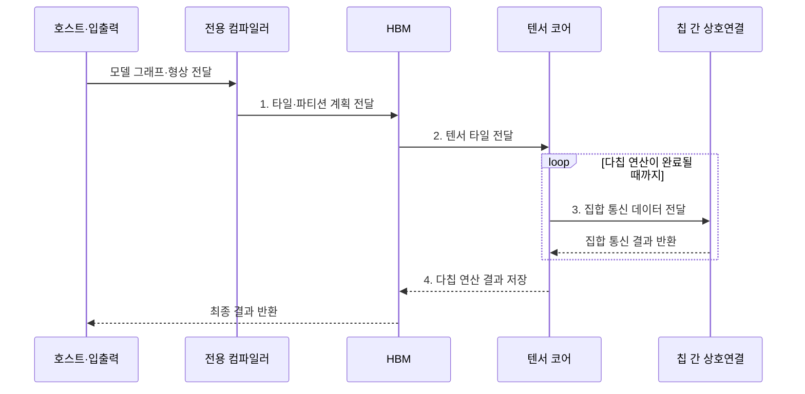

---
sidebar:
  order: 142
  label: "142. TPU (Tensor Processing Unit)"
  badge:
    text: "기출 · 60%"
    variant: note
title: "TPU (Tensor Processing Unit)"
date: "2026-07-31T12:01:53+09:00"
tags:
  - "notes-latest-tech"
weight: 142
extra:
  question_no: "142"
  source_status: "기출"
  source_history: "126회, 134회"
  priority: 60
  priority_note: "TPU 행렬 연산·GPU 비교가 반복 출제됨"
---

## Ⅰ. 개요

핵심 용어

- **텐서 처리장치(Tensor Processing Unit, TPU)**: Google이 신경망 텐서 연산용으로 설계한 주문형 집적회로(Application-Specific Integrated Circuit, ASIC)이다.
- **행렬 곱셈장치(Matrix Multiply Unit, MXU)**: 시스톨릭 배열로 행렬 곱을 수행하는 TPU 핵심 연산기이다.

- 정의/개념: 텐서 처리장치(Tensor Processing Unit, TPU)가 시스톨릭 행렬 곱셈장치(Matrix Multiply Unit, MXU)로 신경망 텐서 연산을 처리하는 **인공지능 전용 주문형 집적회로**
- 배경/필요성: 범용 프로세서의 **데이터 이동·제어 비용** 으로 행렬 처리량 제약

#### 한줄 요약

- 큰 곱셈표를 계산할 때 숫자를 매번 창고에 되돌리지 않고 옆 계산 칸으로 전달해 여러 곱셈과 덧셈을 이어서 처리하는 공장과 같음

## Ⅱ. 특징

핵심 용어

- **시스톨릭 배열(Systolic Array)**: 데이터가 인접 MAC 사이를 박동처럼 흐르며 재사용되는 연산 배열이다.
- **곱셈 누산(Multiply-Accumulate, MAC)**: 곱셈 결과를 누적해 행렬 연산을 구성하는 계산이다.

- **연산 축**: 시스톨릭 행렬 곱셈장치(Matrix Multiply Unit, MXU)의 곱셈-누산(Multiply-Accumulate, MAC) 간 데이터 재사용
- **확장 축**: 고대역폭 메모리(High Bandwidth Memory, HBM)·칩 간 상호연결(Inter-Chip Interconnect, ICI) 기반 텐서 공급·다칩 병렬
- **배치 축**: 그래프 컴파일로 연산 융합·타일·칩 배치

#### 한줄 요약

- 같은 크기의 행렬 계산을 오래 반복하면 계산 칸을 빈틈없이 쓰지만, 모양이 자주 바뀌는 작은 작업은 계산 칸이 놀아 전용 공장의 이점이 줄어듦

## Ⅲ. 구조 및 구성요소

핵심 용어

- **고대역폭 메모리(High Bandwidth Memory, HBM)**: 적층 구조로 넓은 메모리 대역폭을 제공하는 메모리이다.
- **칩 간 상호연결(Inter-Chip Interconnect, ICI)**: TPU 칩의 집합 통신과 파티션 교환을 담당하는 연결망이다.

텐서 처리장치(Tensor Processing Unit, TPU)는 고대역폭 메모리(High Bandwidth Memory, HBM), 행렬 곱셈장치(Matrix Multiply Unit, MXU), 칩 간 상호연결(Inter-Chip Interconnect, ICI)을 결합한다.

| 구성요소 | 책임 |
|:---|:---|
| 호스트·입출력 | **모델 제어·입력·결과** 관리 |
| 전용 컴파일러 | 모델을 변환하는 **TPU 실행 코드** |
| HBM | **가중치·활성값 저장·공급** |
| 텐서 코어 | **MXU·벡터·스칼라 연산** 분담 |
| 칩 간 상호연결 | **ICI 집합 통신·파티션** 교환 |

#### 한줄 요약

- 전용 실행 코드가 작업 위치를 정하고, HBM 창고가 재료를 대며, 텐서 코어가 계산하고, 칩 간 통로가 여러 작업장을 이어줌

## Ⅳ. 흐름도

핵심 용어

- **타일**: 큰 텐서를 MXU와 HBM 용량에 맞춰 나눈 계산 블록이다.
- **파티션**: 모델·데이터 연산을 여러 TPU 칩에 배치하기 위해 나눈 작업 단위이다.

행렬 곱셈장치(Matrix Multiply Unit, MXU)에 맞춘 타일을 고대역폭 메모리(High Bandwidth Memory, HBM)에서 공급하고 여러 텐서 처리장치(Tensor Processing Unit, TPU)에 파티션을 배치한다.

1. **타일·파티션 계획 전달**: 연산 융합·MXU·칩 배치 결정
2. **텐서 타일 전달**: HBM의 가중치·활성값 공급
3. **집합 통신 데이터 전달**: 칩 간 파티션 결과 교환
4. **다칩 연산 결과 저장**: 결합 결과를 HBM에 기록

#### 한줄 요약

- 모델을 전용 작업표로 바꾸고 재료를 HBM에 놓은 뒤 행렬 작업과 작업장 간 결과 교환을 끝내야 호스트가 최종 결과를 받음

## Ⅴ. 종류 및 비교

핵심 용어

- **그래프 컴파일**: 모델 연산을 융합하고 텐서와 칩 배치를 정해 TPU 실행 코드로 변환하는 과정이다.
- **단일 명령 다중 스레드(Single Instruction, Multiple Threads, SIMT)**: 여러 스레드가 같은 명령을 실행해 다양한 데이터 병렬 연산을 처리하는 그래픽 처리장치 방식이다.

텐서 처리장치(Tensor Processing Unit, TPU), 중앙처리장치(Central Processing Unit, CPU), 그래픽 처리장치(Graphics Processing Unit, GPU)는 행렬 전용성·제어 유연성·병렬 범용성이 다르다.

| 프로세서 | TPU | CPU | GPU |
|:---|:---|:---|:---|
| 적용 기준 | **반복 행렬 연산·고정 형상** | **제어·비정형 연산** | **다양한 병렬 연산·모델 변경** |
| 핵심 특징 | **시스톨릭 MXU·그래프 컴파일** | **범용 코어·독립 제어** | **SIMT·텐서 코어** |
| 한계 | **지원 연산·형상 제약** | **행렬 처리량 제한** | **분기·전송 오버헤드** |

> 요약: 중앙처리장치는 **제어**, 그래픽 처리장치는 **범용 병렬**, 텐서 처리장치는 **행렬 전용**

#### 한줄 요약

- CPU는 무엇이든 맡는 기술자, GPU는 작업 지시를 바꿀 수 있는 병렬 작업반, TPU는 행렬 작업에 맞춘 전용 생산라인에 가까움

## Ⅵ. 실무 고려사항 및 대책

핵심 용어

- **형상 버킷**: 크기가 비슷한 입력을 묶어 정해진 텐서 형상으로 실행하는 최적화 방법이다.
- **집합 통신**: 여러 칩이 계산 결과를 합산·분배·교환해 공동 상태를 만드는 통신 연산이다.

행렬 곱셈장치(Matrix Multiply Unit, MXU) 이용률과 칩 간 상호연결(Inter-Chip Interconnect, ICI) 통신량을 함께 최적화한다.

| 문제 | 대책 | 효과 |
|:---|:---|:---|
| 작은·가변 형상으로 **MXU 이용률** 저하 | 형상 버킷·행렬 타일 패딩 적용 | 시스톨릭 배열 **점유율 향상** |
| 다칩 파티션의 **ICI 통신 병목** | 텐서·데이터 병렬 배치 최적화 | 집합 통신 **대기 감소** |

#### 한줄 요약

- 대형 언어 모델은 행렬 크기와 칩 배치를 전용 생산라인에 맞추고, 서빙은 자주 쓰는 입력 모양의 작업표를 미리 준비해 둠

## Ⅶ. 결론

핵심 용어

- **고정 형상**: 실행 전에 텐서의 차원과 크기가 일정하게 정해진 연산 형태이다.
- **가변 연산**: 입력이나 모델에 따라 계산 구조와 텐서 형상이 자주 달라지는 연산이다.

- 규칙적 반복 행렬은 **텐서 처리장치(Tensor Processing Unit, TPU)**, 가변 모델·연산은 **그래픽 처리장치(Graphics Processing Unit, GPU)** 선택

#### 한줄 요약

- 행렬 공장이 계속 가동될 만큼 일이 규칙적이면 TPU가 유리하지만, 작업 모양이 자주 바뀌면 범용 장비가 더 나음
