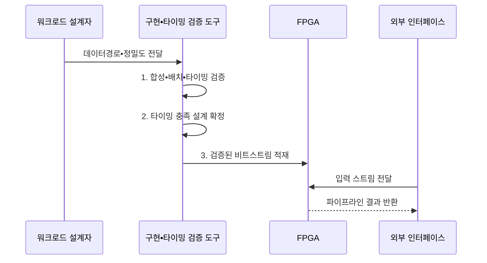

---
sidebar:
  order: 143
  label: "143. FPGA AI Acceleration (FPGA AI 가속)"
  badge:
    text: "기출 • 60%"
    variant: note
title: "FPGA AI Acceleration (FPGA AI 가속)"
date: "2026-08-03T08:48:47+09:00"
tags:
  - "notes-latest-tech"
weight: 143
extra:
  question_no: "143"
  source_status: "기출"
  source_history: "126회, 134회"
  priority: 60
  priority_note: "FPGA 재구성 가속•ASIC 비교가 반복 출제됨"
---

## Ⅰ. 개요

핵심 용어

- **현장 프로그래머블 게이트 배열(Field-Programmable Gate Array, FPGA)**: 제조 후에도 논리•배선을 재구성해 인공지능(Artificial Intelligence, AI) 데이터 경로를 구현하는 반도체이다.
- **결정적 지연**: 같은 조건에서 처리 시간이 예측 가능한 상한 안에 유지되는 특성이다.

- 정의/개념: 현장 프로그래머블 게이트 배열(Field-Programmable Gate Array, FPGA)의 재구성 논리•배선으로 인공지능(Artificial Intelligence, AI) 데이터 경로를 구현하는 **하드웨어 가속 방식**
- 배경/필요성: 범용 가속기의 **맞춤 데이터경로•결정적 지연** 확보 한계

#### 한줄 요약

- 작업 순서를 소프트웨어로 지시하는 대신 필요한 계산대와 통로 자체를 다시 배치해 입력이 쉬지 않고 흘러가게 만드는 공장과 같음

## Ⅱ. 특징

핵심 용어

- **비트스트림(Bitstream)**: FPGA의 논리•배선•메모리 구성을 장치에 적재하는 설정 데이터이다.
- **공간 파이프라인**: 연산 단계를 서로 다른 회로 블록에 동시에 배치해 데이터를 연속 처리하는 구조이다.

- **재구성 축**: 비트스트림 기반 논리•배선 변경
- **실행 축**: 연산 단계 동시 배치의 공간 파이프라인
- **설계 축**: 데이터경로 맞춤화로 지연은 감소하나 구현 복잡성 증가

#### 한줄 요약

- 현장 프로그래머블 게이트 배열(Field-Programmable Gate Array, FPGA)은 생산라인을 다시 만들 수 있지만 새 배치를 설계하고 모든 통로가 제시간에 연결되는지 확인하는 데 시간이 걸림

## Ⅲ. 구조 및 구성요소

핵심 용어

- **룩업 테이블(Look-Up Table, LUT)**: 논리 함수를 구현하는 FPGA 기본 블록이다.
- **디지털 신호처리(Digital Signal Processing, DSP) 블록**: 곱셈•누산을 수행하는 전용 회로이다.
- **블록 메모리(Block RAM, BRAM)**: FPGA 내부에서 가중치와 중간 데이터를 보관하는 재구성 가능한 메모리이다.

룩업 테이블(Look-Up Table, LUT), 디지털 신호처리(Digital Signal Processing, DSP) 블록, 블록 메모리(Block RAM, BRAM)를 조합해 맞춤 데이터 경로를 구성한다.

| 구성요소 | 책임 |
|:---|:---|
| 재구성 로직 | **LUT 기반 연산•제어 경로** 구성 |
| 곱셈•누산 블록 | **DSP 병렬 곱셈•누산** 처리 |
| 온칩 메모리 | **BRAM 가중치•라인 버퍼** 저장 |
| 외부 인터페이스 | **데이터 스트림•호스트** 연결 |
| 구현 도구 | **비트스트림 합성•배치•배선** 변환 |

#### 한줄 요약

- 설계 도구가 계산대, 작은 창고, 통로를 연결하면 외부 입력이 정해진 순서대로 흐르는 생산라인이 만들어짐

## Ⅳ. 흐름도

핵심 용어

- **합성**: 설계한 연산과 제어 논리를 현장 프로그래머블 게이트 배열(Field-Programmable Gate Array, FPGA)의 룩업 테이블(Look-Up Table, LUT)•디지털 신호처리(Digital Signal Processing, DSP) 블록•메모리 자원으로 변환하는 과정이다.
- **타이밍 검증**: 배치•배선된 신호가 정한 클록 주기 안에 도착하는지 확인하는 절차이다.

1. **합성•배치•타이밍 검증**: 논리 변환•클록 제약 판정
2. **타이밍 충족 설계 확정**: 자원•경로 제약을 만족한 설계 확정
3. **검증된 비트스트림 적재**: 회로 구성을 FPGA에 반영

#### 한줄 요약

- 계산 모양과 숫자 폭을 정하고 회로로 바꾼 뒤 모든 신호가 제한 시간 안에 도착하는지 확인해야 실제 장치에 새 생산라인을 올릴 수 있음

## Ⅴ. 종류 및 비교

핵심 용어

- **그래픽 처리장치(Graphics Processing Unit, GPU)**: 소프트웨어 커널로 다양한 병렬 연산을 실행하는 범용 가속기이다.
- **주문형 집적회로(Application-Specific Integrated Circuit, ASIC)**: 특정 연산과 데이터 경로를 제조할 때 고정한 전용 반도체이다.

현장 프로그래머블 게이트 배열(Field-Programmable Gate Array, FPGA), 그래픽 처리장치(Graphics Processing Unit, GPU), 주문형 집적회로(Application-Specific Integrated Circuit, ASIC)는 변경 주기와 효율이 다르다.

| 가속기 | FPGA | GPU | ASIC |
|:---|:---|:---|:---|
| 적용 기준 | **재구성•결정적 지연** | **잦은 모델•연산 변경** | **안정된 대량 워크로드** |
| 핵심 특징 | **비트스트림 회로 재구성** | **소프트웨어 병렬 커널** | **제조 시 데이터경로 고정** |
| 한계 | **합성•타이밍 개발 복잡** | **전력•분기 오버헤드** | **높은 초기비•변경 불가** |

> 요약: 그래픽 처리장치는 **범용 변경**, 현장 프로그래머블 게이트 배열은 **회로 재구성**, 주문형 집적회로는 **고정**

#### 한줄 요약

- GPU는 작업 지시를 바꾸고, FPGA는 생산라인을 다시 연결하며, ASIC은 한 제품을 가장 잘 만들도록 생산라인을 고정함

## Ⅵ. 실무 고려사항 및 대책

핵심 용어

- **배치•배선**: 논리 블록을 물리 위치에 놓고 신호 경로를 연결하는 FPGA 구현 단계이다.
- **클록 제약**: 회로가 충족해야 하는 동작 주기와 신호 도착 시간을 정한 조건이다.

룩업 테이블(Look-Up Table, LUT)•디지털 신호처리(Digital Signal Processing, DSP) 블록•블록 메모리(Block RAM, BRAM)의 자원 예산과 현장 프로그래머블 게이트 배열(Field-Programmable Gate Array, FPGA)의 타이밍을 함께 검증한다.

| 문제 | 대책 | 효과 |
|:---|:---|:---|
| 자원 초과로 **배치•배선 실패** | LUT•DSP•BRAM 예산 기반 설계 탐색 | 비트스트림 **구현 가능성** 확보 |
| 긴 조합 경로로 **타이밍 위반** | 파이프 단계 추가•클록 제약 검증 | 결정적 **처리 지연** 확보 |

#### 한줄 요약

- 보안 장비는 패킷이 멈추지 않게 검사 단계를 일렬로 연결하고, 비전 장비는 반복 곱셈과 가까운 영상 데이터를 칩 안에 배치함

## Ⅶ. 결론

핵심 용어

- **재구성성**: 제조 뒤에도 비트스트림을 바꾸어 회로 기능과 데이터 경로를 변경할 수 있는 성질이다.
- **구현 복잡성**: 회로 설계•합성•배치•배선•타이밍 검증에 필요한 개발 부담이다.

- **재구성성•구현 복잡성별 선택**: 잦은 변경은 그래픽 처리장치(Graphics Processing Unit, GPU), 결정적 지연•재구성은 현장 프로그래머블 게이트 배열(Field-Programmable Gate Array, FPGA)

#### 한줄 요약

- 생산라인을 가끔 바꾸면서도 빠른 처리가 필요하면 FPGA가 맞고, 매일 바꾸면 GPU, 오래 고정하면 ASIC이 나음
