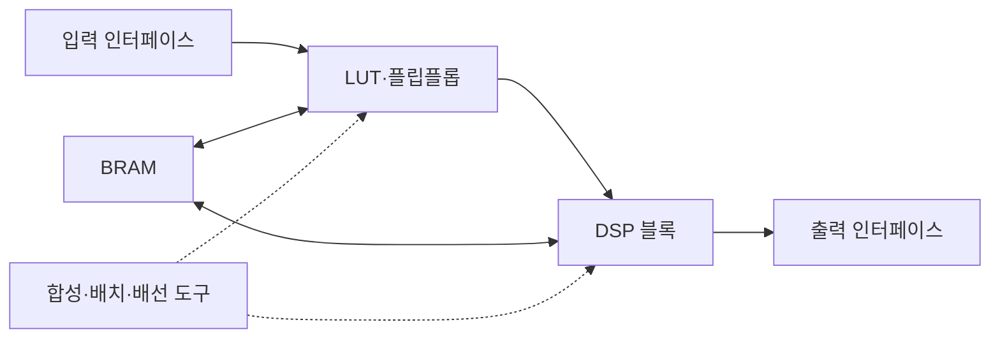

---
sidebar:
  order: 143
  label: "143. FPGA AI Acceleration (FPGA AI Acceleration)"
  badge:
    text: "기출 · 60%"
    variant: note
title: "FPGA AI Acceleration (FPGA AI Acceleration)"
date: "2026-07-27T23:59:59+09:00"
tags:
  - "notes-latest-tech"
weight: 143
extra:
  question_no: "143"
  source_status: "기출"
  source_history: "126회, 134회"
  priority: 60
  priority_note: "FPGA 재구성 가속·ASIC 비교가 반복 출제됨"
---

## 미리 알고가기

- **현장 프로그래머블 게이트 배열(Field-Programmable Gate Array, FPGA)**: 제조 후 논리·배선을 재구성하는 반도체
- **룩업 테이블(Look-Up Table, LUT)**: 논리 함수를 구현하는 FPGA 기본 블록
- **디지털 신호처리(Digital Signal Processing, DSP) 블록**: 곱셈·누산을 수행하는 전용 회로
- **블록 메모리(Block RAM, BRAM)**: FPGA 내부의 재구성 가능한 메모리
- **비교 장치**: GPU는 소프트웨어 커널 변경, ASIC은 제조 시 회로 고정 방식
- **FPGA 구성**: LUT는 논리, DSP는 산술 연산, BRAM은 칩 내부 데이터 저장을 담당하며 설계에 맞게 재구성됨

## Ⅰ. 개요

- 정의/개념: 재구성 논리로 AI 데이터경로를 구현하는 가속기
- 기존 한계: 범용 가속기는 맞춤 입출력·고정 지연 확보가 어려움

### 쉽게 이해하기 (학습용)

- 작업 순서를 소프트웨어로 지시하는 대신 필요한 계산대와 통로 자체를 다시 배치해 입력이 쉬지 않고 흘러가게 만드는 공장과 같음

## Ⅱ. 특징

- **회로 재구성**: 비트스트림으로 논리·배선을 변경한다
- **공간 파이프라인**: 연산 단계를 회로에 동시 배치한다
- **설계 상충**: 맞춤 지연·효율 대신 합성 시간이 증가한다

### 쉽게 이해하기 (학습용)

- FPGA는 생산라인을 다시 만들 수 있지만 새 배치를 설계하고 모든 통로가 제시간에 연결되는지 확인하는 데 시간이 걸림

## Ⅲ. 구성요소 및 구조

| 설계 요소 | 설명 |
|:---|:---|
| 재구성 로직 | 연산 경로 및 제어 논리 구성 |
| 곱셈·누산 블록 | 병렬 곱셈·누산 고정소수 연산 |
| 온칩 메모리 | 가중치·데이터 재사용 라인 버퍼 저장 |
| 외부 인터페이스 | 외부 데이터 스트림·호스트 연결 |
| 구현 도구 | 비트스트림 합성·배치·배선 변환 |

> 요약: 논리·메모리 연결을 합성해 맞춤 파이프라인을 만든다.

### 쉽게 이해하기 (학습용)

- 설계 도구가 계산대, 작은 창고, 통로를 연결하면 외부 입력이 정해진 순서대로 흐르는 생산라인이 만들어짐

## Ⅳ. 원리 및 절차 흐름도

| 절차 | 설명 |
|:---|:---|
| 워크로드·정밀도분석 | 연산·이동·수치 폭 결정 |
| 데이터경로·파이프설계 | LUT·DSP·BRAM 자원 배분 |
| 논리합성 | 설계를 논리 회로로 변환 |
| 배치·배선·타이밍검증 | 물리 자원·클록 제약 확인 |
| 비트스트림구성 | 구성 메모리에 회로 적재 |
| 스트리밍추론 | 입력을 공간 파이프라인 처리 |

> 요약: 회로 합성·검증한 비트스트림으로 추론한다.

### 쉽게 이해하기 (학습용)

- 계산 모양과 숫자 폭을 정하고 회로로 바꾼 뒤 모든 신호가 제한 시간 안에 도착하는지 확인해야 실제 장치에 새 생산라인을 올릴 수 있음

## Ⅴ. GPU·FPGA·ASIC 비교

| 비교 기준 | GPU | FPGA | ASIC |
|:---|:---|:---|:---|
| 적용 기준 | 모델·연산 변경이 잦을 때 | 변경 가능성과 고정 지연이 모두 필요할 때 | 안정된 워크로드를 대량 배치할 때 |
| 핵심 특징 | 소프트웨어 병렬 커널 | 비트스트림 회로 재구성 | 제조 시 데이터경로 고정 |
| 한계 | 전력·분기 오버헤드 | 합성·타이밍 개발 복잡 | 높은 초기비·변경 불가 |

> 요약: 범용 GPU, 재구성 FPGA, 고정 ASIC을 고른다.

### 쉽게 이해하기 (학습용)

- GPU는 작업 지시를 바꾸고, FPGA는 생산라인을 다시 연결하며, ASIC은 한 제품을 가장 잘 만들도록 생산라인을 고정함

## Ⅵ. 실무 사례

1. 침입 탐지: **파싱·추론 파이프라인**을 회로화

### 쉽게 이해하기 (학습용)

- 보안 장비는 패킷이 멈추지 않게 검사 단계를 일렬로 연결하고, 비전 장비는 반복 곱셈과 가까운 영상 데이터를 칩 안에 배치함

## Ⅶ. 결론

- 낮고 결정적인 AI 지연을 확보하기 위해 **파이프라인·DSP·BRAM·재구성·개발 비용**을 검토하고, 변경 가능한 고정 지연 처리에 FPGA를 적용한다

### 쉽게 이해하기 (학습용)

- 생산라인을 가끔 바꾸면서도 빠른 처리가 필요하면 FPGA가 맞고, 매일 바꾸면 GPU, 오래 고정하면 ASIC이 나음
