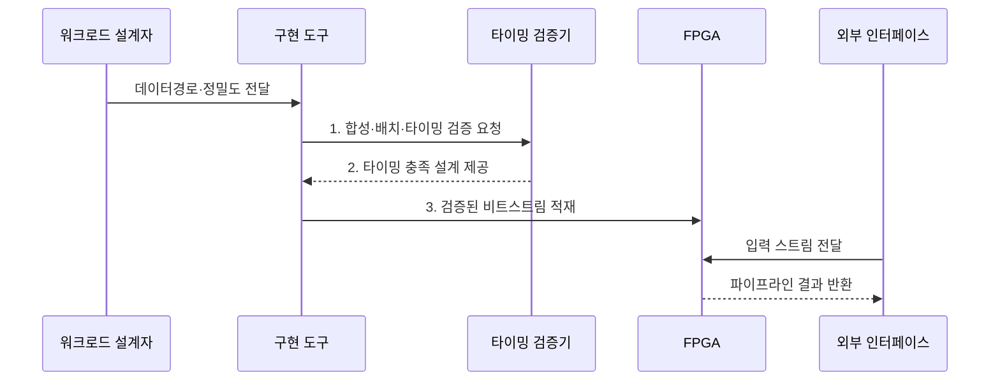

---
sidebar:
  order: 143
  label: "143. FPGA AI Acceleration (FPGA AI 가속)"
  badge:
    text: "기출 · 60%"
    variant: note
title: "FPGA AI Acceleration (FPGA AI 가속)"
date: "2026-07-31T08:50:34+09:00"
tags:
  - "notes-latest-tech"
weight: 143
extra:
  question_no: "143"
  source_status: "기출"
  source_history: "126회, 134회"
  priority: 60
  priority_note: "FPGA 재구성 가속·ASIC 비교가 반복 출제됨"
---

## 미리 알고가기

- **현장 프로그래머블 게이트 배열(Field-Programmable Gate Array, FPGA)**: 제조 후 논리·배선을 재구성하는 반도체
- **룩업 테이블(Look-Up Table, LUT)**: 논리 함수를 구현하는 FPGA 기본 블록
- **디지털 신호처리(Digital Signal Processing, DSP) 블록**: 곱셈·누산을 수행하는 전용 회로
- **블록 메모리(Block RAM, BRAM)**: FPGA 내부의 재구성 가능한 메모리
- **비트스트림(Bitstream)**: FPGA의 논리·배선·메모리 구성을 장치에 적재하는 설정 데이터

## Ⅰ. 개요

- 정의/개념: 재구성 논리로 AI 데이터경로를 구현하는 **FPGA 가속기**
- 배경/필요성: 범용 가속기의 **맞춤 데이터경로·결정적 지연** 확보 한계

### 쉽게 이해하기 (학습용)

- 작업 순서를 소프트웨어로 지시하는 대신 필요한 계산대와 통로 자체를 다시 배치해 입력이 쉬지 않고 흘러가게 만드는 공장과 같음

## Ⅱ. 특징

- **재구성 축**: 비트스트림 기반 논리·배선 변경
- **실행 축**: 연산 단계 동시 배치의 공간 파이프라인
- **절충 축**: 맞춤 지연·효율과 합성·타이밍 복잡성

### 쉽게 이해하기 (학습용)

- FPGA는 생산라인을 다시 만들 수 있지만 새 배치를 설계하고 모든 통로가 제시간에 연결되는지 확인하는 데 시간이 걸림

## Ⅲ. 구조 및 구성요소

| 구성요소 | 책임 |
|:---|:---|
| 재구성 로직 | **LUT 기반 연산·제어 경로** 구성 |
| 곱셈·누산 블록 | **DSP 병렬 곱셈·누산** 처리 |
| 온칩 메모리 | **BRAM 가중치·라인 버퍼** 저장 |
| 외부 인터페이스 | **데이터 스트림·호스트** 연결 |
| 구현 도구 | **비트스트림 합성·배치·배선** 변환 |

### 쉽게 이해하기 (학습용)

- 설계 도구가 계산대, 작은 창고, 통로를 연결하면 외부 입력이 정해진 순서대로 흐르는 생산라인이 만들어짐

## Ⅳ. 흐름도

1. **합성·배치·타이밍 검증 요청**: 논리 변환·클록 제약 판정
2. **타이밍 충족 설계 제공**: 자원·경로 제약을 만족한 설계 확정
3. **검증된 비트스트림 적재**: 회로 구성을 FPGA에 반영

### 쉽게 이해하기 (학습용)

- 계산 모양과 숫자 폭을 정하고 회로로 바꾼 뒤 모든 신호가 제한 시간 안에 도착하는지 확인해야 실제 장치에 새 생산라인을 올릴 수 있음

## Ⅴ. 종류 및 비교

| 가속기 | FPGA | GPU | ASIC |
|:---|:---|:---|:---|
| 적용 기준 | **재구성·결정적 지연** | **잦은 모델·연산 변경** | **안정된 대량 워크로드** |
| 핵심 특징 | **비트스트림 회로 재구성** | **소프트웨어 병렬 커널** | **제조 시 데이터경로 고정** |
| 한계 | **합성·타이밍 개발 복잡** | **전력·분기 오버헤드** | **높은 초기비·변경 불가** |

> 요약: **GPU**는 범용 변경, **FPGA**는 회로 재구성, ASIC은 고정

### 쉽게 이해하기 (학습용)

- GPU는 작업 지시를 바꾸고, FPGA는 생산라인을 다시 연결하며, ASIC은 한 제품을 가장 잘 만들도록 생산라인을 고정함

## Ⅵ. 실무 고려사항 및 대책

| 고려사항 | 대책 | 효과 |
|:---|:---|:---|
| 자원 초과로 **배치·배선 실패** | LUT·DSP·BRAM 예산 기반 설계 탐색 | 비트스트림 **구현 가능성** 확보 |
| 긴 조합 경로로 **타이밍 위반** | 파이프 단계 추가·클록 제약 검증 | 결정적 **처리 지연** 확보 |

### 쉽게 이해하기 (학습용)

- 보안 장비는 패킷이 멈추지 않게 검사 단계를 일렬로 연결하고, 비전 장비는 반복 곱셈과 가까운 영상 데이터를 칩 안에 배치함

## Ⅶ. 결론

- 잦은 변경은 **GPU**, 결정적 지연·재구성은 **FPGA** 선택

### 쉽게 이해하기 (학습용)

- 생산라인을 가끔 바꾸면서도 빠른 처리가 필요하면 FPGA가 맞고, 매일 바꾸면 GPU, 오래 고정하면 ASIC이 나음
