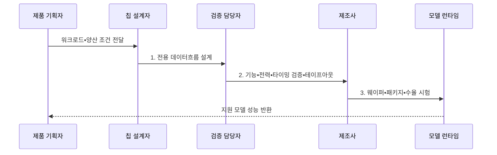

---
sidebar:
  order: 144
  label: "144. ASIC AI Acceleration (ASIC AI 가속)"
  badge:
    text: "기출 • 60%"
    variant: note
title: "ASIC AI Acceleration (ASIC AI 가속)"
date: "2026-08-04T14:37:04+09:00"
tags:
  - "notes-latest-tech"
weight: 144
extra:
  question_no: "144"
  source_status: "기출"
  source_history: "126회, 134회"
  priority: 60
  priority_note: "ASIC 전용 가속의 비용•유연성 비교가 반복됨"
---

## Ⅰ. 개요

핵심 용어

- **주문형 집적회로(Application-Specific Integrated Circuit, ASIC)**: 특정 연산과 데이터 흐름을 제조할 때 고정한 전용 반도체이다.
- **인공지능(Artificial Intelligence, AI)**: 학습한 모델로 인식•추론 작업을 수행하는 기술이다.
- **전용 데이터 흐름**: 특정 연산에 맞춰 데이터 이동과 재사용 경로를 하드웨어로 고정한 구조이다.

- 정의/개념: ASIC가 AI 연산•데이터 흐름을 제조 시 고정하는 **전용 하드웨어 가속 방식**
- 배경/필요성: 범용•재구성 회로에서 발생하는 **제어•배선 오버헤드** 때문에 전력 효율 제약

#### 한줄 요약

- 한 제품만 오래 대량 생산하도록 계산대와 운반 통로를 칩에 고정해 두는 전용 공장과 같음

## Ⅱ. 특징

핵심 용어

- **비반복 공학비(Non-Recurring Engineering, NRE)**: 설계•검증•마스크에 드는 일회성 개발비이다.
- **온칩 재사용**: 가중치와 중간값을 칩 내부에 유지해 외부 메모리 전송을 줄이는 방법이다.

- **구조 축**: 제어•배선을 제거한 전용 데이터흐름
- **효율 축**: 온칩 재사용으로 전력당 처리량 극대화
- **경제 축**: 양산량이 적거나 연산이 바뀌면 NRE 회수 곤란

#### 한줄 요약

- 전용 공장은 같은 제품을 가장 적은 전력으로 만들지만 제품 설계가 바뀌면 생산라인을 고치는 대신 새 칩을 설계해야 함

## Ⅲ. 구조 및 구성요소

핵심 용어

- **고정 연산 배열**: 특정 자료형과 연산을 병렬 처리하도록 제조 단계에서 배치한 회로이다.
- **데이터 연결망**: 연산 배열과 메모리 사이의 데이터 이동 경로를 제공하는 칩 내부 구조이다.

| 구성요소 | 책임 |
|:---|:---|
| 고정 연산 배열 | **특정 정밀도 전용 연산** 처리 |
| 온칩 메모리 | **근접 데이터•가중치** 저장 |
| 데이터 연결망 | **병렬 데이터 이동 경로** 고정 |
| 명령•제어기 | **외부 메모리•호스트 요청** 공급 |
| 전력 제어 | **연산 블록 전원•열** 관리 |

#### 한줄 요약

- 큰 창고의 재료를 작은 내부 창고에 가져오고 고정 통로로 계산대에 전달하며 전력과 열이 한도를 넘지 않게 관리함

## Ⅳ. 흐름도

핵심 용어

- **테이프아웃(Tape-out)**: 검증한 반도체 설계를 제조용 데이터로 확정하는 단계이다.
- **수율 시험**: 제조한 칩 중 기능•전력•성능 기준을 만족하는 비율과 결함을 확인하는 시험이다.

1. **전용 데이터흐름 설계**: 연산 배열•메모리•연결망 고정
2. **기능•전력•타이밍 검증•테이프아웃**: 제조 설계 확정
3. **웨이퍼•패키지•수율 시험**: 기준 통과 칩 선별

#### 한줄 요약

- 무엇을 몇 개나 얼마나 오래 만들지 정한 뒤 생산라인을 설계하고 검증 생산을 통과해야 실제 칩을 찍어 모델을 올릴 수 있음

## Ⅴ. 종류 및 비교

핵심 용어

- **그래픽 처리장치(Graphics Processing Unit, GPU)**: 소프트웨어로 다양한 병렬 연산을 바꿔 실행할 수 있는 범용 가속기이다.
- **현장 프로그래머블 게이트 배열(Field-Programmable Gate Array, FPGA)**: 제조 뒤에도 비트스트림으로 논리와 배선을 재구성할 수 있는 반도체이다.

ASIC, GPU, FPGA는 변경 가능성과 전력 효율이 다르다.

| 가속기 | ASIC | GPU | FPGA |
|:---|:---|:---|:---|
| 적용 기준 | **안정된 대량 워크로드** | **잦은 모델•연산 변경** | **고정 지연•회로 재구성** |
| 핵심 특징 | **제조 시 데이터경로 고정** | **소프트웨어 병렬 커널** | **비트스트림 회로 재구성** |
| 한계 | **높은 NRE•변경 불가** | **전력•분기 오버헤드** | **합성•타이밍 개발 복잡** |

> 요약: 그래픽 처리장치는 **변경**, 현장 프로그래머블 게이트 배열은 **재구성**, 주문형 집적회로는 **고정 연산** 중심

#### 한줄 요약

- 작업 지시를 자주 바꾸면 GPU, 생산라인을 다시 연결해야 하면 FPGA, 같은 제품을 오래 대량 생산하면 ASIC을 선택함

## Ⅵ. 실무 고려사항 및 대책

핵심 용어

- **워크로드 수명**: 전용 칩이 지원할 모델과 연산 구성이 유효하게 유지될 예상 기간이다.
- **손익분기점**: 누적 효율 절감액이 NRE와 제조 비용을 상쇄하는 생산량이나 사용 기간이다.

| 문제 | 대책 | 효과 |
|:---|:---|:---|
| 모델 변경으로 **고정 연산자** 무용화 | 워크로드 수명•연산 안정성 선검증 | 테이프아웃 후 **재설계 위험** 감소 |
| 낮은 생산량으로 **NRE 회수** 실패 | 예상 수량•수명 기반 손익분기 분석 | 전용 칩 **경제성 확보** |

#### 한줄 요약

- 카메라 칩은 자주 쓰는 영상 계산만 남긴 전용 회로로 전력을 줄이고, 데이터센터 칩은 같은 계산을 대량 배치해 큰 설계비를 나눠 부담함

## Ⅶ. 결론

핵심 용어

- **연산 안정성**: 제품 수명 동안 지원해야 할 모델 연산과 자료형이 크게 바뀌지 않는 성질이다.
- **양산량**: 높은 초기 개발비를 제품 단위로 분산할 수 있도록 생산하는 칩 수량이다.

- **연산 안정성•양산량별 선택**: NRE 회수 가능한 안정적 대량 작업은 ASIC, 잦은 변경은 GPU

#### 한줄 요약

- 같은 제품을 오래 많이 만들수록 ASIC이 유리하지만 제품이 자주 바뀌면 새 생산라인 비용 때문에 재구성 장비가 나음
