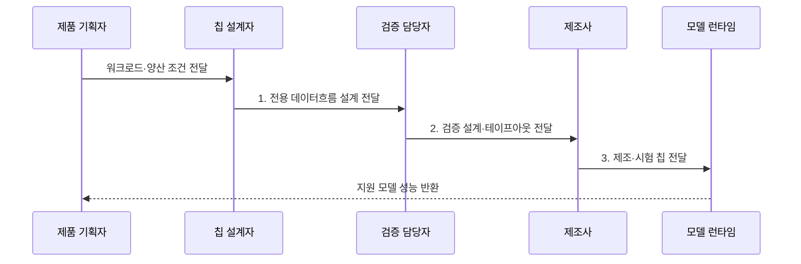

---
sidebar:
  order: 144
  label: "144. ASIC AI Acceleration (ASIC AI 가속)"
  badge:
    text: "기출 · 60%"
    variant: note
title: "ASIC AI Acceleration (ASIC AI 가속)"
date: "2026-07-31T08:51:08+09:00"
tags:
  - "notes-latest-tech"
weight: 144
extra:
  question_no: "144"
  source_status: "기출"
  source_history: "126회, 134회"
  priority: 60
  priority_note: "ASIC 전용 가속의 비용·유연성 비교가 반복됨"
---

## 미리 알고가기

- **주문형 집적회로(Application-Specific Integrated Circuit, ASIC)**: 특정 용도의 회로를 제조 시 고정한 반도체
- **비반복 공학비(Non-Recurring Engineering, NRE)**: 설계·검증·마스크에 드는 일회성 개발비
- **테이프아웃(Tape-out)**: 검증한 반도체 설계를 제조용 데이터로 확정하는 단계

## Ⅰ. 개요

- 정의/개념: AI 연산·데이터흐름을 제조 시 고정한 **ASIC 전용 칩**
- 배경/필요성: 범용·재구성 회로의 **제어·배선·전력 오버헤드** 제거 필요

### 쉽게 이해하기 (학습용)

- 한 제품만 오래 대량 생산하도록 계산대와 운반 통로를 칩에 고정해 두는 전용 공장과 같음

## Ⅱ. 특징

- **구조 축**: 제어·배선을 제거한 전용 데이터흐름
- **효율 축**: 온칩 재사용으로 전력당 처리량 극대화
- **경제 축**: 높은 NRE·개발기간과 변경 불가 절충

### 쉽게 이해하기 (학습용)

- 전용 공장은 같은 제품을 가장 적은 전력으로 만들지만 제품 설계가 바뀌면 생산라인을 고치는 대신 새 칩을 설계해야 함

## Ⅲ. 구조 및 구성요소

| 구성요소 | 책임 |
|:---|:---|
| 고정 연산 배열 | **특정 정밀도 전용 연산** 처리 |
| 온칩 메모리 | **근접 데이터·가중치** 저장 |
| 데이터 연결망 | **병렬 데이터 이동 경로** 고정 |
| 명령·제어기 | **외부 메모리·호스트 요청** 공급 |
| 전력 제어 | **연산 블록 전원·열** 관리 |

### 쉽게 이해하기 (학습용)

- 큰 창고의 재료를 작은 내부 창고에 가져오고 고정 통로로 계산대에 전달하며 전력과 열이 한도를 넘지 않게 관리함

## Ⅳ. 흐름도

1. **전용 데이터흐름 설계 전달**: 연산 배열·메모리·연결망 고정
2. **검증 설계·테이프아웃 전달**: 기능·전력·타이밍 검증
3. **제조·시험 칩 전달**: 웨이퍼·패키지·수율 시험 통과

### 쉽게 이해하기 (학습용)

- 무엇을 몇 개나 얼마나 오래 만들지 정한 뒤 생산라인을 설계하고 검증 생산을 통과해야 실제 칩을 찍어 모델을 올릴 수 있음

## Ⅴ. 종류 및 비교

| 가속기 | ASIC | GPU | FPGA |
|:---|:---|:---|:---|
| 적용 기준 | **안정된 대량 워크로드** | **잦은 모델·연산 변경** | **고정 지연·회로 재구성** |
| 핵심 특징 | **제조 시 데이터경로 고정** | **소프트웨어 병렬 커널** | **비트스트림 회로 재구성** |
| 한계 | **높은 NRE·변경 불가** | **전력·분기 오버헤드** | **합성·타이밍 개발 복잡** |

> 요약: **GPU**는 변경, **FPGA**는 재구성, ASIC은 고정 연산 중심

### 쉽게 이해하기 (학습용)

- 작업 지시를 자주 바꾸면 GPU, 생산라인을 다시 연결해야 하면 FPGA, 같은 제품을 오래 대량 생산하면 ASIC을 선택함

## Ⅵ. 실무 고려사항 및 대책

| 고려사항 | 대책 | 효과 |
|:---|:---|:---|
| 모델 변경으로 **고정 연산자** 무용화 | 워크로드 수명·연산 안정성 선검증 | 테이프아웃 후 **재설계 위험** 감소 |
| 낮은 생산량으로 **NRE 회수** 실패 | 예상 수량·수명 기반 손익분기 분석 | 전용 칩 **경제성 확보** |

### 쉽게 이해하기 (학습용)

- 카메라 칩은 자주 쓰는 영상 계산만 남긴 전용 회로로 전력을 줄이고, 데이터센터 칩은 같은 계산을 대량 배치해 큰 설계비를 나눠 부담함

## Ⅶ. 결론

- 안정적 대량·NRE 회수 가능은 **ASIC**, 잦은 변경은 **GPU** 선택

### 쉽게 이해하기 (학습용)

- 같은 제품을 오래 많이 만들수록 ASIC이 유리하지만 제품이 자주 바뀌면 새 생산라인 비용 때문에 재구성 장비가 나음
