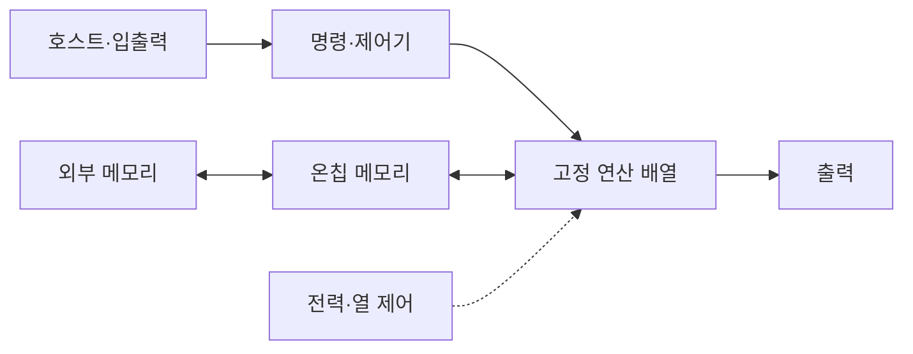

---
sidebar:
  order: 144
  label: "144. ASIC AI Acceleration (ASIC AI Acceleration)"
  badge:
    text: "기출 · 60%"
    variant: note
title: "ASIC AI Acceleration (ASIC AI Acceleration)"
date: "2026-07-27T23:59:59+09:00"
tags:
  - "notes-latest-tech"
weight: 144
extra:
  question_no: "144"
  source_status: "기출"
  source_history: "126회, 134회"
  priority: 60
  priority_note: "ASIC 전용 가속의 비용·유연성 비교가 반복됨"
---

## 미리 알고가기

- **주문형 집적회로(Application-Specific Integrated Circuit, ASIC)**: 특정 용도의 회로를 제조 시 고정한 반도체
- **비반복 공학비(Non-Recurring Engineering, NRE)**: 설계·검증·마스크에 드는 일회성 개발비
- **테이프아웃(Tape-out)**: 검증한 반도체 설계를 제조용 데이터로 확정하는 단계
- **비교 장치**: GPU는 소프트웨어 변경, FPGA는 비트스트림 회로 재구성 방식
- **ASIC 판단 요소**: GPU·FPGA보다 높은 전력·성능 효율을 얻을 수 있지만, NRE와 개발 기간이 크고 출시 후 변경이 어려움

## Ⅰ. 개요

- 정의/개념: AI 연산·데이터흐름을 제조 시 고정한 전용 칩
- 기존 한계: 범용·재구성 회로의 제어·배선 오버헤드가 큼

### 쉽게 이해하기 (학습용)

- 한 제품만 오래 대량 생산하도록 계산대와 운반 통로를 칩에 고정해 두는 전용 공장과 같음

## Ⅱ. 특징

- **전용 데이터흐름**: 불필요한 제어·배선을 제거한다
- **최고 효율**: 온칩 재사용으로 전력당 처리량을 높인다
- **NRE 상충**: 높은 초기비·개발기간과 변경 불가를 감수한다

### 쉽게 이해하기 (학습용)

- 전용 공장은 같은 제품을 가장 적은 전력으로 만들지만 제품 설계가 바뀌면 생산라인을 고치는 대신 새 칩을 설계해야 함

## Ⅲ. 구성요소 및 구조

| 설계 요소 | 설명 |
|:---|:---|
| 고정 연산 배열 | 특정 정밀도 연산 전용 회로 처리 |
| 온칩 메모리 | 연산기 근접 데이터·가중치 저장 |
| 데이터 연결망 | 연산자 간 병렬 데이터 이동 고정 |
| 명령·제어기 | 외부 메모리·호스트 요청 공급 |
| 전력 제어 | 연산 블록 전원·열 관리 |

> 요약: 메모리 공급과 고정 연산 배열로 데이터 흐름을 실행한다.

### 쉽게 이해하기 (학습용)

- 큰 창고의 재료를 작은 내부 창고에 가져오고 고정 통로로 계산대에 전달하며 전력과 열이 한도를 넘지 않게 관리함

## Ⅳ. 원리 및 절차 흐름도

| 절차 | 설명 |
|:---|:---|
| 워크로드·양산성확정 | 수량·수명·모델 변경 주기 결정 |
| 아키텍처·데이터흐름설계 | 연산·정밀도·메모리 배분 |
| 논리·물리구현 | RTL·합성·배치·배선 수행 |
| 검증·테이프아웃 | 기능·전력·타이밍 검증 |
| 제조·패키징·시험 | 웨이퍼·패키지·수율 검사 |
| 모델컴파일·배포 | 지원 연산으로 모델 변환 |

> 요약: 워크로드를 회로화하고 검증·제조해 모델을 배포한다.

### 쉽게 이해하기 (학습용)

- 무엇을 몇 개나 얼마나 오래 만들지 정한 뒤 생산라인을 설계하고 검증 생산을 통과해야 실제 칩을 찍어 모델을 올릴 수 있음

## Ⅴ. GPU·FPGA·ASIC 비교

| 비교 기준 | GPU | FPGA | ASIC |
|:---|:---|:---|:---|
| 적용 기준 | 모델·연산 변경이 잦을 때 | 고정 지연과 회로 변경이 필요할 때 | 안정된 워크로드를 대량 배치할 때 |
| 핵심 특징 | 소프트웨어 병렬 커널 | 비트스트림 회로 재구성 | 제조 시 데이터경로 고정 |
| 한계 | 전력·분기 오버헤드 | 합성·타이밍 개발 복잡 | 높은 NRE·변경 불가 |

> 요약: 변경 GPU, 재구성 FPGA, 고정 ASIC을 고른다.

### 쉽게 이해하기 (학습용)

- 작업 지시를 자주 바꾸면 GPU, 생산라인을 다시 연결해야 하면 FPGA, 같은 제품을 오래 대량 생산하면 ASIC을 선택함

## Ⅵ. 실무 사례

1. 엣지 카메라: **양자화 합성곱 경로**를 고정

### 쉽게 이해하기 (학습용)

- 카메라 칩은 자주 쓰는 영상 계산만 남긴 전용 회로로 전력을 줄이고, 데이터센터 칩은 같은 계산을 대량 배치해 큰 설계비를 나눠 부담함

## Ⅶ. 결론

- 고정 AI 연산의 전력 효율을 높이기 위해 **모델 안정성·생산 수량·NRE·정밀도·수명**을 검토하고, 장기 대량 워크로드가 초기 비용을 회수할 때 ASIC을 선택한다

### 쉽게 이해하기 (학습용)

- 같은 제품을 오래 많이 만들수록 ASIC이 유리하지만 제품이 자주 바뀌면 새 생산라인 비용 때문에 재구성 장비가 나음
