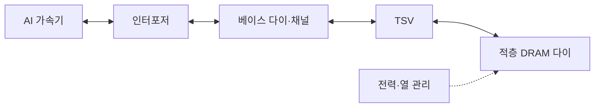

---
sidebar:
  order: 145
  label: "145. HBM 고대역폭 메모리 (High Bandwidth Memory)"
  badge:
    text: "기출 · 80%"
    variant: note
title: "HBM 고대역폭 메모리 (High Bandwidth Memory)"
date: "2026-07-27T23:59:59+09:00"
tags:
  - "notes-latest-tech"
weight: 145
extra:
  question_no: "145"
  source_status: "기출"
  source_history: "129회, 131회"
  priority: 80
  priority_note: "HBM 대역폭·패키징 비교가 AI 인프라 핵심임"
---

## 미리 알고가기

- **고대역폭 메모리(High Bandwidth Memory, HBM)**: 적층 DRAM과 초광폭 인터페이스를 쓰는 패키지 근접 메모리
- **실리콘 관통전극(Through-Silicon Via, TSV)**: 적층 다이의 신호·전원을 수직 연결하는 전극
- **동적 임의접근 메모리(Dynamic RAM, DRAM)**: 주기적 재충전이 필요한 휘발성 메모리
- **인터포저(Interposer)**: 가속기와 HBM을 넓고 짧게 연결하는 패키지 기판
- **그래픽 DDR(Graphics Double Data Rate, GDDR)**: 그래픽용 고속 보드 실장 메모리
- **DDR(Double Data Rate)**: 클록 양쪽 변에서 전송하는 범용 메모리
- **약어 읽기·표기**: HBM·TSV·DRAM·GDDR·DDR은 ‘에이치비엠·티에스브이·디램·지디디알·디디알’로 읽고 적층·수직 연결·메모리 유형을 구분함

## Ⅰ. 개요

- 정의/개념: 적층 DRAM·초광폭 채널 기반 고대역폭 메모리
- 기존 한계: 보드 메모리의 제한된 핀 폭은 가속기 공급 병목

### 쉽게 이해하기 (학습용)

- 멀리 있는 좁은 창고 문을 빠르게 여닫는 대신 계산기 옆에 층층이 쌓은 창고와 수많은 문을 두어 재료를 동시에 공급하는 것과 같음

## Ⅱ. 특징

- **수직 적층**: TSV가 여러 DRAM 다이를 짧게 연결한다
- **초광폭 채널**: 낮은 속도의 많은 핀으로 대역폭을 높인다
- **패키징 상충**: 근접 배치는 열·수율·비용 복잡도를 높인다

### 쉽게 이해하기 (학습용)

- 창고 층과 출입문을 늘리면 한꺼번에 더 많은 재료를 보내지만 공간이 좁아지고 열이 쌓이며 한 층의 불량이 전체 묶음 비용에 영향을 줌

## Ⅲ. 구성요소 및 구조

| 설계 요소 | 설명 |
|:---|:---|
| 적층 DRAM | 수직 적층 뱅크·저장 용량 구성 |
| TSV | 데이터·주소·전원 수직 전달 전극 |
| 인터포저 | 가속기-HBM 간 짧은 병렬 연결 |
| 독립 채널 | 요청 분산 및 병렬 접근 조정 |
| 열·전력 관리 | 온도·전력 밀도 패키지 한도 관리 |

> 요약: 인터포저와 독립 채널로 적층 메모리 대역폭을 높인다.

### 쉽게 이해하기 (학습용)

- 인터포저는 계산기와 다층 창고를 잇는 넓은 바닥 배선이고, 관통 전극은 창고 층을 세로로 잇는 승강로이며, 채널은 동시에 여는 출입문임

## Ⅳ. 원리 및 절차 흐름도

| 절차 | 설명 |
|:---|:---|
| 가속기메모리요청 | 연산기가 주소·명령 발행 |
| 채널·뱅크분산 | 요청을 독립 채널·뱅크에 배치 |
| 적층DRAM접근 | 선택 다이의 데이터 읽기·쓰기 |
| TSV·인터포저전송 | 수직·수평 경로로 데이터 전달 |
| 초광폭데이터공급 | 다수 채널을 병렬 전송 |

> 요약: 요청을 채널·뱅크에 분산해 적층 데이터를 공급한다.

### 쉽게 이해하기 (학습용)

- 계산기의 요청을 여러 창고 문과 선반에 나눠 보내고, 찾은 재료를 층간 승강로와 넓은 바닥 통로로 동시에 돌려보냄

## Ⅴ. HBM·GDDR·DDR 비교

| 비교 기준 | HBM | GDDR | DDR |
|:---|:---|:---|:---|
| 적용 기준 | 가속기가 대역폭에 제한될 때 | 그래픽·가속기의 비용 균형이 필요할 때 | 범용 서버의 용량 확장이 우선일 때 |
| 핵심 특징 | 적층·초광폭·패키지 근접 | 보드 실장·고속 핀 | 모듈·채널 기반 범용 메모리 |
| 한계 | 열·수율·패키징 비용 | 전력·핀 속도 부담 | 상대적으로 낮은 대역폭 |

> 요약: 대역폭 HBM, 비용 GDDR, 용량 DDR을 고른다.

### 쉽게 이해하기 (학습용)

- HBM은 계산기 옆 다층 창고, GDDR은 보드 위 빠른 창고, DDR은 멀지만 용량을 쉽게 늘리는 범용 창고에 가까움

## Ⅵ. 실무 사례

1. AI 학습: **채널 인터리빙**으로 코어 대기 축소
2. 대형 모델: **HBM·DDR 계층화**로 용량 보완

### 쉽게 이해하기 (학습용)

- 자주 쓰는 재료는 계산기 옆 HBM 창고의 여러 문에 나눠 두고, 공간이 모자라면 덜 쓰는 재료를 큰 DDR 창고에 보관했다가 미리 가져옴

## Ⅶ. 결론

- 대역폭 병목은 **HBM**, 용량·열 한계는 계층화

### 쉽게 이해하기 (학습용)

- 빠른 창고가 계산을 살리더라도 공간과 열 한계를 넘으면 큰 창고를 함께 쓰고 필요한 재료만 가까이 옮겨야 함
