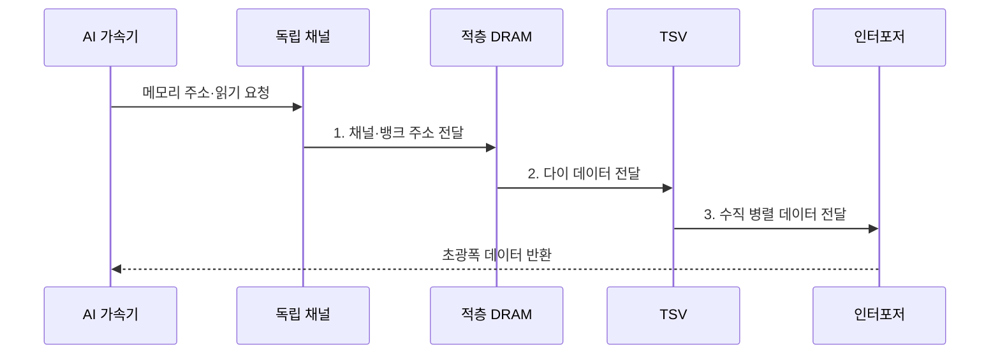

---
sidebar:
  order: 145
  label: "145. HBM (고대역폭 메모리)"
  badge:
    text: "기출 · 80%"
    variant: note
title: "HBM (고대역폭 메모리)"
date: "2026-07-31T12:05:07+09:00"
tags:
  - "notes-latest-tech"
weight: 145
extra:
  question_no: "145"
  source_status: "기출"
  source_history: "129회, 131회"
  priority: 80
  priority_note: "HBM 대역폭·패키징 비교가 AI 인프라 핵심임"
---

## 미리 알고가기

- **고대역폭 메모리(High Bandwidth Memory, HBM)**: 적층 DRAM과 초광폭 인터페이스를 쓰는 패키지 근접 메모리
- **실리콘 관통전극(Through-Silicon Via, TSV)**: 적층 다이의 신호·전원을 수직 연결하는 전극
- **동적 임의접근 메모리(Dynamic RAM, DRAM)**: 주기적 재충전이 필요한 휘발성 메모리
- **인터포저(Interposer)**: 가속기와 HBM을 넓고 짧게 연결하는 패키지 기판
- **그래픽 DDR(Graphics Double Data Rate, GDDR)**: 그래픽용 고속 보드 실장 메모리
- **DDR(Double Data Rate)**: 클록 양쪽 변에서 전송하는 범용 메모리

## Ⅰ. 개요

- 정의/개념: **적층 DRAM·초광폭 인터페이스** 기반 패키지 근접 메모리
- 배경/필요성: 보드 메모리의 제한된 **핀 폭**으로 가속기 데이터 공급 병목

### 쉽게 이해하기 (학습용)

- 멀리 있는 좁은 창고 문을 빠르게 여닫는 대신 계산기 옆에 층층이 쌓은 창고와 수많은 문을 두어 재료를 동시에 공급하는 것과 같음

## Ⅱ. 특징

- **적층 축**: TSV 기반 DRAM 다이 수직 연결
- **대역폭 축**: 다수 저속 핀의 초광폭 병렬 채널
- **패키지 축**: 근접 배치로 전송 전력은 감소하나 열·수율 비용 증가

### 쉽게 이해하기 (학습용)

- 창고 층과 출입문을 늘리면 한꺼번에 더 많은 재료를 보내지만 공간이 좁아지고 열이 쌓이며 한 층의 불량이 전체 묶음 비용에 영향을 줌

## Ⅲ. 구조 및 구성요소

| 구성요소 | 책임 |
|:---|:---|
| 적층 DRAM | **수직 적층 뱅크·저장 용량** 구성 |
| TSV | **데이터·주소·전원 수직 전달** |
| 인터포저 | **가속기-HBM 병렬 연결** |
| 독립 채널 | **요청 분산·병렬 접근** 조정 |
| 열·전력 관리 | **온도·전력 밀도 한도** 관리 |

### 쉽게 이해하기 (학습용)

- 인터포저는 계산기와 다층 창고를 잇는 넓은 바닥 배선이고, 관통 전극은 창고 층을 세로로 잇는 승강로이며, 채널은 동시에 여는 출입문임

## Ⅳ. 흐름도

1. **채널·뱅크 주소 전달**: 요청 분산·병렬 접근
2. **다이 데이터 전달**: 선택 DRAM 다이·뱅크 읽기
3. **수직 병렬 데이터 전달**: TSV·인터포저로 신호 전송

### 쉽게 이해하기 (학습용)

- 계산기의 요청을 여러 창고 문과 선반에 나눠 보내고, 찾은 재료를 층간 승강로와 넓은 바닥 통로로 동시에 돌려보냄

## Ⅴ. 종류 및 비교

| 메모리 | HBM | GDDR | DDR |
|:---|:---|:---|:---|
| 적용 기준 | **가속기 대역폭 병목** | **가속기 비용 균형** | **범용 서버 용량 확장** |
| 핵심 특징 | **적층·초광폭·패키지 근접** | **보드 실장·고속 핀** | **모듈·채널 기반 범용성** |
| 한계 | **열·수율·패키징 비용** | **전력·핀 속도 부담** | **상대적으로 낮은 대역폭** |

> 요약: **HBM**은 대역폭, **GDDR**은 비용, DDR은 용량 중심

### 쉽게 이해하기 (학습용)

- HBM은 계산기 옆 다층 창고, GDDR은 보드 위 빠른 창고, DDR은 멀지만 용량을 쉽게 늘리는 범용 창고에 가까움

## Ⅵ. 실무 고려사항 및 대책

| 고려사항 | 대책 | 효과 |
|:---|:---|:---|
| 불균형 접근으로 **채널 대역폭** 미활용 | 주소 인터리빙·뱅크 병렬 배치 | HBM **유효 대역폭** 향상 |
| 적층·근접 배치로 **열 밀도** 상승 | 열 경로·전력 제한·온도 감시 | 패키지 **성능 저하 방지** |

### 쉽게 이해하기 (학습용)

- 자주 쓰는 재료는 계산기 옆 HBM 창고의 여러 문에 나눠 두고, 공간이 모자라면 덜 쓰는 재료를 큰 DDR 창고에 보관했다가 미리 가져옴

## Ⅶ. 결론

- 대역폭 병목은 **HBM**, 용량·확장성 우선은 **DDR** 선택

### 쉽게 이해하기 (학습용)

- 빠른 창고가 계산을 살리더라도 공간과 열 한계를 넘으면 큰 창고를 함께 쓰고 필요한 재료만 가까이 옮겨야 함
