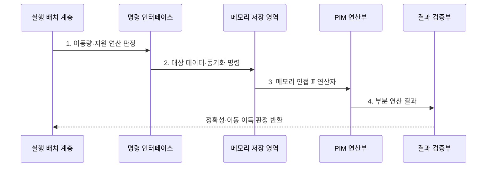

---
sidebar:
  order: 146
  label: "146. 메모리 내 처리 (Processing-in-Memory, PIM)"
  badge:
    text: "기출 · 70%"
    variant: note
title: "메모리 내 처리 (Processing-in-Memory, PIM)"
date: "2026-07-31T12:06:09+09:00"
tags:
  - "notes-latest-tech"
weight: 146
extra:
  question_no: "146"
  source_status: "기출"
  source_history: "129회, 131회"
  priority: 70
  priority_note: "PIM의 데이터 이동 절감 구조가 반복 출제됨"
---

## 미리 알고가기

- **메모리 내 처리(Processing-in-Memory, PIM)**: 메모리 내부 회로에서 연산해 데이터 이동을 줄이는 구조
- **메모리 근접 처리(Processing-Near-Memory, PNM)**: 메모리 옆 로직에서 연산해 이동 거리를 줄이는 구조
- **폰 노이만 병목(Von Neumann Bottleneck)**: 처리기·메모리 간 전송이 성능·전력을 제한하는 현상
- **PIM과 PNM**: PIM은 메모리 내부에서, PNM은 메모리 가까이에서 연산해 데이터 이동을 줄임

> **키워드:** 메모리 내 처리 (Processing-in-Memory, PIM)

## Ⅰ. 개요

- 정의/개념: 메모리 내부 연산으로 데이터 이동을 줄이는 **PIM 구조**
- 배경/필요성: 처리기·메모리 간 데이터 왕복으로 **지연·에너지 병목** 발생

### 쉽게 이해하기 (학습용)

- 모든 데이터를 처리기로 옮기지 않고 메모리 내부에서 계산해 결과만 전달한다.

## Ⅱ. 특징

- **이동 축**: 데이터가 위치한 메모리에서 연산해 전송량·전력 절감
- **배치 축**: 지원 명령·데이터만 메모리에 오프로딩
- **검증 축**: 정밀도·일관성·동기화 비용 확인

### 쉽게 이해하기 (학습용)

- 호스트와 명령을 주고받는 비용보다 데이터 운반을 줄이는 이득이 큰 작업에 적용한다.

## Ⅲ. 구조 및 구성요소

| 구성요소 | 책임 |
|:---|:---|
| 실행 배치 계층 | **호스트·PIM 실행 주체** 결정 |
| 명령 인터페이스 | **대상·연산·동기화 명령** 전달 |
| 메모리 저장 영역 | **연산 대상 데이터** 인근 배치 |
| PIM 연산부 | **지원 연산·부분 결과** 처리 |
| 결과 검증부 | **데이터 소유권·연산 오차** 확인 |

### 쉽게 이해하기 (학습용)

- 호스트가 지원 작업을 나누고 명령을 보내면 메모리 근처 연산부가 계산하고 검증부가 결과를 확인한다.

## Ⅳ. 흐름도

1. **이동량·지원 연산 판정**: 오프로딩 편익과 명령 지원 확인
2. **대상 데이터·동기화 명령**: 연산 대상과 소유권 경계 지정
3. **메모리 인접 피연산자**: 호스트 왕복 없이 데이터 공급
4. **부분 연산 결과**: 필터·벡터·누산의 지원 연산 수행

### 쉽게 이해하기 (학습용)

- 작업의 이동 비용을 분석해 이득이 있는 지원 연산만 메모리로 보내고 정확한 결과만 회수한다.

## Ⅴ. 종류 및 비교

| 메모리 연산 구조 | 셀 내부 PIM | 로직 계층 PIM | PNM |
|:---|:---|:---|:---|
| 적용 기준 | **단순 대량 연산·오차 허용** | **제한 명령의 정확 연산** | **유연한 메모리 집약 처리** |
| 핵심 특징 | **셀·감지회로 내 연산** | **메모리 로직 다이 연산** | **메모리 옆 처리기 연산** |
| 한계 | **소자 편차·변환 오차** | **명령·용량·열 제약** | **근거리 데이터 이동 잔존** |

> 요약: **셀 PIM**은 효율, **로직 PIM**은 정확 명령, PNM은 유연성

### 쉽게 이해하기 (학습용)

- 셀 연산은 효율과 오차, 로직 계층은 지원 명령, 메모리 근처 처리는 유연성과 이동량으로 선택한다.

## Ⅵ. 실무 고려사항 및 대책

| 고려사항 | 대책 | 효과 |
|:---|:---|:---|
| 오프로딩보다 큰 명령 비용 | 연산량 대비 **데이터 이동 절감량** 사전 측정 | 비효율 오프로딩 방지 |
| 셀 연산의 정밀도 오차 | 허용 오차·**결과 검증** 적용 | 계산 정확성 보존 |
| 호스트·PIM 데이터 불일치 | 소유권·동기화 **일관성 규칙** 정의 | 오래된 데이터 사용 방지 |

### 쉽게 이해하기 (학습용)

- 데이터 분석은 조건에 맞지 않는 행을 메모리에서 먼저 버려 호스트로 옮길 양을 줄인다.

## Ⅶ. 결론

- 단순 대량·이동 절감은 **PIM**, 유연한 근접 처리는 **PNM** 선택

### 쉽게 이해하기 (학습용)

- 데이터 운반을 줄인 이득이 명령·동기화 비용보다 크고 결과 오차가 허용 범위일 때만 PIM을 쓴다.
