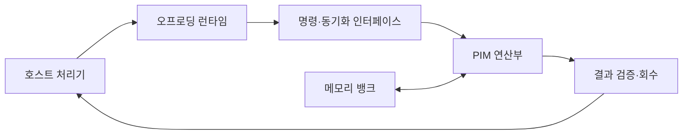

---
sidebar:
  order: 146
  label: "146. 메모리 내 처리 (Processing-in-Memory, PIM)"
  badge:
    text: "기출 · 70%"
    variant: note
title: "메모리 내 처리 (Processing-in-Memory, PIM)"
date: "2026-07-27T23:59:59+09:00"
tags:
  - "notes-latest-tech"
weight: 146
extra:
  question_no: "146"
  source_status: "기출"
  source_history: "129회, 131회"
  priority: 70
  priority_note: "PIM의 데이터 이동 절감 구조가 반복 출제됨"
---

## 미리 알고가기

- **메모리 내 처리(Processing-in-Memory, PIM)**: 메모리 내부 회로에서 연산해 데이터 이동을 줄이는 구조
- **메모리 근접 처리(Processing-Near-Memory, PNM)**: 메모리 옆 로직에서 연산해 이동 거리를 줄이는 구조
- **폰 노이만 병목(Von Neumann Bottleneck)**: 처리기·메모리 간 전송이 성능·전력을 제한하는 현상
- **PIM과 PNM**: PIM은 메모리 내부에서, PNM은 메모리 가까이에서 연산해 데이터 이동을 줄임

## Ⅰ. 개요

- 정의/개념: 메모리 내부 연산으로 데이터 이동을 줄이는 구조
- 기존 한계: 처리기·메모리 왕복이 지연·에너지 병목을 유발

### 쉽게 이해하기 (학습용)

- 모든 데이터를 처리기로 옮기지 않고 메모리 내부에서 계산해 결과만 전달한다.

## Ⅱ. 특징

- **이동 절감**: 데이터 위치에서 연산해 대역폭·전력을 줄인다
- **제한 오프로딩**: 지원 명령·데이터만 메모리로 보낸다
- **정확성 통제**: 정밀도·일관성·동기화 오버헤드를 검증한다

### 쉽게 이해하기 (학습용)

- 호스트와 명령을 주고받는 비용보다 데이터 운반을 줄이는 이득이 큰 작업에 적용한다.

## Ⅲ. 아키텍처 및 구성요소

| 설계 요소 | 설명 |
|:---|:---|
| 실행 배치 계층 | 호스트와 PIM 연산 실행 주체 결정 |
| 명령 인터페이스 | 데이터 대상·연산·동기화 명령 전달 |
| 메모리 저장 영역 | 연산 대상 데이터를 연산부 인근 배치 |
| PIM 연산부 | 지원 연산 수행 및 부분 결과 저장 |
| 결과 검증부 | 데이터 소유권과 연산 결과 오차 확인 |

> 요약: 실행 배치·명령·메모리 연산·결과 검증을 연결한다

### 쉽게 이해하기 (학습용)

- 호스트가 지원 작업을 나누고 명령을 보내면 메모리 근처 연산부가 계산하고 검증부가 결과를 확인한다.

## Ⅳ. 원리 및 절차 흐름도

| 절차 | 설명 |
|:---|:---|
| 이동량·지원연산분석 | 이동량·연산량·명령 확인 |
| 오프로딩 판정 | 지원 명령·이동 절감 확인 |
| 데이터·명령배치 | 대상 데이터와 명령 전달 |
| PIM연산·동기화 | 필터·벡터·누산 수행 |
| 정확성·이득검증 | 오차·일관성·전력 이득 확인 |
| 결과회수·호스트복귀 | 결과 전달·미지원 연산 수행 |

> 요약: 이동 이득을 판정해 연산하고 검증된 결과만 회수한다

### 쉽게 이해하기 (학습용)

- 작업의 이동 비용을 분석해 이득이 있는 지원 연산만 메모리로 보내고 정확한 결과만 회수한다.

## Ⅴ. 메모리 근접 연산 구조 비교

| 비교 기준 | 셀 내부 PIM | 로직 계층 PIM | PNM |
|:---|:---|:---|:---|
| 적용 기준 | 단순 대량 연산·오차 허용 시 | 제한 명령의 정확 연산 시 | 유연한 메모리 집약 처리 시 |
| 핵심 특징 | 셀·감지회로에서 연산 | 메모리 로직 다이에서 연산 | 메모리 옆 처리기에서 연산 |
| 한계 | 소자 편차·변환 오차 | 명령·용량·열 제약 | 근거리 데이터 이동 잔존 |

> 요약: 셀은 효율, 로직은 명령, 근처 연산은 유연성을 본다

### 쉽게 이해하기 (학습용)

- 셀 연산은 효율과 오차, 로직 계층은 지원 명령, 메모리 근처 처리는 유연성과 이동량으로 선택한다.

## Ⅵ. 실무 사례

1. 데이터 분석: **메모리 내 필터**로 전송량 절감

### 쉽게 이해하기 (학습용)

- 데이터 분석은 조건에 맞지 않는 행을 메모리에서 먼저 버려 호스트로 옮길 양을 줄인다.

## Ⅶ. 결론

- 데이터 이동 비용을 줄이기 위해 **연산 이동성·전송량·동기화·일관성·개발 비용**을 검토하고, 이동 절감 이득이 큰 연산에 PIM을 적용한다

### 쉽게 이해하기 (학습용)

- 데이터 운반을 줄인 이득이 명령·동기화 비용보다 크고 결과 오차가 허용 범위일 때만 PIM을 쓴다.
