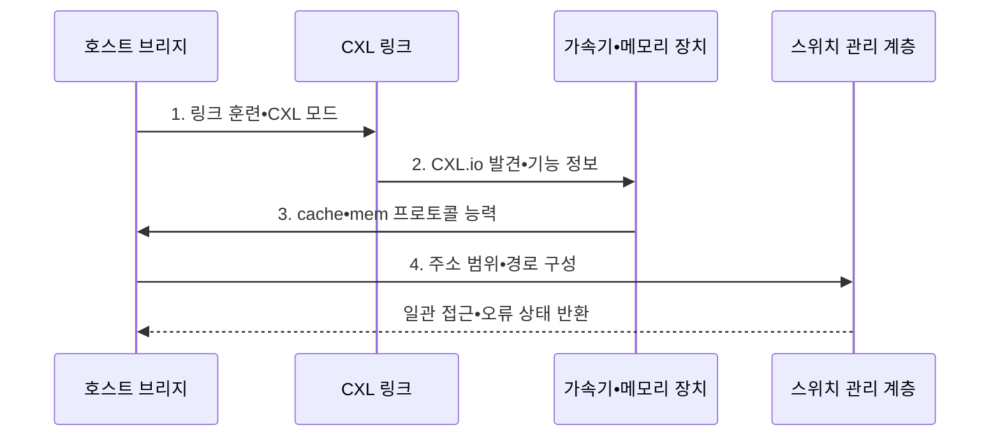

---
sidebar:
  order: 147
  label: "147. CXL (Compute Express Link)"
  badge:
    text: "기출 • 50%"
    variant: note
title: "CXL (Compute Express Link)"
date: "2026-08-05T02:18:09+09:00"
tags:
  - "notes-latest-tech"
weight: 147
extra:
  question_no: "147"
  source_status: "기출"
  source_history: "129회"
  priority: 50
  priority_note: "CXL 일관성•메모리 확장 설계가 유력함"
---

## Ⅰ. 개요

<details>
<summary>핵심 용어</summary>

- **컴퓨트 익스프레스 링크(Compute Express Link, CXL)**: PCIe 물리 계층에서 입출력과 캐시•메모리 일관성을 제공하는 연결 표준이다.
- **주변장치 상호연결 익스프레스(Peripheral Component Interconnect Express, PCIe)**: CXL이 공유하는 물리•전기 연결 기반이다.

</details>

- 정의/개념: **CXL** 은 **PCIe 물리 계층** 에서 입출력과 캐시•메모리 일관성을 제공하는 연결 표준
- 배경/필요성: PCIe의 명시적 복사로 장치 메모리의 **공유•일관성 유지** 가 제한됨

#### 한줄 요약

- PCIe로 장치를 찾고 장치 역할에 따라 캐시 공유와 메모리 접근 통로를 제공한다.

## Ⅱ. 특징

<details>
<summary>핵심 용어</summary>

- **CXL.io**: 장치 발견•설정•입출력을 담당하는 필수 프로토콜이다.
- **CXL.cache**: 장치가 호스트 메모리를 일관되게 캐시하도록 지원하는 프로토콜이다.
- **CXL.mem**: 호스트가 장치 메모리에 일관되게 접근하도록 지원하는 프로토콜이다.

</details>

**CXL** 은 입출력용 CXL.io, 호스트 캐시용 CXL.cache, 장치 메모리용 CXL.mem을 제공한다.

- **제어 축**: CXL.io로 장치 발견•설정•입출력 처리
- **캐시 축**: CXL.cache로 호스트 메모리 캐시 일관성 유지
- **메모리 축**: CXL.mem으로 장치 메모리 일관 접근

#### 한줄 요약

- 모든 장치는 공통 입구를 쓰고 가속기는 호스트 캐시를, 메모리 장치는 자신의 저장 공간을 공유한다.

## Ⅲ. 구조 및 구성요소

<details>
<summary>핵심 용어</summary>

- **호스트 브리지**: 프로세서의 메모리 체계와 CXL 장치 사이에서 주소•일관성 경계를 제공하는 구성요소이다.
- **CXL 메모리 장치**: 용량 확장•계층화•풀링을 위해 호스트가 CXL.mem으로 접근하는 메모리 자원이다.
- **스위치 관리 계층**: 여러 CXL 장치의 연결 경로•자원•오류 상태를 관리하는 계층이다.

</details>

**CXL 링크** 는 호스트 브리지와 가속기•메모리 장치를 연결한다.

```text
                 [호스트 브리지]
                        |
                    [CXL 링크]
                        |
             +----------+----------+
             |                     |
       [가속기 장치]          [메모리 장치]
             |                     |
             +----------+----------+
                        |
               [스위치 관리 계층]
```

선의 의미: 호스트 브리지와 CXL 링크 아래 가속기 장치 및 메모리 장치가 일관성 자원을 공유하고, 스위치 관리 계층이 경로•자원•오류 경계를 관리한다.

| 구성요소 | 책임 |
|:---|:---|
| 호스트 브리지 | **장치 발견•일관성 기준** 경계 |
| CXL 링크 | **CXL.io•cache•mem** 전송 경로 |
| 가속기 장치 | **캐시•장치 메모리 연산** 제공 |
| 메모리 장치 | **CXL.mem 확장 자원** 제공 |
| 스위치 관리 계층 | **경로•자원•오류 처리** 관리 |

#### 한줄 요약

- 호스트가 장치를 찾고 링크와 스위치가 유형별 캐시•메모리 경로와 오류 격리를 제공한다.

## Ⅳ. 흐름도

<details>
<summary>핵심 용어</summary>

- **링크 훈련**: 양 끝 장치가 물리 연결 속도•폭•동작 모드를 협상해 통신 경로를 여는 과정이다.
- **주소 범위 구성**: 호스트 주소 공간의 일부를 CXL 장치 메모리에 매핑하는 절차이다.

</details>



1. **링크 훈련•CXL 모드**: **PCIe 물리 경로** 와 동작 모드 협상
2. **CXL.io 발견•기능 정보**: 장치 식별자•오류 능력 확인
3. **cache•mem 프로토콜 능력**: 장치 유형별 지원 조합 판정
4. **주소 범위•경로 구성**: 호스트 주소 공간과 장치 메모리 연결

#### 한줄 요약

- 링크를 연 뒤 장치 유형을 확인하고 캐시•메모리 경로와 주소 범위를 설정해 일관되게 접근한다.

## Ⅴ. 종류 및 비교

<details>
<summary>핵심 용어</summary>

- **Type-1 장치**: CXL.io와 CXL.cache로 호스트 메모리를 캐시하는 가속기이다.
- **Type-2 장치**: CXL.io•CXL.cache•CXL.mem으로 호스트와 장치 메모리를 함께 사용하는 가속기이다.
- **Type-3 장치**: CXL.io와 CXL.mem으로 메모리 용량•대역폭을 확장하는 장치이다.

</details>

**CXL Type-1•2•3 장치** 는 캐시와 메모리 프로토콜 지원 조합이 다르다.

| CXL 장치 유형 | Type-1 장치 | Type-2 장치 | Type-3 장치 |
|:---|:---|:---|:---|
| 적용 기준 | **호스트 메모리 캐시 가속** | **장치 메모리 보유 가속** | **메모리 용량•대역폭 확장** |
| 핵심 특징 | **CXL.io•cache** | **CXL.io•cache•mem** | **CXL.io•mem** |
| 한계 | **장치 메모리 없음** | **일관성•주소 관리 복잡** | **로컬 메모리보다 높은 지연** |

> 요약: **Type-1•2** 는 가속기, **Type-3** 은 메모리 확장 중심

#### 한줄 요약

- 호스트 메모리만 캐시하면 Type-1, 장치 메모리도 쓰면 Type-2, 메모리 확장 전용이면 Type-3이다.

## Ⅵ. 실무 고려사항 및 대책

<details>
<summary>핵심 용어</summary>

- **메모리 계층 배치**: 접근 빈도와 지연 요구에 따라 데이터를 로컬•확장 메모리에 나누어 두는 방법이다.
- **오류 격리**: 한 주소 범위나 장치의 장애가 다른 공유 자원으로 퍼지지 않게 차단하는 통제이다.

</details>

| 문제 | 대책 | 효과 |
|:---|:---|:---|
| 장치 유형•프로토콜 불일치 | Type별 **CXL.io•cache•mem 조합** 검증 | 미지원 경로 구성 방지 |
| 원격 메모리 지연 증가 | 접근 빈도별 **메모리 계층 배치** | 로컬•확장 메모리 균형 |
| 공유 주소 오류 확산 | 범위별 **오류 격리•복구** 설계 | 일관성 장애 확산 제한 |

#### 한줄 요약

- Type-2 가속기는 호스트 메모리를 일관되게 캐시하면서 자신의 메모리도 연산에 사용한다.

## Ⅶ. 결론

<details>
<summary>핵심 용어</summary>

- **캐시 일관성**: 여러 처리기와 장치의 캐시가 같은 메모리 위치에 대해 모순 없는 값을 유지하는 성질이다.
- **메모리 확장**: 컴퓨트 익스프레스 링크 장치를 호스트 주소 공간에 연결해 사용 가능한 용량과 대역폭을 늘리는 방식이다.

</details>

- **CXL** 기반 호스트 메모리 가속은 **Type-1•2**, 용량 확장은 **Type-3** 선택

#### 한줄 요약

- 장치 유형에 맞는 프로토콜을 고르고 주소 매핑•일관성•오류 격리를 설계해야 안전하게 확장할 수 있다.
