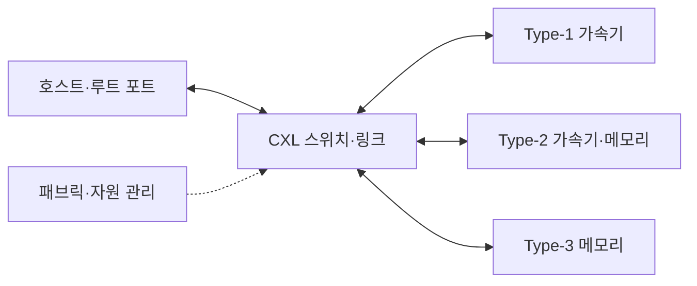

---
sidebar:
  order: 147
  label: "147. CXL (Compute Express Link)"
  badge:
    text: "기출 · 50%"
    variant: note
title: "CXL (Compute Express Link)"
date: "2026-07-27T23:59:59+09:00"
tags:
  - "notes-latest-tech"
weight: 147
extra:
  question_no: "147"
  source_status: "기출"
  source_history: "129회"
  priority: 50
  priority_note: "CXL 일관성·메모리 확장 설계가 유력함"
---

## 미리 알고가기

- **컴퓨트 익스프레스 링크(Compute Express Link, CXL)**: PCIe 물리 계층에서 캐시·메모리 일관성을 제공하는 연결 표준
- **주변장치 상호연결 익스프레스(Peripheral Component Interconnect Express, PCIe)**: CXL이 공유하는 물리·전기 연결 기반
- **CXL.io**: 장치 발견·설정·입출력을 담당하는 필수 프로토콜
- **CXL.cache**: 장치가 호스트 메모리를 일관되게 캐시하는 프로토콜
- **CXL.mem**: 호스트가 장치 메모리에 일관되게 접근하는 프로토콜
- **약어·표기 읽기**: CXL·PCIe는 ‘시엑스엘·피시아이 익스프레스’로 읽고, 점 표기는 CXL의 io·cache·mem 기능 구분을 뜻함
- **유형 읽기**: Type-1·2·3은 ‘타입 원·투·스리’로 읽고 장치의 캐시·메모리 역할 조합을 구분함

## Ⅰ. 개요

- 정의/개념: PCIe 기반 입출력·캐시·메모리 일관 연결 표준
- 기존 한계: PCIe는 장치 메모리의 명시적 복사 비용 발생

### 쉽게 이해하기 (학습용)

- PCIe로 장치를 찾고 장치 역할에 따라 캐시 공유와 메모리 접근 통로를 제공한다.

## Ⅱ. 특징

- **CXL.io**: 모든 장치의 발견·설정·입출력을 담당한다
- **CXL.cache**: 장치의 호스트 메모리 캐시를 일관시킨다
- **CXL.mem**: 호스트의 장치 메모리 접근을 일관시킨다

### 쉽게 이해하기 (학습용)

- 모든 장치는 공통 입구를 쓰고 가속기는 호스트 캐시를, 메모리 장치는 자신의 저장 공간을 공유한다.

## Ⅲ. 아키텍처 및 구성요소

| 설계 요소 | 설명 |
|:---|:---|
| 호스트 브리지 | 장치 발견 및 일관성 기준 프로세서 측 경계 |
| CXL 링크 | CXL.io·cache·mem 프로토콜 전송 경로 |
| Type-1 가속기 | 호스트 메모리를 캐시하는 가속기 |
| Type-2 가속기 | 호스트 캐시와 장치 메모리를 쓰는 가속기 |
| Type-3 장치 | 호스트 주소 공간용 메모리 확장 자원 |
| 스위치 관리 계층 | 경로 제어, 자원 구성 및 오류 처리 담당 |

> 요약: 호스트·링크·장치·스위치가 일관된 메모리를 잇는다

### 쉽게 이해하기 (학습용)

- 호스트가 장치를 찾고 링크와 스위치가 유형별 캐시·메모리 경로와 오류 격리를 제공한다.

## Ⅳ. 원리 및 절차 흐름도

| 절차 | 설명 |
|:---|:---|
| 링크훈련·모드협상 | 물리 링크·동작 모드 결정 |
| CXL.io장치발견 | 식별자·기능·오류 능력 확인 |
| 장치유형·기능판정 | 프로토콜 조합 확인 |
| cache·mem경로설정 | 캐시·메모리 경로 활성화 |
| 주소·메모리범위매핑 | 호스트 주소 공간 연결 |
| 일관접근·오류처리 | 일관성 유지·오류 격리 |

> 요약: 장치를 발견해 유형별 경로·주소·오류 처리를 설정한다

### 쉽게 이해하기 (학습용)

- 링크를 연 뒤 장치 유형을 확인하고 캐시·메모리 경로와 주소 범위를 설정해 일관되게 접근한다.

## Ⅴ. CXL 장치 유형 비교

| 비교 기준 | Type-1 장치 | Type-2 장치 | Type-3 장치 |
|:---|:---|:---|:---|
| 적용 기준 | 호스트 메모리 캐시 가속 시 | 장치 메모리 보유 가속 시 | 메모리 용량·대역폭 확장 시 |
| 핵심 특징 | CXL.io·cache | CXL.io·cache·mem | CXL.io·mem |
| 한계 | 장치 메모리 없음 | 일관성·주소 관리 복잡 | 로컬 메모리보다 높은 지연 |

> 요약: 캐시·겸용·확장을 Type-1·2·3으로 구분한다

### 쉽게 이해하기 (학습용)

- 호스트 메모리만 캐시하면 Type-1, 장치 메모리도 쓰면 Type-2, 메모리 확장 전용이면 Type-3이다.

## Ⅵ. 실무 사례

1. AI 가속기: **Type-2**로 호스트·장치 메모리 연결

### 쉽게 이해하기 (학습용)

- Type-2 가속기는 호스트 메모리를 일관되게 캐시하면서 자신의 메모리도 연산에 사용한다.

## Ⅶ. 결론

- 서버 메모리와 장치 접근을 확장하기 위해 **지연·대역폭·일관성·공유 범위·장치 유형**을 검토하고, 가속기는 Type-1·2, 메모리 확장은 Type-3 CXL을 선택한다

### 쉽게 이해하기 (학습용)

- 장치 유형에 맞는 프로토콜을 고르고 주소 매핑·일관성·오류 격리를 설계해야 안전하게 확장할 수 있다.
