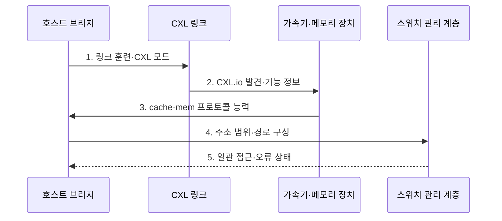

---
sidebar:
  order: 147
  label: "147. CXL (Compute Express Link)"
  badge:
    text: "기출 · 50%"
    variant: note
title: "CXL (Compute Express Link)"
date: "2026-07-27T23:59:59+09:00"
tags:
  - "notes-latest-tech"
weight: 147
extra:
  question_no: "147"
  source_status: "기출"
  source_history: "129회"
  priority: 50
  priority_note: "CXL 일관성·메모리 확장 설계가 유력함"
---

## 미리 알고가기

- **컴퓨트 익스프레스 링크(Compute Express Link, CXL)**: PCIe 물리 계층에서 캐시·메모리 일관성을 제공하는 연결 표준
- **주변장치 상호연결 익스프레스(Peripheral Component Interconnect Express, PCIe)**: CXL이 공유하는 물리·전기 연결 기반
- **CXL.io**: 장치 발견·설정·입출력을 담당하는 필수 프로토콜
- **CXL.cache**: 장치가 호스트 메모리를 일관되게 캐시하는 프로토콜
- **CXL.mem**: 호스트가 장치 메모리에 일관되게 접근하는 프로토콜
- **CXL 프로토콜**: PCIe 물리 계층 위에서 CXL.io는 장치 제어, CXL.cache는 캐시 일관성, CXL.mem은 호스트의 장치 메모리 접근을 담당함
- **장치 유형**: Type-1은 캐시, Type-2는 캐시와 메모리, Type-3은 메모리 기능을 제공함

## Ⅰ. 개요

- 정의/개념: PCIe 기반 입출력·캐시·메모리 일관 연결 표준
- 배경/필요성: PCIe 장치 메모리의 **명시적 복사·일관성 비용** 완화 필요

### 쉽게 이해하기 (학습용)

- PCIe로 장치를 찾고 장치 역할에 따라 캐시 공유와 메모리 접근 통로를 제공한다.

## Ⅱ. 특징

- **CXL.io**: 모든 장치의 발견·설정·입출력을 담당한다
- **CXL.cache**: 장치의 호스트 메모리 캐시를 일관시킨다
- **CXL.mem**: 호스트의 장치 메모리 접근을 일관시킨다

### 쉽게 이해하기 (학습용)

- 모든 장치는 공통 입구를 쓰고 가속기는 호스트 캐시를, 메모리 장치는 자신의 저장 공간을 공유한다.

## Ⅲ. 구조 및 구성요소

| 구성요소 | 책임 |
|:---|:---|
| 호스트 브리지 | 장치 발견 및 일관성 기준 프로세서 측 경계 |
| CXL 링크 | CXL.io·cache·mem 프로토콜 전송 경로 |
| 가속기 장치 | CXL.cache·mem 조합으로 연산·장치 메모리 제공 |
| 메모리 장치 | 호스트 주소 공간용 CXL.mem 확장 자원 |
| 스위치 관리 계층 | 경로 제어, 자원 구성 및 오류 처리 담당 |

### 쉽게 이해하기 (학습용)

- 호스트가 장치를 찾고 링크와 스위치가 유형별 캐시·메모리 경로와 오류 격리를 제공한다.

## Ⅳ. 흐름도

1. **링크 훈련·CXL 모드**: PCIe 물리 경로와 동작 모드 협상
2. **CXL.io 발견·기능 정보**: 장치 식별자·오류 능력 확인
3. **cache·mem 프로토콜 능력**: 장치 유형별 지원 조합 판정
4. **주소 범위·경로 구성**: 호스트 주소 공간과 장치 메모리 연결
5. **일관 접근·오류 상태**: 캐시 일관성 유지와 장애 격리

### 쉽게 이해하기 (학습용)

- 링크를 연 뒤 장치 유형을 확인하고 캐시·메모리 경로와 주소 범위를 설정해 일관되게 접근한다.

## Ⅴ. 종류 및 비교

| CXL 장치 유형 | Type-1 장치 | Type-2 장치 | Type-3 장치 |
|:---|:---|:---|:---|
| 적용 기준 | 호스트 메모리 캐시 가속 시 | 장치 메모리 보유 가속 시 | 메모리 용량·대역폭 확장 시 |
| 핵심 특징 | CXL.io·cache | CXL.io·cache·mem | CXL.io·mem |
| 한계 | 장치 메모리 없음 | 일관성·주소 관리 복잡 | 로컬 메모리보다 높은 지연 |

> 요약: 캐시·겸용·확장을 Type-1·2·3으로 구분한다

### 쉽게 이해하기 (학습용)

- 호스트 메모리만 캐시하면 Type-1, 장치 메모리도 쓰면 Type-2, 메모리 확장 전용이면 Type-3이다.

## Ⅵ. 실무 고려사항 및 대책

| 고려사항 | 대책 | 효과 |
|:---|:---|:---|
| 장치 유형·프로토콜 불일치 | Type별 **CXL.io·cache·mem** 조합 검증 | 미지원 경로 구성 방지 |
| 원격 메모리 지연 증가 | 접근 빈도별 **메모리 계층 배치** | 로컬·확장 메모리 균형 |
| 공유 주소 오류 확산 | 범위별 **오류 격리·복구** 설계 | 일관성 장애 확산 제한 |

### 쉽게 이해하기 (학습용)

- Type-2 가속기는 호스트 메모리를 일관되게 캐시하면서 자신의 메모리도 연산에 사용한다.

## Ⅶ. 결론

- 서버 메모리와 장치 접근을 확장하기 위해 **지연·대역폭·일관성·공유 범위·장치 유형**을 검토하고, 가속기는 Type-1·2, 메모리 확장은 Type-3 CXL을 선택한다

### 쉽게 이해하기 (학습용)

- 장치 유형에 맞는 프로토콜을 고르고 주소 매핑·일관성·오류 격리를 설계해야 안전하게 확장할 수 있다.
