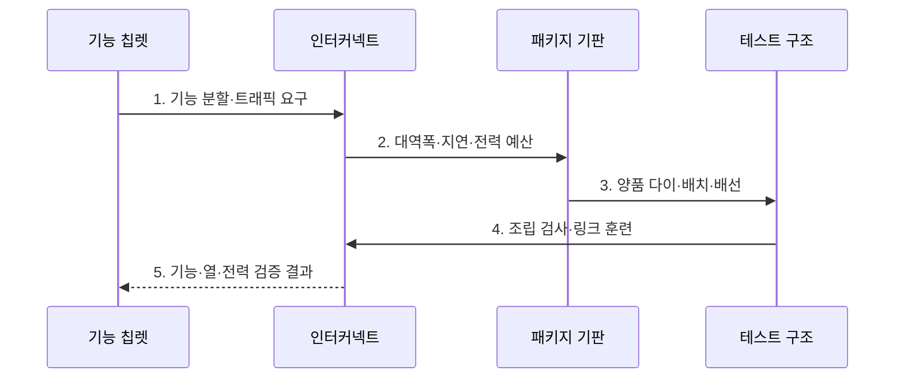

---
sidebar:
  order: 148
  label: "148. 칩렛 (Chiplet)"
  badge:
    text: "기출 · 70%"
    variant: note
title: "칩렛 (Chiplet)"
date: "2026-07-27T23:59:59+09:00"
tags:
  - "notes-latest-tech"
weight: 148
extra:
  question_no: "148"
  source_status: "기출"
  source_history: "131회"
  priority: 70
  priority_note: "칩렛 분할·수율·상호연결 비교가 유력함"
---

## 미리 알고가기

- **칩렛 (Chiplet)**: 거대 칩을 기능별 다이로 분할하고 패키지에서 재연결하는 설계 방식
- **제조 수율**: 결함 면적을 최소화해 개별 다이 수율과 선별 사용성을 높임
- **인터커넥트 지연**: 다이 간 고속 배선에 따른 지연과 패키징 복잡도가 주요 제약임

## Ⅰ. 개요

- 정의/개념: 기능별 **다이**를 패키지 링크로 결합하는 반도체 설계
- 배경/필요성: 대형 단일 다이의 **수율·공정 선택·재사용** 한계

### 쉽게 이해하기 (학습용)

- 큰 칩을 기능별 작은 부품으로 따로 만들고 패키지 안의 전용 배선으로 다시 조립한다.

## Ⅱ. 특징

> 다이 면적이 커질수록 파란 상대 수율 선이 지수적으로 낮아져 작은 다이 분할의 근거가 되며, 결함 밀도 $D_0=0.005/mm^2$를 가정한 모형값이지 실공정 수율은 아니다.

- 소형 다이 기반 **제조 수율 개선**
- 기능별 공정 선택과 **검증 다이 재사용**
- 분할 증가에 따른 **링크·패키징 비용**

### 쉽게 이해하기 (학습용)

- 작은 다이는 선별과 공정 선택이 쉽지만 너무 잘게 나누면 연결 지연과 조립·검사 비용이 커진다.

## Ⅲ. 구조 및 구성요소

| 구성요소 | 책임 |
|:---|:---|
| 기능 칩렛 | 연산·입출력·메모리 제어 독립 다이 |
| 인터커넥트 | 다이 간 데이터·제어 전송 경로 |
| 패키지 기판 | 칩렛 배치 및 전력·열 전달 물리 경계 |
| 시스템 관리기 | 순서·전력·오류 상태 통합 조정 |
| 테스트 구조 | 양품 선별 및 시스템 진단 경로 |

### 쉽게 이해하기 (학습용)

- 기능 칩렛을 링크와 기판으로 연결하고 시스템 관리와 시험 구조가 전력·열·오류를 함께 통제한다.

## Ⅳ. 흐름도

1. **기능 분할·트래픽 요구**: 응집도·재사용·수율로 다이 경계 결정
2. **대역폭·지연·전력 예산**: 다이 간 통신 링크 사양 산정
3. **양품 다이·배치·배선**: 공정별 선별 다이를 패키지에 공동 설계
4. **조립 검사·링크 훈련**: 연결 결함과 링크 특성 확인
5. **기능·열·전력 검증 결과**: 통합 패키지 수율·성능 판정

### 쉽게 이해하기 (학습용)

- 수율과 재사용을 기준으로 다이를 나누고 링크·전력·열 예산에 맞춰 양품 다이를 조립해 검증한다.

## Ⅴ. 종류 및 비교

| 반도체 통합 방식 | 칩렛 SiP | 모놀리식 SoC | 보드 다중 칩 |
|:---|:---|:---|:---|
| 적용 기준 | 공정 혼합·재사용 | 면적·지연 최우선 | 교체·단순 구성 |
| 핵심 특징 | 패키지 내 다이 링크 | 단일 다이 기능 통합 | 보드 기반 부품 연결 |
| 한계 | 링크·패키지·열 복잡성 | 대형 다이 수율·비용 | 거리·전력·대역폭 한계 |

> 요약: 지연은 SoC, 공정 혼합은 칩렛, 교체는 보드를 택한다

### 쉽게 이해하기 (학습용)

- 최소 지연은 단일 SoC, 공정 혼합·재사용은 칩렛, 쉬운 부품 교체는 보드 다중 칩이 알맞다.

## Ⅵ. 실무 고려사항 및 대책

| 고려사항 | 대책 | 효과 |
|:---|:---|:---|
| 분할로 다이 간 트래픽 증가 | 응집도 기반 경계·**링크 예산** 설계 | 통신 병목 감소 |
| 조립 후 수율 저하 | Known Good Die·**조립 전 선별** 적용 | 불량 패키지 손실 축소 |
| 칩렛별 열 집중 | 기판 배치·**열 경로 공동 설계** | 핫스폿 완화 |

### 쉽게 이해하기 (학습용)

- 연산 다이는 미세 공정으로 성능을 높이고 입출력 다이는 성숙 공정으로 비용을 줄인다.

## Ⅶ. 결론

- 칩 수율과 공정 선택을 최적화하기 위해 **다이별 공정·수율·링크 대역폭·열·조립·시험 비용**을 검토하고, 분할 이득이 패키징 비용보다 클 때 칩렛을 적용한다.

### 쉽게 이해하기 (학습용)

- 개별 다이 수율만 보지 않고 조립·링크·시험을 포함한 최종 패키지 수율과 비용으로 칩렛을 선택한다.
