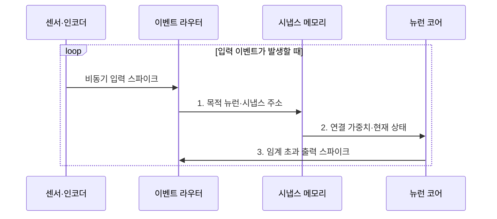

---
sidebar:
  order: 149
  label: "149. 뉴로모픽 컴퓨팅 (Neuromorphic Computing)"
  badge:
    text: "기출 · 30%"
    variant: note
title: "뉴로모픽 컴퓨팅 (Neuromorphic Computing)"
date: "2026-07-31T08:54:42+09:00"
tags:
  - "notes-latest-tech"
weight: 149
extra:
  question_no: "149"
  source_status: "기출"
  source_history: "128회"
  priority: 30
  priority_note: "뉴로모픽은 특화 구조이나 최근 반복성이 낮음"
---

## Ⅰ. 개요

핵심 용어

- **뉴로모픽 컴퓨팅(Neuromorphic Computing, NC)**: 인간 뇌의 신경망 구조와 스파이크 처리 방식을 모방한 비폰노이만형 컴퓨팅이다.
- **스파이킹 신경망(Spiking Neural Network, SNN)**: 이산 스파이크의 발생 시점과 내부 상태로 정보를 처리하는 신경망이다.

- 정의/개념: **뉴로모픽 컴퓨팅**은 인간 뇌의 신경망 구조를 모방해 스파이크로 뉴런·시냅스 상태를 갱신하는 비폰노이만형 컴퓨팅
- 배경/필요성: 밀집 연산의 **희소 센서 이벤트·초저전력 처리** 한계

### 쉽게 이해하기 (학습용)

- 모든 센서를 계속 확인하지 않고 변화가 생긴 센서만 신호를 보내 필요한 뉴런을 깨운다.

## Ⅱ. 특징

핵심 용어

- **이벤트 기반 처리**: 입력 변화가 발생한 시점에 관련 연산만 수행해 전력 소모를 줄이는 방식이다.
- **비동기 연산**: 공통 클록의 고정 주기보다 개별 이벤트 도착에 따라 실행되는 연산 방식이다.

- **활성 축**: 이벤트 발생 뉴런만 비동기 연산
- **배치 축**: 시냅스 인접 저장·스파이크 라우팅
- **한계 축**: 이벤트 혼잡·ANN-SNN 변환 오차

### 쉽게 이해하기 (학습용)

- 평소에는 쉬다가 신호가 몰리면 통로가 붐비며 기존 모델을 스파이크로 바꿀 때 정확도가 달라질 수 있다.

## Ⅲ. 구조 및 구성요소

핵심 용어

- **시냅스 메모리**: 뉴런 사이의 연결 강도와 학습 상태를 저장하는 메모리이다.
- **이벤트 라우터**: 발생한 스파이크를 목적 뉴런으로 비동기 전달하는 연결 구조이다.

| 구성요소 | 책임 |
|:---|:---|
| 센서·인코더 | **입력 변화·스파이크** 변환 |
| 시냅스 메모리 | **연결 강도·상태** 저장 |
| 뉴런 코어 | **입력 누적·임계값 발화** 판정 |
| 이벤트 라우터 | **발화 신호 비동기 전달** |
| 외부 인터페이스 | **가중치 갱신·모델 배치** 제어 |

### 쉽게 이해하기 (학습용)

- 센서가 변화를 스파이크로 만들면 라우터가 뉴런에 전달하고 시냅스 가중치와 상태로 발화를 판단한다.

## Ⅳ. 흐름도

핵심 용어

- **막전위**: 뉴런이 입력 스파이크를 누적해 발화 여부를 판단하는 내부 상태값이다.
- **발화 임계값**: 누적된 뉴런 상태가 출력 스파이크를 생성하도록 정한 기준값이다.

1. **목적 뉴런·시냅스 주소**: 연결 대상에 이벤트 전달
2. **연결 가중치·현재 상태**: 입력 누적·막전위 갱신
3. **임계 초과 출력 스파이크**: 발화 뉴런만 후속 전파

### 쉽게 이해하기 (학습용)

- 변화 신호가 목적 뉴런의 상태를 누적하고 임계값을 넘은 뉴런만 다음 스파이크를 보낸다.

## Ⅴ. 종류 및 비교

핵심 용어

- **인공신경망(Artificial Neural Network, ANN)**: 연속 활성값과 밀집 텐서 연산을 주로 사용하는 신경망이다.
- **엣지 MCU**: 센서 가까이에서 소형 제어와 경량 추론을 수행하는 저전력 마이크로컨트롤러이다.

| 에지 계산 방식 | 뉴로모픽 | GPU AI | 엣지 MCU |
|:---|:---|:---|:---|
| 적용 기준 | **초저전력 희소 이벤트** | **범용·정확도 우선** | **소형 단순 제어** |
| 핵심 특징 | **스파이크 이벤트 연산** | **밀집 텐서 병렬 연산** | **순차 제어·경량 추론** |
| 한계 | **도구·학습 생태계 부족** | **전력·메모리 비용** | **모델 크기·처리량 제한** |

> 요약: **뉴로모픽**은 희소 이벤트, **GPU**는 범용 AI, MCU는 제어

### 쉽게 이해하기 (학습용)

- 희소 이벤트와 초저전력은 뉴로모픽, 범용 AI는 GPU, 작은 순차 제어는 MCU가 알맞다.

## Ⅵ. 실무 고려사항 및 대책

핵심 용어

- **ANN-SNN 변환**: 학습한 연속 활성값 기반 ANN을 스파이크와 시간 상태 기반 SNN으로 바꾸는 과정이다.
- **이벤트 희소성**: 전체 시간·뉴런 가운데 실제 스파이크가 발생하는 비율이 낮은 성질이다.

| 문제 | 대책 | 효과 |
|:---|:---|:---|
| 이벤트 폭주로 **라우터 혼잡** | 이벤트율 제한·**라우팅 용량** 설계 | 지연 급증 방지 |
| ANN-SNN 변환으로 **정확도 저하** | 임계값·시간창별 **변환 오차** 검증 | 과업 정확도 보존 |
| 낮은 희소성으로 **전력 이득 감소** | 실제 이벤트율로 **전력 절감량** 측정 | 부적합 적용 방지 |

### 쉽게 이해하기 (학습용)

- 이벤트 카메라는 밝기가 바뀐 픽셀만 보내 로봇이 적은 전력으로 장애물 방향을 판단하게 한다.

## Ⅶ. 결론

핵심 용어

- **전력 이득**: 이벤트 기반 연산으로 줄인 에너지가 변환·라우팅 비용보다 큰 정도이다.
- **전용 생태계**: SNN 모델·학습 도구·컴파일러·뉴로모픽 하드웨어로 구성된 개발 환경이다.

- 희소 이벤트·초저전력은 **뉴로모픽**, 범용·저희소성은 **GPU** 선택

### 쉽게 이해하기 (학습용)

- 희소 이벤트의 전력 이득이 모델 변환 오차와 전용 도구 비용보다 클 때 뉴로모픽을 선택한다.
