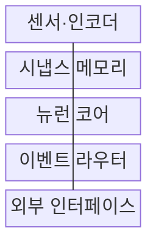
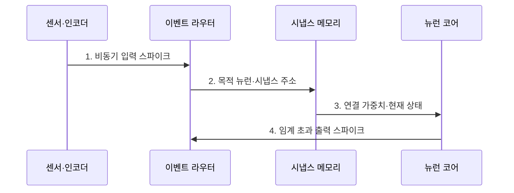

---
sidebar:
  order: 149
  label: "149. 뉴로모픽 컴퓨팅 (Neuromorphic Computing)"
  badge:
    text: "기출 · 30%"
    variant: note
title: "뉴로모픽 컴퓨팅 (Neuromorphic Computing)"
date: "2026-07-27T23:59:59+09:00"
tags:
  - "notes-latest-tech"
weight: 149
extra:
  question_no: "149"
  source_status: "기출"
  source_history: "128회"
  priority: 30
  priority_note: "뉴로모픽은 특화 구조이나 최근 반복성이 낮음"
---

## 미리 알고가기

- **뉴로모픽 컴퓨팅 (Neuromorphic Computing, NC)**: 인간 뇌의 신경망 구조와 스파이크 처리 방식을 모방한 비폰노이만형 컴퓨팅
- **이벤트 기반 처리**: 이벤트 발생 시점에만 연산을 수행해 초저전력을 지원함
- **생태계 차이**: 주류 딥러닝과 다른 전용 알고리즘과 하드웨어 구조가 필요함

## Ⅰ. 개요

- 정의/개념: **스파이크**로 뉴런·시냅스 상태를 갱신하는 비동기 계산 방식
- 배경/필요성: 밀집 연산의 **희소 센서 이벤트·초저전력 처리** 한계

### 쉽게 이해하기 (학습용)

- 모든 센서를 계속 확인하지 않고 변화가 생긴 센서만 신호를 보내 필요한 뉴런을 깨운다.

## Ⅱ. 특징

- 활성 뉴런만 갱신하는 **이벤트 기반 연산**
- 시냅스 인접 저장과 **비동기 스파이크 라우팅**
- 이벤트 혼잡·변환 오차 기반 **성능 한계**

### 쉽게 이해하기 (학습용)

- 평소에는 쉬다가 신호가 몰리면 통로가 붐비며 기존 모델을 스파이크로 바꿀 때 정확도가 달라질 수 있다.

## Ⅲ. 구조 및 구성요소

| 구성요소 | 책임 |
|:---|:---|
| 센서·인코더 | 입력 변화를 스파이크로 변환 |
| 시냅스 메모리 | 뉴런 연결 강도 및 상태 저장 |
| 뉴런 코어 | 입력 누적 및 임계값 발화 판정 |
| 이벤트 라우터 | 발화 신호 비동기 전달 |
| 외부 인터페이스 | 가중치 갱신 및 모델 배치 제어 |

> 요약: 센서·시냅스·뉴런·라우터가 스파이크를 처리한다

### 쉽게 이해하기 (학습용)

- 센서가 변화를 스파이크로 만들면 라우터가 뉴런에 전달하고 시냅스 가중치와 상태로 발화를 판단한다.

## Ⅳ. 흐름도

### 동작 원리

1. **비동기 입력 스파이크**: 센서 변화가 있을 때만 이벤트 생성
2. **목적 뉴런·시냅스 주소**: 라우터가 연결 대상에 신호 전달
3. **연결 가중치·현재 상태**: 입력을 누적해 막전위 갱신
4. **임계 초과 출력 스파이크**: 발화 조건을 만족한 뉴런만 전파

> 요약: 이벤트로 상태를 갱신하고 임계값에서만 발화한다

### 쉽게 이해하기 (학습용)

- 변화 신호가 목적 뉴런의 상태를 누적하고 임계값을 넘은 뉴런만 다음 스파이크를 보낸다.

## Ⅴ. 종류 및 비교

| 에지 계산 방식 | 뉴로모픽 | GPU AI | 엣지 MCU |
|:---|:---|:---|:---|
| 적용 기준 | 초저전력 희소 이벤트 | 범용·정확도 우선 | 소형 단순 제어 |
| 핵심 특징 | 스파이크 이벤트 기반 연산 | 밀집 텐서 병렬 연산 | 순차 제어·경량 추론 |
| 한계 | 도구·학습 생태계 부족 | 전력·메모리 비용 | 모델 크기·처리량 제한 |

> 요약: 희소 이벤트는 뉴로모픽, 범용은 GPU, 제어는 MCU다

### 쉽게 이해하기 (학습용)

- 희소 이벤트와 초저전력은 뉴로모픽, 범용 AI는 GPU, 작은 순차 제어는 MCU가 알맞다.

## Ⅵ. 실무 고려사항 및 대책

| 고려사항 | 대책 | 효과 |
|:---|:---|:---|
| 이벤트 폭주로 라우터 혼잡 | 이벤트율 제한·**라우팅 용량** 설계 | 지연 급증 방지 |
| ANN-SNN 변환 정확도 저하 | 임계값·시간창별 **변환 오차** 검증 | 과업 정확도 보존 |
| 희소성 낮은 입력 | 실제 이벤트율로 **전력 이득** 측정 | 부적합 적용 방지 |

### 쉽게 이해하기 (학습용)

- 이벤트 카메라는 밝기가 바뀐 픽셀만 보내 로봇이 적은 전력으로 장애물 방향을 판단하게 한다.

## Ⅶ. 결론

- 희소 신호의 초저전력 처리를 위해 **이벤트 희소성·지연·모델 변환 오차·학습 도구·하드웨어 비용**을 검토하고, 전력 이득이 전환 비용보다 클 때 뉴로모픽을 적용한다.

### 쉽게 이해하기 (학습용)

- 희소 이벤트의 전력 이득이 모델 변환 오차와 전용 도구 비용보다 클 때 뉴로모픽을 선택한다.
