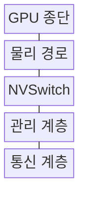
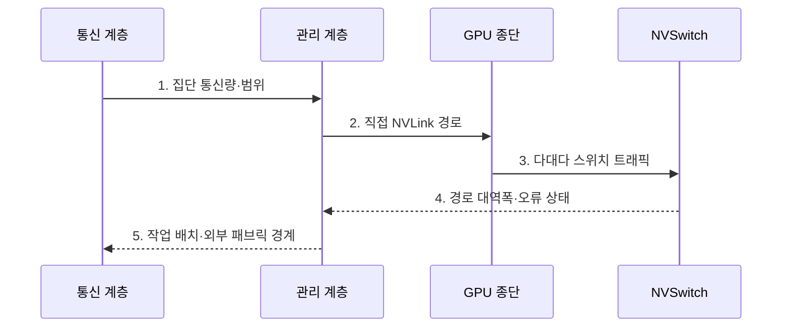

---
sidebar:
  order: 150
  label: "150. NVLink"
  badge:
    text: "기출 · 50%"
    variant: note
title: "NVLink"
date: "2026-07-27T23:59:59+09:00"
tags:
  - "notes-latest-tech"
weight: 150
extra:
  question_no: "150"
  source_status: "기출"
  source_history: "138회"
  priority: 50
  priority_note: "NVLink GPU 간 대역폭 설계가 138회 출제됨"
---

## 미리 알고가기

- **NVLink(엔브이링크)**: 이름의 NV는 NVIDIA 계열 브랜드를 나타내며, GPU 간 메모리 접근과 데이터 교환을 제공하는 고대역폭 연결 기술
- **대규모 AI 학습**: 노드 내부 GPU 간 집단 통신 병목 현상을 완화함
- **PCIe 대비 강점**: PCIe 대비 높은 대역폭과 낮은 지연 시간으로 고속 통신 지원

## Ⅰ. 개요

- 정의/개념: GPU 간 **메모리 접근·데이터 교환**을 제공하는 고속 연결 기술
- 배경/필요성: PCIe의 **GPU 집단 통신 대역폭·지연** 한계

### 쉽게 이해하기 (학습용)

- 여러 GPU가 문제를 나눠 풀 때 일반 통로보다 넓은 전용 통로로 자료를 주고받는다.

## Ⅱ. 특징

- 링크 수·속도 기반 **GPU 통신 용량**
- 직접 링크와 **NVSwitch 다대다 패브릭**
- 스위치 도메인 밖 **외부 패브릭 병목**

### 쉽게 이해하기 (학습용)

- 직접 링크는 인접 GPU를 잇고 NVSwitch는 교차로가 되며 랙 밖 통신은 별도 네트워크를 쓴다.

## Ⅲ. 구조 및 구성요소

| 구성요소 | 책임 |
|:---|:---|
| GPU 종단 | 링크 송수신 및 메모리 요청 처리 |
| 물리 경로 | 세대별 속도·링크 수 기반 연결 |
| NVSwitch | 다중 경로 전환 및 다대다 제공 |
| 관리 계층 | 경로·분할 영역 설정 및 오류 감시 |
| 통신 계층 | GPU 작업 및 집단 연산 배치 조정 |

> 요약: GPU·링크·스위치·관리·통신 계층을 연결한다

### 쉽게 이해하기 (학습용)

- GPU 종단과 물리 링크 및 NVSwitch가 경로를 만들고 관리·통신 계층이 작업과 오류를 조정한다.

## Ⅳ. 흐름도

### 동작 원리

1. **집단 통신량·범위**: GPU별 전송량과 통신 패턴 측정
2. **직접 NVLink 경로**: 인접 GPU의 고정 통신을 점대점 배치
3. **다대다 스위치 트래픽**: 도메인 내 전역 교환을 NVSwitch로 전환
4. **경로 대역폭·오류 상태**: 링크 포화와 장애 경로 확인
5. **작업 배치·외부 패브릭 경계**: 랙 밖 트래픽을 클러스터망으로 분리

> 요약: 통신 범위별 직접·스위치·외부 경로를 배치한다

### 쉽게 이해하기 (학습용)

- 통신량과 범위를 측정해 인접 GPU는 직접 잇고 다대다는 스위치, 랙 간은 외부 패브릭에 배치한다.

## Ⅴ. 종류 및 비교

| GPU 연결 방식 | NVLink 직접 | NVSwitch 패브릭 | InfiniBand |
|:---|:---|:---|:---|
| 적용 기준 | 소수 GPU 직접 연결 | 다수 GPU 전역 연결 | 서버 간 클러스터 연결 |
| 핵심 특징 | GPU 점대점 고속 링크 | 스위치 기반 GPU 패브릭 | 노드 간 RDMA 패브릭 |
| 한계 | 연결 수·토폴로지 제한 | 비용·전력·플랫폼 종속 | 노드 내부보다 긴 지연 |

> 요약: 인접은 직접, 도메인은 스위치, 랙 간은 패브릭이다

### 쉽게 이해하기 (학습용)

- 인접 GPU의 고정 통신은 직접 링크, 도메인 내 다대다는 NVSwitch, 랙 간 확장은 InfiniBand가 맡는다.

## Ⅵ. 실무 고려사항 및 대책

| 고려사항 | 대책 | 효과 |
|:---|:---|:---|
| 집단 통신의 특정 링크 포화 | 통신 패턴 기반 **토폴로지 배치** | 병목 링크 분산 |
| NVSwitch 도메인 밖 트래픽 | 계층형 집단 통신·**외부 패브릭 분리** | 랙 간 지연 영향 축소 |
| 링크 장애의 GPU 고립 | 대체 경로·**오류 격리** 구성 | 작업 중단 범위 제한 |

### 쉽게 이해하기 (학습용)

- 8개 GPU 학습은 빈번한 가중치 교환이 NVSwitch의 다대다 경로를 쓰게 배치한다.

## Ⅶ. 결론

- GPU 간 통신 병목을 줄이기 위해 **통신 패턴·범위·링크 대역폭·토폴로지·외부 패브릭 비용**을 검토하고, 직접 NVLink·NVSwitch·랙 간 패브릭을 계층적으로 선택한다.

### 쉽게 이해하기 (학습용)

- GPU 통신 범위와 패턴에 맞는 링크 계층을 고르고 실제 작업의 통신 시간으로 효율을 검증한다.
