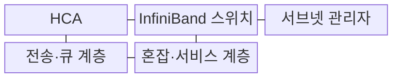
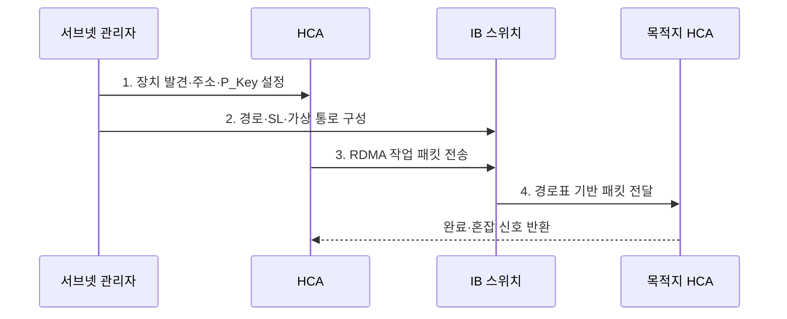

---
sidebar:
  order: 151
  label: "151. InfiniBand"
  badge:
    text: "기출 · 60%"
    variant: note
title: "InfiniBand"
date: "2026-07-31T08:56:35+09:00"
tags:
  - "notes-latest_tech"
weight: 151
extra:
  question_no: "151"
  source_status: "기출"
  source_history: "138회"
  priority: 60
  priority_note: "인피니밴드 지연·혼잡 제어가 138회 출제됨"
---

## 미리 알고가기

- **인피니밴드(InfiniBand)**: 고성능 컴퓨팅·AI 클러스터의 노드 사이에 저지연·고대역폭 원격 메모리 통신을 제공하는 전용 스위치 패브릭
- **원격 직접 메모리 접근(Remote Direct Memory Access, RDMA)**: 원격 CPU·커널 개입을 줄이고 등록된 메모리 사이를 직접 전송하는 기술
- **호스트 채널 어댑터(Host Channel Adapter, HCA)**: 서버의 메모리 작업 요청을 InfiniBand 패킷으로 만들고 완료를 처리하는 장치
- **서브넷 관리자(Subnet Manager)**: 패브릭 장치를 발견하고 주소·경로·분할 정책을 설정하는 관리 주체
- **분할 키(Partition Key, P_Key)**: 같은 InfiniBand 패브릭에서 통신 가능한 논리 집단을 구분하는 접근 식별값
- **서비스 수준(Service Level, SL)**: 트래픽 종류별 우선순위와 가상 통로 매핑을 정하는 서비스 속성
- **적응형 경로(Adaptive Routing)**: 혼잡 상태에 따라 같은 목적지로 가는 여러 경로 중 전송 경로를 동적으로 선택하는 방식
- **융합 이더넷 기반 RDMA(RDMA over Converged Ethernet, RoCE)**: 이더넷 패브릭의 무손실·혼잡 설정 위에서 RDMA를 제공하는 방식
- **NVLink·NVSwitch**: GPU 메모리 사이를 고대역폭으로 연결하고 여러 GPU의 다대다 통신을 구성하는 인터커넥트 기술

## Ⅰ. 개요

- 정의/개념: **InfiniBand**는 RDMA·서브넷 관리·혼잡 제어를 통합한 저지연 클러스터 스위치 패브릭
- 배경/필요성: 일반 소켓·이더넷은 대규모 집단 통신에서 **지연·CPU 부하·손실** 증가

### 쉽게 이해하기 (학습용)
- 서버마다 전용 출입구를 달고 관리자가 주소·차선·우회로를 정하는 클러스터 전용 도로망임

## Ⅱ. 특징

- **관리 축**: 서브넷 관리자의 주소·경로·분할 설정
- **전송 축**: HCA 등록 메모리 기반 저부하 RDMA
- **혼잡 축**: SL·가상 통로·적응형 경로로 부하 분산

### 쉽게 이해하기 (학습용)
- 관리자가 도로와 통행 구역을 정하고 서버 출입구가 메모리를 직접 보내며 정체 시 다른 길로 분산함

## Ⅲ. 구조 및 구성요소

| 구성요소 | 책임 |
|:---|:---|
| HCA | RDMA 작업 요청·패킷·완료의 **호스트 종단 처리** |
| InfiniBand 스위치 | 주소·경로표 기반 **패킷 전달** |
| 서브넷 관리자 | 장치 발견·주소·경로·P_Key의 **패브릭 구성** |
| 전송·큐 계층 | 연결·순서·재전송과 **송수신 큐 관리** |
| 혼잡·서비스 계층 | SL·가상 통로·혼잡 신호의 **트래픽 제어** |

### 쉽게 이해하기 (학습용)
- 서버 출입구와 교차로, 주소 관리자, 배송 줄, 정체 관제소가 하나의 전용 도로망을 구성함

## Ⅳ. 흐름도

1. **장치 발견·주소·P_Key 설정**: 포트 상태를 수집해 **통신 종단·분할 경계** 확정
2. **경로·SL·가상 통로 구성**: 목적지와 서비스 수준에 맞는 **전송 경로** 게시
3. **RDMA 작업 패킷 전송**: HCA가 등록 메모리 요청을 **패킷 스트림**으로 변환
4. **경로표 기반 패킷 전달**: 스위치가 주소와 가상 통로에 따라 **목적지 HCA** 연결

### 쉽게 이해하기 (학습용)
- 관리자가 주소와 차선을 정한 뒤 서버 출입구가 짐을 보내고 정체 신호에 따라 속도와 길을 바꿈

## Ⅴ. 종류 및 비교

| 비교 기준 | InfiniBand | 이더넷 기반 RDMA | NVLink·NVSwitch |
|:---|:---|:---|:---|
| 적용 기준 | **전용 다중 노드 저지연** | **기존 이더넷 운영 활용** | **서버·도메인 GPU 연결** |
| 핵심 특징 | 관리형 **RDMA 통합 패브릭** | RoCE 기반 **이더넷 RDMA** | GPU 메모리 **고속 직접 연결** |
| 한계 | **전용 장비·운영 비용** | **무손실·혼잡 구성 부담** | **노드 간 연결 범위 제한** |

> 요약: **InfiniBand**는 전용 클러스터, **RoCE**는 이더넷 RDMA 중심

### 쉽게 이해하기 (학습용)
- 전용 도시 도로망, 기존 도로의 고속 배송, GPU 사이 내부 통로는 적용 범위가 다름

## Ⅵ. 실무 고려사항 및 대책

| 고려사항 | 대책 | 효과 |
|:---|:---|:---|
| 잘못된 P_Key의 **테넌트 통신 노출** | 분할 정책·HCA 멤버십 상호 검증 | 패브릭 격리 **확보** |
| 집단 통신의 **핫스폿 혼잡** | SL·가상 통로 분리·적응형 경로 적용 | 완료 지연 **완화** |
| 비대칭 토폴로지의 **느린 링크 집중** | 경로 텔레메트리 기반 순위·경로 재배치 | 대역폭 활용률 **향상** |

### 쉽게 이해하기 (학습용)
- 통행 구역을 잘못 열지 않고 특정 교차로에 짐이 몰리면 차선과 우회로를 다시 배치함

## Ⅶ. 결론

- 전용 다중 노드는 **InfiniBand**, 기존 이더넷 활용은 **RoCE** 선택

### 쉽게 이해하기 (학습용)
- 빠른 선로뿐 아니라 누가 통신하고 정체 때 어느 길로 우회할지 함께 정함
