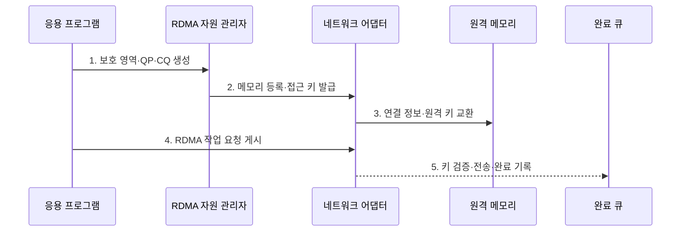

---
sidebar:
  order: 152
  label: "152. 원격 직접 메모리 접근 (RDMA)"
  badge:
    text: "기출 · 60%"
    variant: note
title: "원격 직접 메모리 접근 (RDMA)"
date: "2026-07-27T23:59:59+09:00"
tags:
  - "notes-latest_tech"
weight: 152
extra:
  question_no: "152"
  source_status: "기출"
  source_history: "138회"
  priority: 60
  priority_note: "RDMA 우회 전송·메모리 등록이 138회 출제됨"
---

## 미리 알고가기

- **원격 직접 메모리 접근(Remote Direct Memory Access, RDMA)**: 원격 CPU·운영체제 커널의 개입을 줄이고 등록된 메모리 사이를 네트워크 어댑터가 직접 전송하는 기술
- **보호 영역(Protection Domain)**: 메모리·큐·연결 객체가 서로 접근할 수 있는 RDMA 자원 격리 경계
- **메모리 영역(Memory Region)**: 주소·길이·접근 권한을 네트워크 어댑터에 등록한 메모리 범위
- **지역·원격 키(Local·Remote Key, L_Key·R_Key)**: 등록 메모리의 로컬·원격 접근 권한을 검증하는 식별값
- **큐 페어(Queue Pair, QP)**: 송신 큐와 수신 큐를 묶어 RDMA 통신 종단을 구성한 객체
- **완료 큐(Completion Queue, CQ)**: 게시한 작업 요청의 성공·오류·완료 상태를 기록하는 큐
- **RDMA 동사(RDMA Verb)**: 읽기·쓰기·원자 연산·송신·수신처럼 어댑터에 게시하는 작업 유형

## Ⅰ. 개요

- 정의/개념: **RDMA**는 등록된 로컬·원격 메모리를 네트워크 어댑터가 직접 읽고 쓰는 통신 기술
- 배경/필요성: 소켓 통신은 커널 경유·복사·문맥 전환으로 **전송 지연·CPU 사용량** 증가

### 쉽게 이해하기 (학습용)
- 직원이 택배를 여러 번 옮기지 않고 허가된 창고 구역끼리 운송 장치가 직접 물건을 이동함

## Ⅱ. 특징

- 원격 CPU 미개입 **읽기·쓰기·원자 연산**
- 메모리 등록·접근 키 기반 **주소·권한 고정**
- QP·CQ 기반 **작업 순서·완료 추적**

### 쉽게 이해하기 (학습용)
- 허가받은 창고 구역과 열쇠, 작업 줄, 완료 통지함을 미리 준비해 직접 전송함

## Ⅲ. 구조 및 구성요소

| 구성요소 | 책임 |
|:---|:---|
| 보호 영역 | 메모리·큐 객체의 **접근 격리 경계 제공** |
| 등록 메모리·키 | 주소·길이·권한의 **접근 범위 고정** |
| 큐 페어 | 송수신 작업의 **종단·순서 구성** |
| 작업 요청·동사 | 대상 버퍼와 **읽기·쓰기 동작 지정** |
| 완료 큐 | 작업 결과·오류의 **비동기 완료 기록** |

### 쉽게 이해하기 (학습용)
- 출입 구역 안에 창고와 열쇠, 작업 줄, 지시서, 완료함을 함께 만들어야 직접 접근할 수 있음

## Ⅳ. 흐름도

### 동작 원리

1. **보호 영역·QP·CQ 생성**: 통신 자원을 동일한 **격리 경계**에 배치
2. **메모리 등록·접근 키 발급**: 어댑터가 접근할 주소·길이·권한의 **고정 범위** 설정
3. **연결 정보·원격 키 교환**: 상대 종단과 허용한 원격 메모리의 **접근 정보** 전달
4. **RDMA 작업 요청 게시**: 읽기·쓰기·원자 연산과 대상 버퍼를 **송신 큐**에 등록
5. **키 검증·전송·완료 기록**: 어댑터가 권한을 확인해 실행하고 **CQ 상태** 반환

### 쉽게 이해하기 (학습용)
- 창고와 작업 줄을 만들고 열쇠를 교환한 뒤 운송 장치가 직접 옮긴 결과를 완료함에서 확인함

## Ⅴ. 종류 및 비교

| 비교 기준 | 단측 RDMA | 양측 송신·수신 | 소켓 통신 |
|:---|:---|:---|:---|
| 적용 기준 | 원격 메모리 직접 조작 | 메시지 경계·원격 알림 | 범용 호환 통신 |
| 핵심 특징 | 원격 CPU 없는 **읽기·쓰기** | 송신·수신 작업의 **버퍼 매칭** | 커널 소켓·**복사 경로** |
| 한계 | 등록·키·동기화 복잡 | 수신 버퍼 사전 게시 | 지연·CPU 오버헤드 |

### 쉽게 이해하기 (학습용)
- 창고를 직접 읽고 쓰는 방식, 수신처가 받을 자리를 준비하는 방식, 일반 택배 경로의 차이임

## Ⅵ. 실무 고려사항 및 대책

| 고려사항 | 대책 | 효과 |
|:---|:---|:---|
| 넓은 R_Key 범위의 **원격 메모리 노출** | 작업별 최소 영역·권한·유효기간 등록 | 접근 피해 범위 **축소** |
| QP 상태 불일치의 **전송 중단** | 연결 전이·오류 상태·재연결 절차 검증 | 통신 복구 **정합성 확보** |
| CQ 미처리의 **큐 고갈** | 완료 폴링·알림·오류별 회수 상한 설정 | 작업 요청 정체 **방지** |

### 쉽게 이해하기 (학습용)
- 열쇠가 여는 창고와 시간을 최소화하고 작업 줄과 완료함이 막히지 않도록 상태를 관리함

## Ⅶ. 결론

- 메모리 범위·키 수명·큐 상태를 기준으로 **RDMA 접근 권한과 완료 처리** 결정

### 쉽게 이해하기 (학습용)
- 빠른 직접 전송보다 어느 구역을 언제까지 열고 완료를 어떻게 확인할지 먼저 정함
