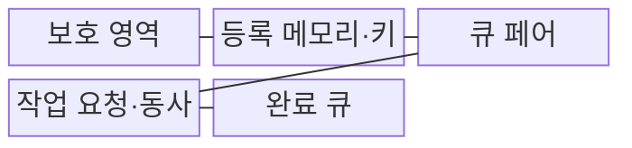
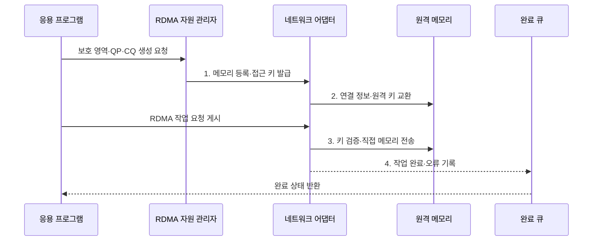

---
sidebar:
  order: 152
  label: "152. 원격 직접 메모리 접근 (RDMA)"
  badge:
    text: "기출 · 60%"
    variant: note
title: "원격 직접 메모리 접근 (RDMA)"
date: "2026-07-31T08:57:15+09:00"
tags:
  - "notes-latest_tech"
weight: 152
extra:
  question_no: "152"
  source_status: "기출"
  source_history: "138회"
  priority: 60
  priority_note: "RDMA 우회 전송·메모리 등록이 138회 출제됨"
---

## Ⅰ. 개요

핵심 용어

- **원격 직접 메모리 접근(Remote Direct Memory Access, RDMA)**: 원격 중앙처리장치(Central Processing Unit, CPU)·운영체제 커널의 개입을 줄이고 등록된 메모리 사이를 네트워크 어댑터가 직접 전송하는 기술이다.
- **메모리 등록**: 전송할 주소·길이·접근 권한을 네트워크 어댑터에 미리 고정하는 절차이다.

- 정의/개념: 등록된 로컬·원격 메모리를 네트워크 어댑터가 직접 읽고 쓰는 **원격 직접 메모리 접근(Remote Direct Memory Access, RDMA) 기술**
- 배경/필요성: 소켓 통신은 커널 경유·복사·문맥 전환으로 **전송 지연·중앙처리장치(Central Processing Unit, CPU) 사용량 증가**

#### 한줄 요약
- 직원이 택배를 여러 번 옮기지 않고 허가된 창고 구역끼리 운송 장치가 직접 물건을 이동함

## Ⅱ. 특징

핵심 용어

- **메모리 영역(Memory Region)**: 주소·길이·접근 권한을 네트워크 어댑터에 등록한 메모리 범위이다.
- **지역·원격 키(Local·Remote Key, L_Key·R_Key)**: 등록 메모리의 로컬·원격 접근 권한을 검증하는 식별값이다.

- **전송 축**: 원격 중앙처리장치(Central Processing Unit, CPU) 미개입 읽기·쓰기·원자 연산
- **보호 축**: 메모리 영역(Memory Region) 등록과 지역·원격 키(Local·Remote Key, L_Key·R_Key)로 주소·권한 고정
- **상태 축**: 큐 페어(Queue Pair, QP)·완료 큐(Completion Queue, CQ) 기반 작업 순서·완료 추적

#### 한줄 요약
- 허가받은 창고 구역과 열쇠, 작업 줄, 완료 통지함을 미리 준비해 직접 전송함

## Ⅲ. 구조 및 구성요소

핵심 용어

- **보호 영역(Protection Domain)**: 메모리·큐·연결 객체가 서로 접근할 수 있는 원격 직접 메모리 접근(Remote Direct Memory Access, RDMA) 자원 격리 경계이다.
- **큐 페어(Queue Pair, QP)**: 송신 큐와 수신 큐를 묶어 RDMA 통신 종단을 구성한 객체이다.
- **완료 큐(Completion Queue, CQ)**: 게시한 작업 요청의 성공·오류·완료 상태를 기록하는 큐이다.

| 구성요소 | 책임 |
|:---|:---|
| 보호 영역 | 메모리·큐 객체의 **접근 격리 경계 제공** |
| 등록 메모리·키 | 주소·길이·권한의 **접근 범위 고정** |
| 큐 페어 | 송수신 작업의 **종단·순서 구성** |
| 작업 요청·동사 | 대상 버퍼와 **읽기·쓰기 동작 지정** |
| 완료 큐 | 작업 결과·오류의 **비동기 완료 기록** |

#### 한줄 요약
- 출입 구역 안에 창고와 열쇠, 작업 줄, 지시서, 완료함을 함께 만들어야 직접 접근할 수 있음

## Ⅳ. 흐름도

핵심 용어

- **원격 직접 메모리 접근 동사(Remote Direct Memory Access Verb, RDMA Verb)**: 읽기·쓰기·원자 연산·송신·수신처럼 어댑터에 게시하는 작업 유형이다.
- **작업 요청**: 대상 버퍼·길이·동사·접근 키를 지정해 네트워크 어댑터 큐에 게시하는 명령이다.

큐 페어(Queue Pair, QP)에 원격 직접 메모리 접근(Remote Direct Memory Access, RDMA) 작업을 게시하고 완료 큐(Completion Queue, CQ)에서 결과를 확인한다.

1. **메모리 등록·접근 키 발급**: 주소·길이·권한 범위 고정
2. **연결 정보·원격 키 교환**: 허용 원격 메모리 정보 전달
3. **키 검증·직접 메모리 전송**: 승인된 동사·버퍼만 실행
4. **작업 완료·오류 기록**: 실행 상태를 CQ에 기록

#### 한줄 요약
- 창고와 작업 줄을 만들고 열쇠를 교환한 뒤 운송 장치가 직접 옮긴 결과를 완료함에서 확인함

## Ⅴ. 종류 및 비교

핵심 용어

- **단측 원격 직접 메모리 접근(One-Sided Remote Direct Memory Access, One-Sided RDMA)**: 원격 응용의 작업 게시 없이 네트워크 어댑터가 원격 메모리를 직접 읽거나 쓰는 방식이다.
- **양측 송신·수신**: 송신자와 수신자가 각각 작업과 버퍼를 게시해 메시지를 교환하는 방식이다.

원격 직접 메모리 접근(Remote Direct Memory Access, RDMA)은 원격 중앙처리장치(Central Processing Unit, CPU)의 개입 여부와 메시지 경계에 따라 방식을 구분한다.

| 비교 기준 | 단측 RDMA | 양측 송신·수신 | 소켓 통신 |
|:---|:---|:---|:---|
| 적용 기준 | **원격 메모리 직접 조작** | **메시지 경계·원격 알림** | **범용 호환 통신** |
| 핵심 특징 | 원격 CPU 없는 **읽기·쓰기** | 송신·수신 작업의 **버퍼 매칭** | 커널 소켓·**복사 경로** |
| 한계 | **등록·키·동기화 복잡** | **수신 버퍼 사전 게시** | **지연·CPU 오버헤드** |

> 요약: 단측 방식은 **직접 접근**, 양측 송수신은 **메시지 경계** 중심

#### 한줄 요약
- 창고를 직접 읽고 쓰는 방식, 수신처가 받을 자리를 준비하는 방식, 일반 택배 경로의 차이임

## Ⅵ. 실무 고려사항 및 대책

핵심 용어

- **R_Key 유효기간**: 원격 키로 등록 메모리에 접근할 수 있도록 허용한 시간 범위이다.
- **큐 고갈**: 완료를 회수하지 못해 새 작업 요청이나 결과를 기록할 큐 공간이 부족한 상태이다.

원격 키(Remote Key, R_Key), 큐 페어(Queue Pair, QP), 완료 큐(Completion Queue, CQ)의 수명과 상태를 함께 관리한다.

| 문제 | 대책 | 효과 |
|:---|:---|:---|
| 넓은 R_Key 범위의 **원격 메모리 노출** | 작업별 최소 영역·권한·유효기간 등록 | 접근 피해 범위 **축소** |
| QP 상태 불일치의 **전송 중단** | 연결 전이·오류 상태·재연결 절차 검증 | 통신 복구 **정합성 확보** |
| CQ 미처리의 **큐 고갈** | 완료 폴링·알림·오류별 회수 상한 설정 | 작업 요청 정체 **방지** |

#### 한줄 요약
- 열쇠가 여는 창고와 시간을 최소화하고 작업 줄과 완료함이 막히지 않도록 상태를 관리함

## Ⅶ. 결론

핵심 용어

- **직접 메모리 조작**: 원격 중앙처리장치(Central Processing Unit, CPU)의 명시적 처리 없이 등록 메모리를 읽고 쓰는 통신 동작이다.
- **완료 상태**: 게시한 원격 직접 메모리 접근(Remote Direct Memory Access, RDMA) 작업의 성공·오류·처리 결과를 응용에 알리는 기록이다.

- **직접 메모리 조작·완료 상태별 선택**: 직접 접근은 단측 원격 직접 메모리 접근(Remote Direct Memory Access, RDMA), 알림·메시지는 양측 송수신

#### 한줄 요약
- 빠른 직접 전송보다 어느 구역을 언제까지 열고 완료를 어떻게 확인할지 먼저 정함
