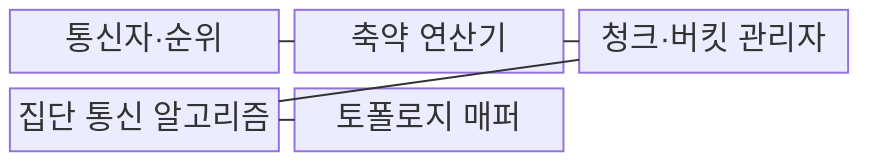
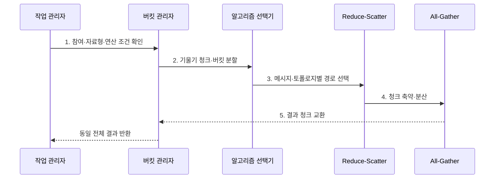

---
sidebar:
  order: 153
  label: "153. All-Reduce 집단 통신"
  badge:
    text: "기출 · 60%"
    variant: note
title: "All-Reduce 집단 통신"
date: "2026-07-31T08:57:42+09:00"
tags:
  - "notes-latest_tech"
weight: 153
extra:
  question_no: "153"
  source_status: "기출"
  source_history: "138회"
  priority: 60
  priority_note: "All-Reduce 집단 통신 병목이 138회 출제됨"
---

## Ⅰ. 개요

핵심 용어

- **올리듀스(All-Reduce)**: 모든 참여자의 값을 합·최댓값 등으로 축약한 뒤 같은 결과를 모든 참여자에게 배포하는 집단 통신 연산이다.
- **집단 통신**: 정해진 참여자 집합이 동일한 호출 순서와 자료형으로 공동 데이터 교환을 수행하는 연산이다.

- 정의/개념: **All-Reduce**는 분산 값을 축약하고 동일 결과를 모든 참여자에게 배포하는 집단 통신
- 배경/필요성: 중앙 집계 서버는 기울기 통신의 **대역폭·처리 병목** 유발

### 쉽게 이해하기 (학습용)
- 각 조의 숫자를 모두 더한 같은 합계를 중앙 선생님 없이 조끼리 전달해 전원이 받음

## Ⅱ. 특징

핵심 용어

- **리듀스-스캐터(Reduce-Scatter)**: 값을 청크로 나누어 축약하면서 각 참여자에게 결과 청크 하나씩을 분산하는 단계이다.
- **올개더(All-Gather)**: 참여자마다 가진 결과 청크를 교환하여 모두가 전체 결과를 갖게 하는 단계이다.

> 참여자 수가 늘수록 파란 링 단계 수는 가파르게 증가하지만 붉은 트리는 완만해 작은 메시지의 단계 지연에 유리하며, 대역폭•청크 크기를 제외한 이론 비교다.

- **연산 축**: Reduce-Scatter·All-Gather 기반 축약·배포
- **전송 축**: 청크·버킷으로 다중 링크 병렬 활용
- **배치 축**: 알고리즘·순위와 물리 토폴로지 정합

### 쉽게 이해하기 (학습용)
- 큰 짐을 조각내 여러 길로 동시에 합치고 다시 나누어 모두가 같은 결과를 가짐

## Ⅲ. 구조 및 구성요소

핵심 용어

- **순위(Rank)**: 집단 통신에 참여하는 프로세스·가속기를 구분하는 논리 번호이다.
- **버킷(Bucket)**: 여러 작은 기울기를 묶어 한 번의 집단 통신으로 보내는 전송 단위이다.
- **집단 통신 토폴로지**: 참여자를 링·트리·계층으로 연결한 논리 통신 경로이다.

| 구성요소 | 책임 |
|:---|:---|
| 통신자·순위 | 참여 집합·자료형·호출 순서의 **통신 계약 관리** |
| 축약 연산기 | 합·평균·최댓값의 **수치 연산 수행** |
| 청크·버킷 관리자 | 메시지 분할·결합의 **전송 단위 조절** |
| 집단 통신 알고리즘 | 링·트리·계층형의 **축약·배포 경로 실행** |
| 토폴로지 매퍼 | 링크 대역폭에 맞는 **순위·경계 배치** |

### 쉽게 이해하기 (학습용)
- 참가자 번호와 더하는 규칙, 짐 조각 크기, 전달 순서, 실제 길 배치를 모두 맞춰야 함

## Ⅳ. 흐름도

핵심 용어

- **청크(Chunk)**: 큰 메시지를 여러 링크에서 병렬로 교환하도록 나눈 데이터 조각이다.
- **역전파(Backpropagation)**: 모델 출력 오차의 기울기를 뒤쪽 층부터 전달하여 가중치 수정값을 계산하는 학습 과정이다.

1. **참여·자료형·연산 조건 확인**: 모든 순위의 원소 수·형식·호출 순서 **일치 여부** 검증
2. **기울기 청크·버킷 분할**: 지연·대역폭과 역전파 준비 순서에 맞는 **전송 단위** 구성
3. **메시지·토폴로지별 경로 선택**: 크기·참여 수·링크 구조에 맞는 **링·트리·계층 경로** 결정
4. **청크 축약·분산**: 참여자가 청크를 교환·축약해 **분할 결과** 보유
5. **결과 청크 교환**: 분할 결과 교환으로 동일 전체 결과 생성

### 쉽게 이해하기 (학습용)
- 같은 규격의 짐을 조각내 길에 맞는 순서로 더하고 각자 가진 합계 조각을 다시 교환함

## Ⅴ. 종류 및 비교

핵심 용어

- **링 All-Reduce**: 참여자가 원형 경로로 청크를 순환시켜 축약·배포하는 대역폭 중심 알고리즘이다.
- **트리 All-Reduce**: 로그 단계의 트리 경로로 값을 축약하고 방송하는 지연 중심 알고리즘이다.

| 비교 기준 | 링 | 트리 | 계층형 |
|:---|:---|:---|:---|
| 적용 기준 | **큰 메시지·대역폭 활용** | **작은 메시지·단계 축소** | **노드 내외 링크 차이** |
| 핵심 특징 | 청크 순환 **축약·배포** | 로그 단계 **축약·방송** | 노드 내부·외부 **분리 축약** |
| 한계 | **순위 증가 시 단계 증가** | **상위 링크 집중** | **계층 경계·매핑 복잡** |

> 요약: **링**은 큰 메시지, **트리**는 작은 메시지, 계층형은 이종 링크

### 쉽게 이해하기 (학습용)
- 큰 짐은 원형 길, 빠른 전달은 나무 길, 건물 안팎 속도가 다르면 계층형 길을 선택함

## Ⅵ. 실무 고려사항 및 대책

핵심 용어

- **집단 교착**: 참여자의 호출 순서·원소 수·자료형이 달라 일부 순위가 영구 대기하는 상태이다.
- **계산·통신 중첩**: 역전파로 준비된 기울기를 즉시 전송해 계산과 데이터 교환을 동시에 진행하는 최적화이다.

| 문제 | 대책 | 효과 |
|:---|:---|:---|
| 순위별 호출 불일치의 **집단 교착** | 원소·자료형·호출 순서 사전 검증 | 통신 진행 **정합성 확보** |
| 느린 링크를 지난 **링 단계 지연** | 토폴로지 기반 순위 재배치·계층형 적용 | 병목 링크 영향 **완화** |
| 큰 버킷의 **역전파 중첩 지연** | 기울기 준비 순서별 버킷 크기 조정 | 계산·통신 중첩률 **향상** |

### 쉽게 이해하기 (학습용)
- 모든 조가 같은 순서로 참여하고 느린 길을 피하며 준비된 짐부터 보내도록 묶음 크기를 정함

## Ⅶ. 결론

핵심 용어

- **단계 지연**: 집단 통신 알고리즘이 결과를 완성하기 위해 거치는 순차 전송 단계의 누적 시간이다.
- **계층형 All-Reduce**: 노드 내부와 외부처럼 성능이 다른 링크별로 축약·배포 단계를 나누는 방식이다.

- 큰 메시지·대역폭 우선은 **링**, 작은 메시지·지연 우선은 **트리** 선택

### 쉽게 이해하기 (학습용)
- 짐 크기와 사람 수, 실제 길 구조에 맞춰 링·트리·계층형과 짐 조각 크기를 고름
