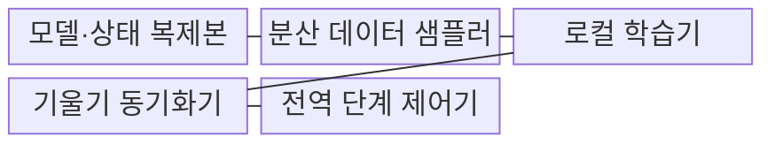
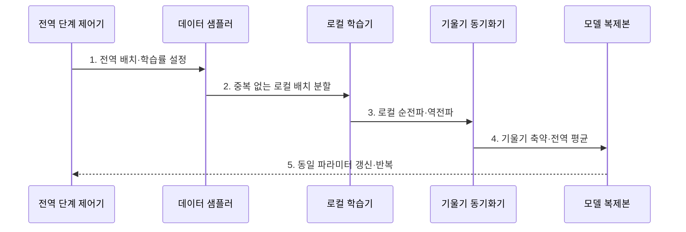

---
sidebar:
  order: 154
  label: "154. 데이터 병렬화 (Data Parallelism)"
  badge:
    text: "기출 · 70%"
    variant: note
title: "데이터 병렬화 (Data Parallelism)"
date: "2026-07-27T23:59:59+09:00"
tags:
  - "notes-latest_tech"
weight: 154
extra:
  question_no: "154"
  source_status: "기출"
  source_history: "138회"
  priority: 70
  priority_note: "데이터 병렬의 동기화·확장 설계가 138회 출제됨"
---

## 미리 알고가기

- **데이터 병렬화(Data Parallelism)**: 같은 모델을 여러 장치에 복제하고 입력 배치를 나누어 계산한 뒤 기울기를 동기화하는 병렬 학습 방식
- **전역 배치(Global Batch)**: 한 학습 단계에서 모든 장치가 함께 처리한 표본의 총개수
- **로컬 배치(Local Batch)**: 한 장치가 한 학습 단계에서 처리한 표본의 개수
- **분산 데이터 샘플러(Distributed Data Sampler)**: 여러 장치에 데이터가 중복·누락되지 않도록 표본 인덱스를 나누는 구성요소
- **올리듀스(All-Reduce)**: 모든 장치의 기울기를 축약한 같은 결과를 다시 모든 장치에 배포하는 집단 통신
- **ZeRO(Zero Redundancy Optimizer)**: 복제된 모델·기울기·옵티마이저 상태를 장치 사이에 단계별로 분할하여 메모리 중복을 줄이는 기법
- **순전파·역전파(Forward·Backward Propagation)**: 입력으로 예측을 계산하고 오차 기울기를 반대 방향으로 전달하는 학습 연산
- **텐서 병렬화(Tensor Parallelism)**: 하나의 계층 안에서 텐서 연산과 파라미터를 여러 장치에 나누는 방식
- **파이프라인 병렬화(Pipeline Parallelism)**: 연속 모델 층을 여러 장치 단계에 나누고 중간값을 전달하는 방식
- **마이크로배치(Microbatch)**: 파이프라인 단계를 겹쳐 실행하도록 하나의 배치를 더 작게 나눈 단위

## Ⅰ. 개요

- 정의/개념: **데이터 병렬화**는 모델을 복제하고 입력 배치를 분할한 뒤 기울기를 동기화하는 병렬 학습 방식
- 배경/필요성: 단일 장치는 대규모 데이터의 **배치 처리량·학습 시간** 한계

### 쉽게 이해하기 (학습용)
- 같은 풀이책을 가진 여러 사람이 다른 문제를 풀고 풀이 방향을 평균 내어 모두 같은 책을 수정함

## Ⅱ. 특징

- 모델 복제·로컬 배치 분할 기반 **표본 병렬 처리**
- All-Reduce 기반 **기울기 전역 동기화**
- 장치 수·전역 배치 증가에 따른 **수렴·통신 절충**

### 쉽게 이해하기 (학습용)
- 사람을 늘리면 한 번에 보는 문제 수와 답을 맞추는 통신량이 함께 늘어 학습 성격도 달라짐

## Ⅲ. 구조 및 구성요소

| 구성요소 | 책임 |
|:---|:---|
| 모델·상태 복제본 | 장치별 동일 **파라미터·학습 상태 보관** |
| 분산 데이터 샘플러 | 표본의 **중복·누락 없는 배치 분할** |
| 로컬 학습기 | 로컬 배치의 **순전파·역전파 계산** |
| 기울기 동기화기 | All-Reduce 기반 **전역 평균 기울기 생성** |
| 전역 단계 제어기 | 배치·학습률·체크포인트의 **공동 단계 관리** |

### 쉽게 이해하기 (학습용)
- 같은 책과 시작점을 가진 작업자에게 문제를 겹치지 않게 나누고 답안 수정 방향을 모두 같게 맞춤

## Ⅳ. 흐름도

1. **전역 배치·학습률 설정**: 장치 수와 로컬 배치에 맞는 **최적화 조건** 고정
2. **중복 없는 로컬 배치 분할**: 같은 단계의 표본을 장치별 **독립 입력 조각**으로 배정
3. **로컬 순전파·역전파**: 각 복제본이 로컬 데이터의 **기울기** 계산
4. **기울기 축약·전역 평균**: 모든 장치의 기울기를 합쳐 **공동 갱신값** 생성
5. **동일 파라미터 갱신·반복**: 복제본을 같은 상태로 맞춰 **다음 전역 단계** 시작

### 쉽게 이해하기 (학습용)
- 문제를 나눠 각자 푼 뒤 수정 방향을 평균 내어 모두 같은 책으로 다음 문제를 시작함

## Ⅴ. 종류 및 비교

| 비교 기준 | 데이터 병렬 | 텐서 병렬 | 파이프라인 병렬 |
|:---|:---|:---|:---|
| 적용 기준 | 모델 복제 가능·큰 배치 | 단일 연산이 장치 초과 | 계층 묶음 분할 가능 |
| 핵심 특징 | 배치 분할·**기울기 동기화** | 텐서 축 분할·**부분 합산** | 단계 분할·**마이크로배치** |
| 한계 | 상태 복제·전역 통신 | 연산별 빈번한 통신 | 파이프라인 버블·불균형 |

### 쉽게 이해하기 (학습용)
- 문제를 나누거나, 한 계산을 나누거나, 풀이 단계를 나누는 병렬 방식의 차이임

## Ⅵ. 실무 고려사항 및 대책

| 고려사항 | 대책 | 효과 |
|:---|:---|:---|
| 장치 증가의 **전역 배치 과대화** | 전역 배치 고정 확장 시험·학습률 재조정 | 수렴 변화 **분리 검증** |
| 샘플러 오류의 **표본 중복·누락** | 장치·반복 단계별 표본 인덱스 검증 | 학습 데이터 **정합성 확보** |
| 기울기 동기화의 **단계 시간 병목** | 버킷 통신·역전파 중첩·토폴로지 배치 | 확장 효율 **향상** |

### 쉽게 이해하기 (학습용)
- 작업자를 늘릴 때 문제 수와 풀이 규칙을 그대로 두고 문제 배분과 답안 평균 통신을 따로 검증함

## Ⅶ. 결론

- 모델 적재·전역 배치·기울기 통신을 기준으로 **데이터 병렬 장치 수와 동기화 정책** 결정

### 쉽게 이해하기 (학습용)
- 같은 모델을 담을 수 있고 배치 변화와 통신 비용을 감당하는 범위까지 장치를 늘림
