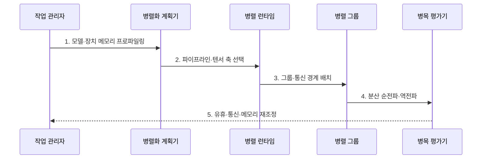

---
sidebar:
  order: 155
  label: "155. 모델 병렬화 (Model Parallelism)"
  badge:
    text: "기출 · 70%"
    variant: note
title: "모델 병렬화 (Model Parallelism)"
date: "2026-07-27T23:59:59+09:00"
tags:
  - "notes-latest_tech"
weight: 155
extra:
  question_no: "155"
  source_status: "기출"
  source_history: "138회"
  priority: 70
  priority_note: "모델 병렬의 분할·통신 설계가 138회 출제됨"
---

## 미리 알고가기

- **모델 병렬화(Model Parallelism)**: 단일 장치에 담기지 않는 모델의 파라미터·연산·상태를 여러 장치에 나누어 공동 실행하는 방식
- **텐서 병렬화(Tensor Parallelism)**: 하나의 계층 안에서 텐서 연산과 파라미터를 여러 장치에 나누고 부분 결과를 합치는 방식
- **파이프라인 병렬화(Pipeline Parallelism)**: 연속 모델 층을 여러 단계에 나누고 활성값·기울기를 단계 사이에 전달하는 방식
- **마이크로배치(Microbatch)**: 파이프라인 단계를 겹쳐 실행하기 위해 하나의 배치를 더 작게 나눈 단위
- **파이프라인 버블(Pipeline Bubble)**: 앞뒤 단계가 입력이나 결과를 기다리며 장치가 유휴 상태가 되는 시간
- **활성값(Activation)**: 각 모델 층이 입력으로 계산하여 다음 층에 전달하는 중간 출력
- **병렬 런타임(Parallel Runtime)**: 모델 조각과 통신 그룹을 장치 토폴로지에 배치하고 분산 실행하는 소프트웨어
- **순전파·역전파(Forward·Backward Propagation)**: 입력으로 예측을 계산하고 오차 기울기를 반대 방향으로 전달하는 학습 연산

## Ⅰ. 개요

- 정의/개념: **모델 병렬화**는 모델 파라미터·연산·상태를 여러 장치에 분할하여 공동 실행하는 방식
- 배경/필요성: 대형 모델의 파라미터·활성값·학습 상태가 **단일 장치 메모리** 초과

### 쉽게 이해하기 (학습용)
- 한 작업대에 놓을 수 없는 거대한 조립품을 공정이나 부품 방향으로 나누어 여러 작업대에서 함께 만듦

## Ⅱ. 특징

- 계층·텐서 축 기반 **모델 저장·연산 분할**
- 분할 경계별 **활성값·부분 결과 통신**
- 단계·텐서 불균형에 따른 **유휴·통신 대기**

### 쉽게 이해하기 (학습용)
- 공정을 나누면 중간 부품을 넘기고 한 공정을 함께 하면 부분 결과를 자주 합쳐야 함

## Ⅲ. 구조 및 구성요소

| 구성요소 | 책임 |
|:---|:---|
| 병렬화 계획기 | 메모리·연산·통신 기반 **분할 축 선택** |
| 파이프라인 단계 그룹 | 계층 조각과 **활성값·기울기 전달** |
| 텐서 병렬 그룹 | 텐서 조각 계산과 **부분 결과 집계** |
| 통신 인터페이스 | 점대점·집단 통신의 **분할 경계 연결** |
| 병렬 런타임 | 링크·노드 기반 **그룹 배치·실행** |

### 쉽게 이해하기 (학습용)
- 공정별 팀과 공정 안 공동 작업팀을 나누고 전달 통로와 자리 배정 프로그램이 실행을 맞춤

## Ⅳ. 흐름도

### 동작 원리

1. **모델·장치 메모리 프로파일링**: 계층별 파라미터·활성값·연산과 **장치 용량** 측정
2. **파이프라인·텐서 축 선택**: 모델 구조와 통신 특성에 맞는 **분할 조합** 결정
3. **그룹·통신 경계 배치**: 고대역폭 링크 안팎에 **텐서·단계 그룹** 매핑
4. **분산 순전파·역전파**: 조각별 계산과 점대점·집단 통신으로 **출력·기울기** 완성
5. **유휴·통신·메모리 재조정**: 버블·링크·장치 사용량으로 **분할 수·경계** 수정

### 쉽게 이해하기 (학습용)
- 부품 크기와 작업대 거리를 재고 팀을 나눈 뒤 기다리는 작업대와 막힌 통로가 줄도록 다시 배치함

## Ⅴ. 종류 및 비교

| 비교 기준 | 파이프라인 병렬 | 텐서 병렬 | 혼합 모델 병렬 |
|:---|:---|:---|:---|
| 적용 기준 | 계층 묶음 분할 가능 | 단일 계층이 장치 초과 | 한 축만으로 용량 부족 |
| 핵심 특징 | 단계 분할·**마이크로배치** | 텐서 축 분할·**부분 합산** | 파이프라인·텐서 **다차원 결합** |
| 한계 | 버블·단계 불균형 | 빈번한 집단 통신 | 토폴로지·배치 복잡성 |

### 쉽게 이해하기 (학습용)
- 공정별 분업, 한 공정의 공동 작업, 두 방식을 겹친 대규모 공장의 차이임

## Ⅵ. 실무 고려사항 및 대책

| 고려사항 | 대책 | 효과 |
|:---|:---|:---|
| 단계 연산 불균형의 **파이프라인 버블** | 계층 비용별 단계 재분할·마이크로배치 조정 | 장치 유휴 시간 **감소** |
| 텐서 분할의 **집단 통신 폭증** | 고대역폭 노드 내부 그룹·통신 중첩 | 계층 실행 지연 **완화** |
| 혼합 축의 **메모리 중복·배치 오류** | 축별 상태 소유권·체크포인트 샤드 검증 | 분산 상태 **정합성 확보** |

### 쉽게 이해하기 (학습용)
- 공정 시간을 비슷하게 맞추고 자주 대화하는 작업자는 가까이 두며 저장본의 부품 소유자를 확인함

## Ⅶ. 결론

- 모델 용량·단계 균형·링크 대역폭을 기준으로 **파이프라인·텐서 병렬 조합** 결정

### 쉽게 이해하기 (학습용)
- 모델이 장치에 들어가면서 기다림과 통신이 가장 적은 분할 축과 배치를 선택함
