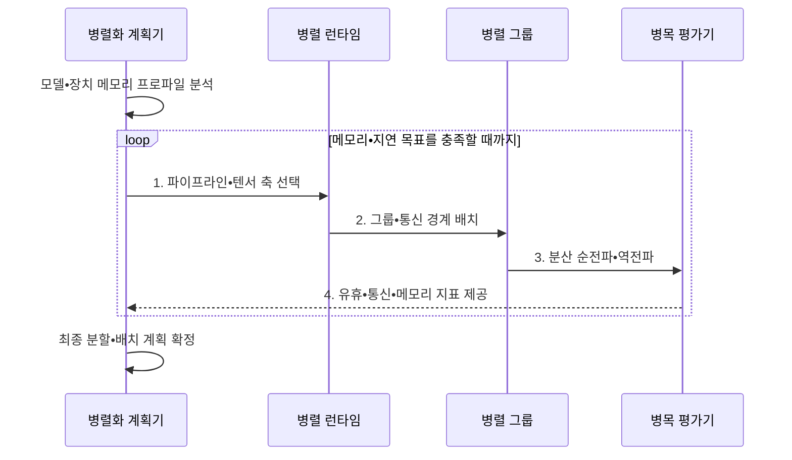

---
sidebar:
  order: 155
  label: "155. 모델 병렬화 (Model Parallelism)"
  badge:
    text: "기출 • 70%"
    variant: note
title: "모델 병렬화 (Model Parallelism)"
date: "2026-08-03T08:48:47+09:00"
tags:
  - "notes-latest_tech"
weight: 155
extra:
  question_no: "155"
  source_status: "기출"
  source_history: "138회"
  priority: 70
  priority_note: "모델 병렬의 분할•통신 설계가 138회 출제됨"
---

## Ⅰ. 개요

핵심 용어

- **모델 병렬화(Model Parallelism)**: 단일 장치에 담기지 않는 모델의 파라미터•연산•상태를 여러 장치에 나누어 공동 실행하는 방식이다.
- **모델 상태**: 학습에 필요한 파라미터•기울기•옵티마이저 값을 함께 이르는 말이다.

- 정의/개념: 모델 파라미터•연산•상태를 여러 장치에 분할하여 공동 실행하는 **모델 병렬화(Model Parallelism) 방식**
- 배경/필요성: 대형 모델의 파라미터•활성값•학습 상태가 **단일 장치 메모리** 초과

#### 한줄 요약
- 한 작업대에 놓을 수 없는 거대한 조립품을 공정이나 부품 방향으로 나누어 여러 작업대에서 함께 만듦

## Ⅱ. 특징

핵심 용어

- **활성값(Activation)**: 각 모델 층이 입력으로 계산하여 다음 층에 전달하는 중간 출력이다.
- **파이프라인 버블(Pipeline Bubble)**: 앞뒤 단계가 입력이나 결과를 기다리며 장치가 유휴 상태가 되는 시간이다.

- **분할 축**: 계층•텐서 기준 모델 저장•연산 분산
- **통신 축**: 경계별 활성값•부분 결과 교환
- **균형 축**: 단계 불균형은 파이프라인 버블, 세분된 텐서 분할은 통신 대기 증가

#### 한줄 요약
- 공정을 나누면 중간 부품을 넘기고 한 공정을 함께 하면 부분 결과를 자주 합쳐야 함

## Ⅲ. 구조 및 구성요소

핵심 용어

- **병렬 런타임(Parallel Runtime)**: 모델 조각과 통신 그룹을 장치 토폴로지에 배치하고 분산 실행하는 소프트웨어이다.
- **병렬화 계획기**: 모델의 층•텐서•메모리와 장치 토폴로지를 분석해 분할 축•단계•통신 그룹을 결정한다.
- **파이프라인 단계 그룹**: 연속된 모델 층을 서로 다른 장치에 배치하여 마이크로배치를 중첩 실행하는 장치 집단이다.
- **텐서 병렬 그룹**: 같은 층의 가중치•연산을 텐서 축으로 분할해 부분 결과를 공동 계산하는 장치 집단이다.
- **통신 인터페이스**: 모델 분할 경계에서 활성값•기울기•부분 결과를 교환하는 연결 계층이다.

| 구성요소 | 책임 |
|:---|:---|
| 병렬화 계획기 | 메모리•연산•통신 기반 **분할 축 선택** |
| 파이프라인 단계 그룹 | 계층 조각과 **활성값•기울기 전달** |
| 텐서 병렬 그룹 | 텐서 조각 계산과 **부분 결과 집계** |
| 통신 인터페이스 | 점대점•집단 통신의 **분할 경계 연결** |
| 병렬 런타임 | 링크•노드 기반 **그룹 배치•실행** |

#### 한줄 요약
- 공정별 팀과 공정 안 공동 작업팀을 나누고 전달 통로와 자리 배정 프로그램이 실행을 맞춤

## Ⅳ. 흐름도

핵심 용어

- **순전파•역전파(Forward•Backward Propagation)**: 입력으로 예측을 계산하고 오차 기울기를 반대 방향으로 전달하는 학습 연산이다.
- **병목 평가**: 장치별 메모리•유휴 시간•통신량을 측정해 분할과 배치를 조정하는 과정이다.

1. **파이프라인•텐서 축 선택**: 구조•통신 특성별 분할 조합 결정
2. **그룹•통신 경계 배치**: 고대역폭 링크에 단계•텐서 그룹 매핑
3. **분산 순전파•역전파**: 조각 계산•통신으로 출력•기울기 완성
4. **유휴•통신•메모리 지표 제공**: 분할 수•경계 재조정 근거

#### 한줄 요약
- 부품 크기와 작업대 거리를 재고 팀을 나눈 뒤 기다리는 작업대와 막힌 통로가 줄도록 다시 배치함

## Ⅴ. 종류 및 비교

핵심 용어

- **텐서 병렬화(Tensor Parallelism)**: 하나의 계층 안에서 텐서 연산과 파라미터를 여러 장치에 나누고 부분 결과를 합치는 방식이다.
- **파이프라인 병렬화(Pipeline Parallelism)**: 연속 모델 층을 여러 단계에 나누고 활성값•기울기를 단계 사이에 전달하는 방식이다.
- **마이크로배치(Microbatch)**: 파이프라인 단계를 겹쳐 실행하기 위해 하나의 배치를 더 작게 나눈 단위이다.

| 비교 기준 | 파이프라인 병렬 | 텐서 병렬 | 혼합 모델 병렬 |
|:---|:---|:---|:---|
| 적용 기준 | **계층 묶음 분할 가능** | **단일 계층이 장치 초과** | **한 축만으로 용량 부족** |
| 핵심 특징 | 단계 분할•**마이크로배치** | 텐서 축 분할•**부분 합산** | 파이프라인•텐서 **다차원 결합** |
| 한계 | **버블•단계 불균형** | **빈번한 집단 통신** | **토폴로지•배치 복잡성** |

> 요약: 계층 분할은 **파이프라인 병렬**, 단일 연산 분할은 **텐서 병렬**

#### 한줄 요약
- 공정별 분업, 한 공정의 공동 작업, 두 방식을 겹친 대규모 공장의 차이임

## Ⅵ. 실무 고려사항 및 대책

핵심 용어

- **상태 소유권**: 분할된 파라미터•기울기•옵티마이저 상태를 어느 장치가 보관하고 갱신하는지 정한 관계이다.
- **체크포인트 샤드**: 모델 병렬 그룹이 맡은 학습 상태만 나누어 저장한 복구 데이터 조각이다.

| 문제 | 대책 | 효과 |
|:---|:---|:---|
| 단계 연산 불균형의 **파이프라인 버블** | 계층 비용별 단계 재분할•마이크로배치 조정 | 장치 유휴 시간 **감소** |
| 텐서 분할의 **집단 통신 폭증** | 고대역폭 노드 내부 그룹•통신 중첩 | 계층 실행 지연 **완화** |
| 혼합 축의 **메모리 중복•배치 오류** | 축별 상태 소유권•체크포인트 샤드 검증 | 분산 상태 **정합성 확보** |

#### 한줄 요약
- 공정 시간을 비슷하게 맞추고 자주 대화하는 작업자는 가까이 두며 저장본의 부품 소유자를 확인함

## Ⅶ. 결론

핵심 용어

- **분할 축**: 모델을 계층•행•열 등 어떤 차원을 기준으로 여러 장치에 나눌지 정한 방향이다.
- **고대역폭 그룹**: 빈번한 부분 결과 교환을 감당하도록 빠른 링크로 연결한 장치 집합이다.

- **분할 축•고대역폭 그룹별 선택**: 계층 분할 가능은 파이프라인 병렬, 단일 계층 초과는 텐서 병렬

#### 한줄 요약
- 모델이 장치에 들어가면서 기다림과 통신이 가장 적은 분할 축과 배치를 선택함
