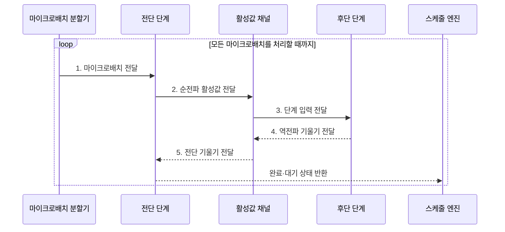

---
sidebar:
  order: 156
  label: "156. Pipeline Parallelism (파이프라인 병렬)"
  badge:
    text: "기출 · 60%"
    variant: note
title: "Pipeline Parallelism (파이프라인 병렬)"
date: "2026-07-31T12:12:34+09:00"
tags:
  - "notes-latest-tech"
weight: 156
extra:
  question_no: "156"
  source_status: "기출"
  source_history: "138회"
  priority: 60
  priority_note: "파이프라인 병렬의 버블·단계 설계가 출제됨"
---

## 미리 알고가기

- **파이프라인 병렬(Pipeline Parallelism, PP, 피피)**: 모델의 연속된 층을 단계로 나누고 여러 장치에서 마이크로배치를 중첩 처리
- **마이크로배치(Microbatch)**: 하나의 학습 배치를 파이프라인에 순차 투입하도록 나눈 작은 실행 단위
- **버블(Bubble)**: 파이프라인을 채우고 비우는 동안 일부 장치가 계산하지 못하는 유휴 시간
- **GPipe**: 모든 마이크로배치 순전파 후 역전파를 수행하는 동기 스케줄
- **1F1B(One Forward One Backward)**: 순전파와 역전파를 교대로 실행하는 스케줄

> **키워드:** Pipeline Parallelism (파이프라인 병렬)

## Ⅰ. 개요

- 정의/개념: 모델 층을 단계로 분할해 **마이크로배치를 중첩 실행**하는 병렬화 기법
- 배경/필요성: 모델이 단일 장치 메모리를 초과하고 **순차 층 분할은 버블** 발생

### 쉽게 이해하기 (학습용)

- 제품 공정에 다음 제품을 연속 투입해 여러 작업대가 동시에 일하는 방식과 같다.

## Ⅱ. 특징

- **분할 축**: 연속 모델 층의 장치별 단계 배치
- **중첩 축**: 마이크로배치 순·역전파로 버블 감소
- **균형 축**: 단계 시간 차이는 처리량 제한, 분할 경계 증가는 통신 대기 증가

### 쉽게 이해하기 (학습용)

- 제품 투입 수와 작업 순서로 반제품 정체와 작업대 대기 시간을 줄인다.

## Ⅲ. 구조 및 구성요소

| 구성요소 | 책임 |
|:---|:---|
| 단계 분할기 | **연산량·파라미터 기반 단계 균형화** |
| 마이크로배치 분할기 | **실행 단위 분할·누적 기울기** 관리 |
| 활성값 채널 | **순전파 활성값·역전파 기울기** 전달 |
| 스케줄 엔진 | **준비·정상·마무리 실행 순서** 제어 |
| 활성값 관리자 | **활성값 보존·재계산** 관리 |

### 쉽게 이해하기 (학습용)

- 작업대별 처리 시간을 맞추고 제품 번호를 붙여 앞 작업과 되돌림 작업의 순서를 관리해야 같은 제품의 결과가 정확히 연결됨

## Ⅳ. 흐름도

1. **마이크로배치 전달**: 전역 배치 분할·연속 투입
2. **순전파 활성값 전달**: 전단 계산·중간 상태 보존
3. **단계 입력 전달**: 후단 장치의 순전파 실행
4. **역전파 기울기 전달**: 후단의 입력 기울기 계산
5. **전단 기울기 전달**: 역순 단계의 기울기 전파

### 쉽게 이해하기 (학습용)

- 작업대 속도를 맞춘 뒤 여러 제품의 앞 작업과 되돌림 작업을 겹쳐 처리한다.

## Ⅴ. 종류 및 비교

| 스케줄 | GPipe | 동기 1F1B | 인터리브 1F1B |
|:---|:---|:---|:---|
| 적용 기준 | **단순한 동기 학습** | **활성값 메모리 절감** | **버블 감소 우선** |
| 핵심 특징 | **모든 순전파 후 역전파** | **순전파·역전파 교대** | **가상 단계 교차 실행** |
| 한계 | **많은 활성값 보관** | **초기·종료 버블** | **통신 횟수·복잡도 증가** |

> 요약: **GPipe**는 단순성, **1F1B**는 활성값 메모리 절감 중심

### 쉽게 이해하기 (학습용)

- 모든 제품을 먼저 앞으로 보낸 뒤 되돌리는 방식, 한 개씩 앞뒤 작업을 번갈아 하는 방식, 작업대를 더 잘게 나눠 쉬는 틈을 메우는 방식의 차이임

## Ⅵ. 실무 고려사항 및 대책

| 고려사항 | 대책 | 효과 |
|:---|:---|:---|
| 단계 시간 차이로 **파이프라인 병목** | 층별 시간·메모리 기반 단계 재분할 | 단계 **처리량 균형** 확보 |
| 적은 마이크로배치로 **버블 비율** 증가 | 마이크로배치 수·1F1B 스케줄 조정 | 장치 **유휴 시간 감소** |

### 쉽게 이해하기 (학습용)

- 실제 대형 학습 시스템도 모델을 작업대처럼 나누고 제품 묶음 수와 앞뒤 작업 순서를 조정해 장치가 쉬는 시간을 줄임

## Ⅶ. 결론

- 단순 동기 학습은 **GPipe**, 활성값 메모리 절감은 **1F1B** 선택

### 쉽게 이해하기 (학습용)

- 여러 장치가 마이크로배치를 이어 처리해 쉬는 시간을 줄인다
