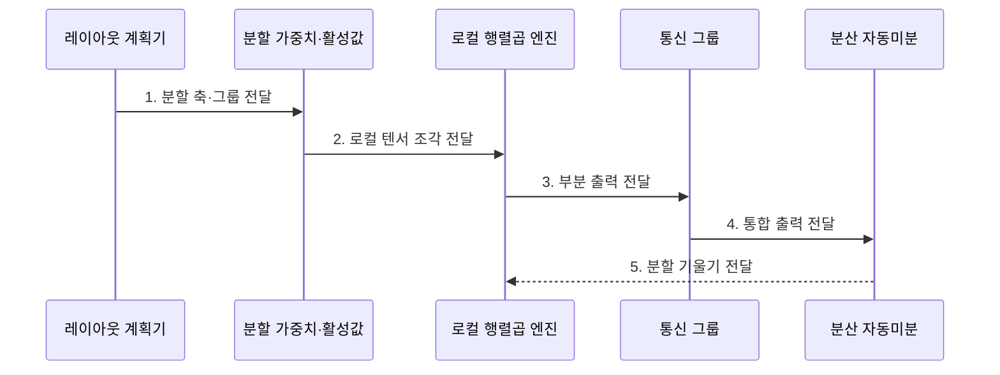

---
sidebar:
  order: 157
  label: "157. Tensor Parallelism (텐서 병렬)"
  badge:
    text: "기출 · 70%"
    variant: note
title: "Tensor Parallelism (텐서 병렬)"
date: "2026-07-31T08:59:54+09:00"
tags:
  - "notes-latest-tech"
weight: 157
extra:
  question_no: "157"
  source_status: "기출"
  source_history: "138회"
  priority: 70
  priority_note: "텐서 병렬의 연산 분할·통신 설계가 출제됨"
---

## 미리 알고가기

- **텐서 병렬(Tensor Parallelism, TP, 티피)**: 한 층의 가중치·연산을 텐서 축으로 나눠 여러 장치가 공동 계산
- **집단 통신(Collective Communication)**: 분할 결과를 All-Reduce·All-Gather 등으로 합치는 장치 그룹 통신
- **All-Reduce(올 리듀스)**: 각 장치의 부분값을 합산한 뒤 모든 장치에 같은 결과를 배포하는 연산
- **All-Gather(올 개더)**: 장치별 텐서 조각을 교환해 전체 텐서를 구성하는 연산

> **키워드:** Tensor Parallelism (텐서 병렬)

## Ⅰ. 개요

- 정의/개념: 단일 층의 **텐서 축·행렬 연산**을 여러 장치에 분할하는 병렬화 기법
- 배경/필요성: 거대 층의 **단일 장치 메모리·연산 용량** 초과 대응

### 쉽게 이해하기 (학습용)

- 한 판재를 방향에 따라 잘라 여러 사람이 동시에 가공하는 방식임

## Ⅱ. 특징

- **분할 축**: 행·열 텐서 축 기반 장치별 부분 연산
- **통신 축**: 레이아웃별 All-Gather·All-Reduce 결합
- **배치 축**: 고대역폭 장치 그룹 안에 통신 집중

### 쉽게 이해하기 (학습용)

- 세로로 자른 결과는 이어 붙이고 가로로 자른 부분 계산값은 합산한다.

## Ⅲ. 구조 및 구성요소

| 구성요소 | 책임 |
|:---|:---|
| 레이아웃 계획기 | **다음 연산 입력 기반 분할 차원** 선택 |
| 분할 가중치·활성값 | **장치별 데이터 범위** 정의 |
| 로컬 행렬곱 엔진 | **분할 텐서 부분 출력** 계산 |
| 텐서 병렬 통신 그룹 | **출력·기울기 집단 통신** 수행 |
| 분산 자동미분 | **레이아웃 대응 기울기** 계산·전달 |

### 쉽게 이해하기 (학습용)

- 세로 조각은 옆으로 이어 완성하고 가로 조각은 각 계산값을 더해 완성하며, 다음 작업이 조각을 그대로 쓸 수 있으면 일부 통신을 미룰 수 있음

## Ⅳ. 흐름도

- **1. 분할 축·그룹 전달**: 다음 연산 레이아웃 기반 행·열 축 결정
- **2. 로컬 텐서 조각 전달**: 장치별 가중치·활성값 범위 배치
- **3. 부분 출력 전달**: 로컬 행렬곱 결과 생성
- **4. 통합 출력 전달**: All-Gather·All-Reduce 기반 다음 입력 완성
- **5. 분할 기울기 전달**: 순전파 레이아웃 대응 역전파 갱신

### 쉽게 이해하기 (학습용)

- 다음 공정이 원하는 조각 모양까지 보고 판재를 나눈 뒤 각자 가공하고, 꼭 필요한 시점에만 이어 붙이거나 합산하는 절차임

## Ⅴ. 종류 및 비교

| 병렬화 방식 | 텐서 병렬 | 파이프라인 병렬 | 데이터 병렬 |
|:---|:---|:---|:---|
| 적용 기준 | **한 층이 장치 용량 초과** | **연속 모델 단계 분할** | **모델 복제본 배치 가능** |
| 핵심 특징 | **텐서 축·연산 분할** | **마이크로배치 단계 중첩** | **배치 분할·기울기 동기화** |
| 한계 | **잦은 집단 통신** | **버블·단계 불균형** | **장치마다 전체 모델 필요** |

> 요약: **텐서 병렬**은 연산, **파이프라인 병렬**은 계층 분할

### 쉽게 이해하기 (학습용)

- 한 부품을 함께 가공하면 텐서 병렬, 공정을 나누면 파이프라인 병렬, 같은 설비로 서로 다른 제품을 만들면 데이터 병렬임

## Ⅵ. 실무 고려사항 및 대책

| 고려사항 | 대책 | 효과 |
|:---|:---|:---|
| 잦은 집단 통신으로 **연산 대기** 증가 | 연속 층의 열·행 레이아웃 결합 | 중간 **동기화 횟수 감소** |
| 장치 수 증가로 **통신량 우세** | 고대역폭 그룹 내 TP 크기 제한 | 연산·통신 **중첩 효율** 확보 |

### 쉽게 이해하기 (학습용)

- 이어지는 두 가공 작업의 자르는 방향을 맞춰 중간에 전체 판재를 다시 조립하지 않고 마지막에만 결과를 합치는 방식임

## Ⅶ. 결론

- 단일 층 용량 초과는 **텐서 병렬**, 계층 묶음 분할은 **파이프라인 병렬** 선택

### 쉽게 이해하기 (학습용)

- 하나의 큰 계산을 나눠 풀고 필요한 지점에서 결과를 합친다
