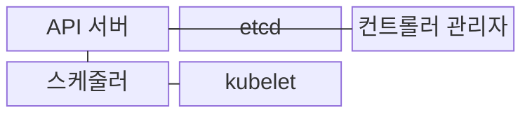
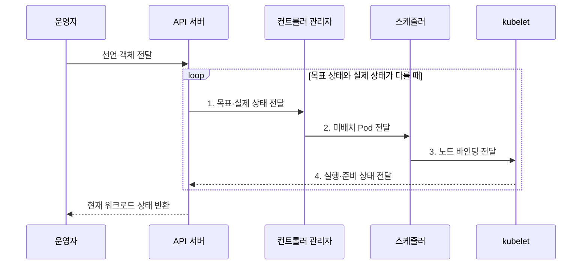

---
sidebar:
  order: 158
  label: "158. Kubernetes (쿠버네티스)"
  badge:
    text: "기출 · 80%"
    variant: note
title: "Kubernetes (쿠버네티스)"
date: "2026-07-31T09:00:33+09:00"
tags:
  - "notes-latest-tech"
weight: 158
extra:
  question_no: "158"
  source_status: "기출"
  source_history: "135회, 137회"
  priority: 80
  priority_note: "쿠버네티스 제어 루프·스케줄링이 반복 출제됨"
---

## 미리 알고가기

- **쿠버네티스(Kubernetes, K8s)**: 다중 노드의 컨테이너를 선언한 목표 상태에 맞춰 배치·확장·복구하는 플랫폼
- **Pod(파드)**: 하나 이상의 컨테이너가 네트워크·저장 공간을 공유하는 Kubernetes의 최소 배포 단위
- **조정(Reconciliation)**: 선언한 목표 상태와 실제 상태의 차이를 반복해서 줄이는 제어 루프

## Ⅰ. 개요

- 정의/개념: 선언 상태·조정 루프로 컨테이너를 운영하는 **Kubernetes(K8s) 플랫폼**
- 배경/필요성: 다중 노드 수동 운영의 **배치·연결·복구 불일치** 해소 필요

### 쉽게 이해하기 (학습용)

- 운영자가 실행 수와 버전을 선언하면 플랫폼이 실제 상태를 반복 확인해 유지한다.

## Ⅱ. 특징

- **객체 축**: Pod 최소 배포 단위 기반 선언 관리
- **조정 축**: 컨트롤러가 목표·실제 상태 차이 축소
- **실행 축**: 스케줄러·kubelet의 배치·실행 분담

### 쉽게 이해하기 (학습용)

- 배치 관리자는 장소를 정하고 현장 감독자가 실행하며, 안내 데스크는 준비된 일꾼에게 트래픽을 보냄

## Ⅲ. 구조 및 구성요소

| 구성요소 | 책임 |
|:---|:---|
| API 서버 | **객체 인증·검증·제어면 통신** 창구 |
| etcd | **클러스터 구성·상태** 분산 저장 |
| 컨트롤러 관리자 | **Pod 생성·교체 요청** 조정 |
| 스케줄러 | **미배치 Pod 실행 노드** 지정 |
| kubelet | **컨테이너 실행·상태 보고** 수행 |

### 쉽게 이해하기 (학습용)

- 주문 창구·기준 장부·감독자·자리 배정자·현장 관리자가 함께 목표 상태를 유지한다.

## Ⅳ. 흐름도

1. **목표·실제 상태 전달**: 컨트롤러의 상태 차이 계산
2. **미배치 Pod 전달**: 부족 복제본 생성·스케줄 요청
3. **노드 바인딩 전달**: 자원·제약 기반 실행 노드 결정
4. **실행·준비 상태 전달**: 컨테이너 실행·준비 상태 보고

### 쉽게 이해하기 (학습용)

- 필요한 인원과 조건을 장부에 적고 부족하면 새 일꾼의 자리를 정해 투입하며, 준비된 사람만 안내하고 실패하면 교체하는 순서임

## Ⅴ. 종류 및 비교

| 워크로드 제어기 | Deployment | StatefulSet | DaemonSet |
|:---|:---|:---|:---|
| 적용 기준 | **교체 가능한 무상태 서비스** | **고정 식별·저장 작업** | **모든 대상 노드 기능 배치** |
| 핵심 특징 | **복제 수·순차 배포** 관리 | **순서·식별자·볼륨** 유지 | **노드별 Pod 복제본** 유지 |
| 한계 | **영속 상태 자체 보장 불가** | **배포·복구 순서로 확장 지연** | **노드 증가만큼 자원 증가** |

> 요약: **Deployment**는 무상태, **StatefulSet**은 상태, DaemonSet은 노드 상주

### 쉽게 이해하기 (학습용)

- 아무 직원이나 대신할 수 있으면 Deployment, 이름과 개인 사물함이 필요하면 StatefulSet, 모든 지점에 한 명씩 필요하면 DaemonSet임

## Ⅵ. 실무 고려사항 및 대책

| 고려사항 | 대책 | 효과 |
|:---|:---|:---|
| 준비되지 않은 Pod로 **트래픽 오류** | readiness probe·Service 엔드포인트 연계 | 정상 Pod만 **요청 수신** |
| 자원 요청 오류로 **스케줄 불가·축출** | 요청·제한·우선순위 기준 검증 | 노드 배치 **안정성 향상** |

### 쉽게 이해하기 (학습용)

- 웹 서버는 복제본으로 교체할 수 있지만 손상된 데이터는 백업에서 복구해야 한다.

## Ⅶ. 결론

- 교체 가능한 무상태는 **Deployment**, 고정 식별·저장은 **StatefulSet** 선택

### 쉽게 이해하기 (학습용)

- 원하는 개수와 상태를 적으면 제어기가 계속 맞춰 준다
