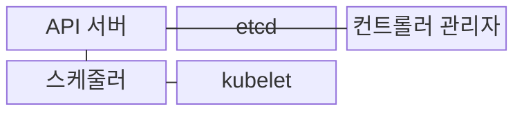
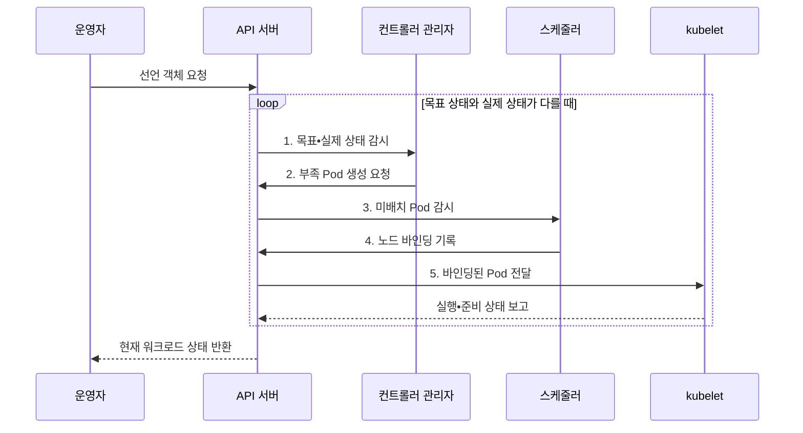

---
sidebar:
  order: 158
  label: "158. Kubernetes (쿠버네티스)"
  badge:
    text: "기출 • 80%"
    variant: note
title: "Kubernetes (쿠버네티스)"
date: "2026-08-04T14:41:47+09:00"
tags:
  - "notes-latest-tech"
weight: 158
extra:
  question_no: "158"
  source_status: "기출"
  source_history: "135회, 137회"
  priority: 80
  priority_note: "쿠버네티스 제어 루프•스케줄링이 반복 출제됨"
---

## Ⅰ. 개요

핵심 용어

- **쿠버네티스(Kubernetes, K8s)**: 다중 노드의 컨테이너를 선언한 목표 상태에 맞춰 배치•확장•복구하는 플랫폼이다.
- **조정(Reconciliation)**: 선언한 목표 상태와 실제 상태의 차이를 반복해서 줄이는 제어 루프이다.

- 정의/개념: 다중 노드의 컨테이너를 선언한 목표 상태에 맞춰 조정•배치•확장•복구하는 **K8s 오케스트레이션 플랫폼**
- 배경/필요성: 다중 노드 수동 운영으로 **배치•연결•복구 상태** 불일치

#### 한줄 요약

- 운영자가 실행 수와 버전을 선언하면 플랫폼이 실제 상태를 반복 확인해 유지한다.

## Ⅱ. 특징

핵심 용어

- **파드(Pod)**: 하나 이상의 컨테이너가 네트워크와 저장 공간을 공유하는 K8s의 최소 배포 단위이다.
- **kubelet**: 각 노드에서 Pod의 컨테이너를 실행하고 상태를 제어면에 보고하는 에이전트이다.

- **객체 축**: Pod를 최소 배포 단위로 선언•관리
- **조정 축**: 컨트롤러가 목표•실제 상태 차이 축소
- **실행 축**: 스케줄러•kubelet의 배치•실행 분담

#### 한줄 요약

- 배치 관리자는 장소를 정하고 현장 감독자가 실행하며, 안내 데스크는 준비된 일꾼에게 트래픽을 보냄

## Ⅲ. 구조 및 구성요소

핵심 용어

- **응용 프로그래밍 인터페이스 서버(Application Programming Interface Server, API Server)**: 객체 요청을 인증•검증하고 모든 제어면 통신의 창구가 되는 구성요소이다.
- **etcd**: 클러스터의 선언 객체와 상태를 일관되게 보관하는 분산 키-값 저장소이다.
- **컨트롤러 관리자(Controller Manager)**: 목표 상태와 실제 상태의 차이를 감시하고 필요한 파드 생성•교체 요청을 수행하는 제어면 구성요소이다.
- **스케줄러(Scheduler)**: 아직 노드가 정해지지 않은 파드의 자원•제약을 평가해 실행 노드를 선택하는 제어면 구성요소이다.

| 구성요소 | 책임 |
|:---|:---|
| API 서버 | **객체 인증•검증•제어면 통신** 창구 |
| etcd | **클러스터 구성•상태** 분산 저장 |
| 컨트롤러 관리자 | **Pod 생성•교체 요청** 조정 |
| 스케줄러 | **미배치 Pod 실행 노드** 지정 |
| kubelet | **컨테이너 실행•상태 보고** 수행 |

#### 한줄 요약

- 주문 창구•기준 장부•감독자•자리 배정자•현장 관리자가 함께 목표 상태를 유지한다.

## Ⅳ. 흐름도

핵심 용어

- **노드 바인딩**: 스케줄러가 미배치 Pod를 실행할 특정 노드에 연결하는 결정이다.
- **준비 상태**: Pod가 서비스 요청을 정상 처리할 수 있는지 나타내는 조건이다.

API 서버는 Pod의 목표•실제 상태를 각 제어 구성요소에 전달한다.

1. **목표•실제 상태 감시**: 컨트롤러의 복제본 차이 계산
2. **부족 Pod 생성 요청**: 필요한 미배치 Pod 객체 생성
3. **미배치 Pod 감시**: 스케줄 대상 Pod 탐색
4. **노드 바인딩 기록**: 자원•제약 기반 실행 노드 결정
5. **바인딩된 Pod 전달**: kubelet의 컨테이너 실행

#### 한줄 요약

- 필요한 인원과 조건을 장부에 적고 부족하면 새 일꾼의 자리를 정해 투입하며, 준비된 사람만 안내하고 실패하면 교체하는 순서임

## Ⅴ. 종류 및 비교

핵심 용어

- **Deployment**: 교체 가능한 무상태 Pod의 복제 수와 순차 배포를 관리하는 제어기이다.
- **StatefulSet**: Pod의 고정 식별자•순서•영속 볼륨 연결을 유지하는 제어기이다.
- **DaemonSet**: 모든 대상 노드에 지정 Pod 복제본이 하나씩 실행되도록 관리하는 제어기이다.

| 워크로드 제어기 | Deployment | StatefulSet | DaemonSet |
|:---|:---|:---|:---|
| 적용 기준 | **교체 가능한 무상태 서비스** | **고정 식별•저장 작업** | **모든 대상 노드 기능 배치** |
| 핵심 특징 | **복제 수•순차 배포** 관리 | **순서•식별자•볼륨** 유지 | **노드별 Pod 복제본** 유지 |
| 한계 | **영속 상태 자체 보장 불가** | **배포•복구 순서로 확장 지연** | **노드 증가만큼 자원 증가** |

> 요약: 무상태는 **Deployment**, 상태 보존은 **StatefulSet**, 노드 상주는 **DaemonSet**

#### 한줄 요약

- 아무 직원이나 대신할 수 있으면 Deployment, 이름과 개인 사물함이 필요하면 StatefulSet, 모든 지점에 한 명씩 필요하면 DaemonSet임

## Ⅵ. 실무 고려사항 및 대책

핵심 용어

- **준비 상태 검사(Readiness Probe)**: 컨테이너가 요청을 받을 준비가 되었는지 주기적으로 확인하는 검사이다.
- **자원 요청•제한**: 스케줄링에 보장할 자원량과 컨테이너가 사용할 수 있는 최대 자원량을 정한 값이다.
- **서비스(Service)**: 준비된 Pod 집합에 안정적인 접근 주소와 트래픽 분산을 제공하는 객체이다.

| 문제 | 대책 | 효과 |
|:---|:---|:---|
| 준비되지 않은 Pod로 **트래픽 오류** | 준비 상태 검사•서비스 엔드포인트 연계 | 정상 Pod만 **요청 수신** |
| 자원 요청 오류로 **스케줄 불가•축출** | 요청•제한•우선순위 기준 검증 | 노드 배치 **안정성 향상** |

#### 한줄 요약

- 웹 서버는 복제본으로 교체할 수 있지만 손상된 데이터는 백업에서 복구해야 한다.

## Ⅶ. 결론

핵심 용어

- **무상태 서비스**: 개별 Pod가 영속 상태를 소유하지 않아 다른 복제본으로 교체할 수 있는 서비스이다.
- **영속 볼륨**: Pod 수명과 분리해 데이터를 계속 보관하도록 제공하는 저장 자원이다.

- **무상태 서비스•영속 볼륨별 선택**: 교체 가능한 워크로드는 Deployment, 고정 식별•저장 워크로드는 StatefulSet

#### 한줄 요약

- 원하는 개수와 상태를 적으면 제어기가 계속 맞춰 준다
