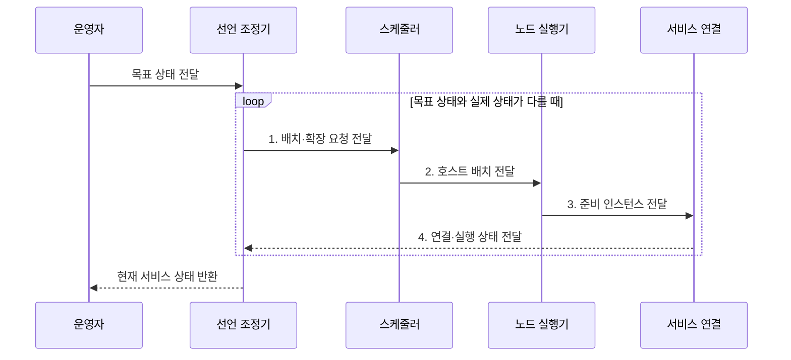

---
sidebar:
  order: 159
  label: "159. Container Orchestration (컨테이너 오케스트레이션)"
  badge:
    text: "기출 · 70%"
    variant: note
title: "Container Orchestration (컨테이너 오케스트레이션)"
date: "2026-07-31T12:14:57+09:00"
tags:
  - "notes-latest-tech"
weight: 159
extra:
  question_no: "159"
  source_status: "기출"
  source_history: "135회, 137회"
  priority: 70
  priority_note: "컨테이너 오케스트레이션 구조가 반복 출제됨"
---

## 미리 알고가기

- **컨테이너 오케스트레이션(Container Orchestration)**: 다중 호스트의 컨테이너 배포·연결·복구·확장을 자동 조정하는 운영 개념
- **오케스트레이션(Orchestration)**: 여러 실행·네트워크·복구 기능을 하나의 목표 상태에 맞춰 조율
- **Kubernetes(쿠버네티스)**: 컨테이너 오케스트레이션 개념을 구현한 대표 플랫폼

## Ⅰ. 개요

- 정의/개념: 다중 호스트의 배치·연결·확장·복구를 자동화하는 **컨테이너 오케스트레이션**
- 배경/필요성: 개별 런타임만으로는 **분산 상태·장애 복구** 통합 조정 불가

### 쉽게 이해하기 (학습용)

- 여러 지점에 일을 나누고 연결하며 결원이 생기면 대체 인력을 보내는 전체 운영 체계임

## Ⅱ. 특징

- **상태 축**: 목표 상태 기반 실행 수·버전·자원 조정
- **배치 축**: 스케줄링·서비스 발견으로 배치·연결
- **복구 축**: 상태 감시 기반 장애 복구·수평 확장

### 쉽게 이해하기 (학습용)

- 인원과 규칙을 정하면 배치, 안내, 결원 보충, 증원이 자동으로 이어지는 능력임

## Ⅲ. 구조 및 구성요소

| 구성요소 | 책임 |
|:---|:---|
| 선언 조정 | **서비스 요구·현재 상태 차이** 조정 |
| 스케줄러 | **최적 호스트 선택·배치** |
| 노드 실행 | **이미지 수신·컨테이너 실행** 보고 |
| 서비스 연결 | **실행 위치 발견·주소 추상화** |
| 복구 확장 | **실패·부하 기반 재시작·증감** |

### 쉽게 이해하기 (학습용)

- 기준 장부, 자리 배정자, 현장 실행자, 안내 데스크, 결원·증원 담당자가 연결된 전체 운영 조직과 같음

## Ⅳ. 흐름도

1. **배치·확장 요청 전달**: 목표·실제 상태 차이 계산
2. **호스트 배치 전달**: 자원·제약 기반 실행 위치 결정
3. **준비 인스턴스 전달**: 컨테이너 실행·준비 상태 확인
4. **연결·실행 상태 전달**: 서비스 발견·복구 상태 갱신

### 쉽게 이해하기 (학습용)

- 목표 인원과 현재 인원을 비교해 배치하고 결원과 수요 증가에 대응한다.

## Ⅴ. 종류 및 비교

| 운영 방식 | 컨테이너 오케스트레이션 | 단일 호스트 런타임 | 가상머신 관리 |
|:---|:---|:---|:---|
| 적용 기준 | **다중 호스트 분산 서비스** | **한 호스트의 단순 실행** | **강한 격리·레거시 운영** |
| 핵심 특징 | **선언 조정·스케줄·복구** | **로컬 컨테이너 직접 실행** | **게스트 OS 단위 관리** |
| 한계 | **제어면·운영 복잡도 증가** | **다중 호스트 자동 조정 부재** | **큰 이미지·시작 비용** |

> 요약: **오케스트레이션**은 다중 호스트, **런타임**은 단일 호스트 중심

### 쉽게 이해하기 (학습용)

- 여러 공장의 작은 작업 상자를 운영하면 오케스트레이션, 한 공장만 쓰면 런타임, 공장 방 전체를 빌리면 가상머신 관리가 맞음

## Ⅵ. 실무 고려사항 및 대책

| 고려사항 | 대책 | 효과 |
|:---|:---|:---|
| 목표·실제 상태 차이로 **복제본 불일치** | 선언 조정·상태 감시 루프 적용 | 서비스 **실행 수 일관성** 확보 |
| 위치 변경으로 **서비스 주소 단절** | 서비스 발견·주소 추상화 적용 | 동적 배치의 **연결 연속성** 확보 |

### 쉽게 이해하기 (학습용)

- 먼저 여러 지점 운영 능력이 필요한지 판단하고, 필요할 때 Kubernetes를 구현체로 고르며 한 지점이면 단순 도구를 쓰는 것임

## Ⅶ. 결론

- 다중 호스트·동적 상태는 **오케스트레이션**, 단일 호스트는 **런타임** 선택

### 쉽게 이해하기 (학습용)

- 여러 서버의 컨테이너를 한 기준으로 배치·복구한다
