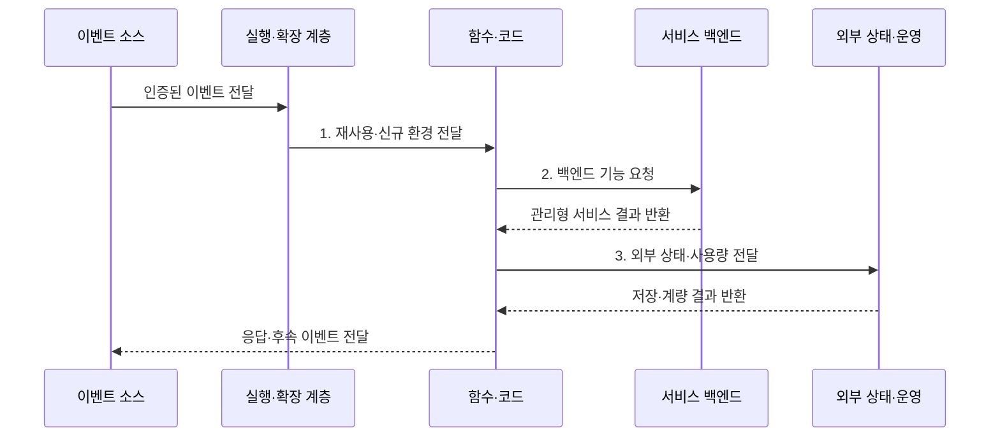

---
sidebar:
  order: 160
  label: "160. Serverless Computing (서버리스 컴퓨팅)"
  badge:
    text: "기출 · 50%"
    variant: note
title: "Serverless Computing (서버리스 컴퓨팅)"
date: "2026-07-31T12:16:04+09:00"
tags:
  - "notes-latest-tech"
weight: 160
extra:
  question_no: "160"
  source_status: "기출"
  source_history: "122회"
  priority: 50
  priority_note: "서버리스의 비용·상태·확장 비교 가치가 유지됨"
---

## Ⅰ. 개요

핵심 용어

- **서버리스 컴퓨팅(Serverless Computing)**: 공급자가 서버 운영·자동 확장·용량 할당·사용량 계량을 맡는 클라우드 실행 모델이다.
- **종량 과금**: 예약한 서버 용량보다 실제 요청·실행 시간·자원 사용량을 기준으로 비용을 부과하는 방식이다.

- 정의/개념: **서버리스 컴퓨팅**은 공급자가 인프라 운영·자동 확장·용량 할당·사용량 계량을 맡는 클라우드 실행 모델
- 배경/필요성: 변동 워크로드의 상시 용량 확보로 **유휴 비용·패치 부담** 증가

#### 한줄 요약

- 주문과 조리법만 보내면 공급자가 주방을 조절해 처리하고 사용분을 정산하는 방식임

## Ⅱ. 특징

핵심 용어

- **콜드 스타트(Cold Start)**: 재사용할 실행 환경이 없어 새 환경과 런타임을 초기화하며 발생하는 첫 요청 지연이다.
- **자동 회수**: 요청이 줄었을 때 공급자가 실행 환경과 할당 자원을 축소하거나 종료하는 기능이다.

- **자원 축**: 요청량 기반 자동 할당·회수·계량
- **구성 축**: FaaS·BaaS·서버리스 컨테이너 조합
- **제약 축**: 콜드 스타트·실행 제한·공급자 종속

#### 한줄 요약

- 주문 시 주방을 새로 열면 첫 처리가 지연되고 장부는 외부에 기록한다.

## Ⅲ. 구조 및 구성요소

핵심 용어

- **이벤트 소스**: 웹 요청·메시지·일정 등 서버리스 실행을 시작하는 입력을 만드는 주체이다.
- **외부 상태**: 실행 환경 수명과 분리해 데이터베이스·객체 저장소 등에 영속적으로 보관하는 업무 상태이다.

| 구성요소 | 책임 |
|:---|:---|
| 이벤트·요청 | **웹·메시지·일정 실행** 개시 |
| 실행·확장 | **격리 환경·인스턴스 자동 조정** |
| 함수·코드 | **입력 처리·후속 이벤트** 생성 |
| 서비스 백엔드 | **인증·DB 완성 기능** 제공 |
| 외부 상태·운영 | **영속 상태·사용량 계량** 관리 |

#### 한줄 요약

- 주문 창구, 필요할 때 여는 주방, 조리 담당 코드, 빌려 쓰는 결제·장부, 별도 기록·감사 창고가 연결된 구조임

## Ⅳ. 흐름도

핵심 용어

- **실행 환경 재사용**: 이전 호출에서 준비한 런타임과 코드를 다음 요청 처리에 활용하는 방식이다.
- **관리형 서비스**: 공급자가 배포·패치·확장·가용성을 운영하고 사용자는 API로 소비하는 기능이다.

1. **재사용·신규 환경 전달**: 준비 환경 선택·콜드 스타트
2. **백엔드 기능 요청**: 인증·데이터베이스 관리형 서비스 호출
3. **외부 상태·사용량 전달**: 영속 상태 분리·실행 자원 계량

#### 한줄 요약

- 준비된 환경이 없으면 초기화 지연이 생기며 결과와 상태는 외부에 기록한다.

## Ⅴ. 종류 및 비교

핵심 용어

- **서비스형 함수(Function as a Service, FaaS)**: 이벤트마다 함수 코드를 격리 환경에서 실행하고 사용량만큼 과금하는 서버리스 유형이다.
- **서비스형 백엔드(Backend as a Service, BaaS)**: 인증·데이터베이스 등 완성된 백엔드 기능을 API로 제공하는 서버리스 유형이다.
- **서버리스 컨테이너**: 사용자 컨테이너 이미지를 요청이나 작업량에 따라 자동 확장하는 서버리스 유형이다.

| 서버리스 유형 | 서비스형 함수 | 서비스형 백엔드 | 서버리스 컨테이너 |
|:---|:---|:---|:---|
| 적용 기준 | **짧고 독립적인 이벤트** | **공통 백엔드 기능 활용** | **사용자 런타임·이미지 필요** |
| 핵심 특징 | **함수 단위 실행·자동 확장** | **완성 기능 API 소비** | **컨테이너 단위 자동 확장** |
| 한계 | **실행 시간·환경 제약** | **공급자 기능·정책 종속** | **큰 시작·운영 비용** |

> 요약: **FaaS**는 함수 실행, **BaaS**는 완성 백엔드 기능 중심

#### 한줄 요약

- 조리법 한 단계만 맡기면 함수, 완성된 결제·회원 장부를 빌리면 백엔드, 포장한 이동식 주방을 맡기면 서버리스 컨테이너임

## Ⅵ. 실무 고려사항 및 대책

핵심 용어

- **사전 준비 인스턴스**: 첫 요청 지연을 줄이기 위해 실행 환경을 미리 초기화해 유지한 자원이다.
- **멱등 처리**: 같은 이벤트가 반복 전달되어도 최종 상태가 한 번 처리한 것과 같도록 만드는 방식이다.

| 문제 | 대책 | 효과 |
|:---|:---|:---|
| 신규 환경 초기화로 **콜드 스타트 지연** | 사전 준비 인스턴스·패키지 경량화 | 첫 요청 **응답 지연 감소** |
| 함수 내부 상태 의존으로 **확장 정합성** 훼손 | 영속 상태 외부화·멱등 이벤트 처리 | 병렬 실행 **상태 일관성** 확보 |

#### 한줄 요약

- 사진은 업로드 때만 변환하고 지연 민감 함수는 실행 환경을 미리 준비한다.

## Ⅶ. 결론

핵심 용어

- **변동 워크로드**: 시간에 따라 요청량이 크게 달라져 고정 용량의 유휴나 부족이 발생하는 작업이다.
- **공급자 종속**: 특정 클라우드의 실행 제약·이벤트·API에 의존해 이전 비용이 커지는 상태이다.

- 짧은 이벤트 처리는 **FaaS**, 완성 백엔드 활용은 **BaaS** 선택

#### 한줄 요약

- 요청 때만 실행하고 장기 상태는 외부에 보관한다
