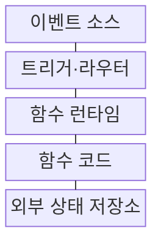
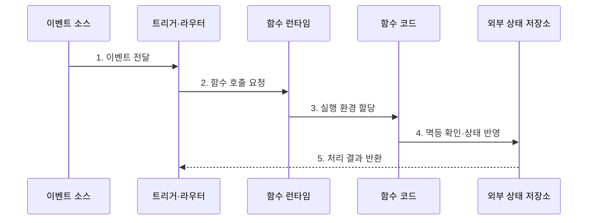

---
sidebar:
  order: 161
  label: "161. 서비스형 함수 (Function as a Service, FaaS)"
  badge:
    text: "기출 · 30%"
    variant: note
title: "서비스형 함수 (Function as a Service, FaaS)"
date: "2026-07-27T23:59:59+09:00"
tags:
  - "notes-latest-tech"
weight: 161
extra:
  question_no: "161"
  source_status: "기출"
  source_history: "122회"
  priority: 30
  priority_note: "FaaS의 서버리스 실행 모델과 설계 쟁점"
---

## 미리 알고가기

- **서버리스 컴퓨팅**: 서버가 없는 것이 아니라 인프라 준비·확장·회수를 공급자가 담당하는 운영 모델
- **트리거(Trigger)**: HTTP 요청, 메시지, 파일 생성 등 함수 실행을 시작하는 이벤트 규칙
- **멱등성(Idempotency)**: 같은 이벤트를 반복 처리해도 최종 상태가 한 번 처리한 것과 같게 유지되는 성질

## Ⅰ. 개요

- 정의/개념: 이벤트에 따라 **함수 단위 코드**를 격리 환경에서 실행하고 자동 확장하는 클라우드 서비스
- 배경/필요성: 간헐적 작업을 위한 상시 서버의 **유휴 비용·배포·확장 관리 부담** 해소

### 쉽게 이해하기 (학습용)

- 주문이 들어온 순간에만 작업대가 열리고 처리가 끝나면 다시 닫히는 방식이다.

## Ⅱ. 특징

- 이벤트 기반 **실행 환경 자동 할당·확장**
- 실행 간 로컬 상태를 보장하지 않는 **무상태 처리**
- 콜드 스타트와 재시도에 따른 **지연·중복 처리**

### 쉽게 이해하기 (학습용)

- 필요할 때만 실행되므로 효율적이지만 첫 실행 준비 시간과 중복 이벤트를 설계해야 한다.

## Ⅲ. 구조 및 구성요소

| 구성요소 | 책임 |
|:---|:---|
| 이벤트 소스 | 요청·메시지·스케줄 이벤트 생성 |
| 트리거·라우터 | 이벤트 조건 평가와 대상 함수 연결 |
| 함수 런타임 | 격리 환경 준비·확장·회수 |
| 함수 코드 | 단일 책임의 업무 로직 수행 |
| 외부 상태 저장소 | 영속 상태·멱등 키·결과 저장 |

> 요약: 이벤트를 함수 실행으로 연결하고 상태는 외부에 저장한다

### 쉽게 이해하기 (학습용)

- 접수 창구가 주문을 알맞은 작업대에 보내고 결과와 처리 기록은 별도 장부에 남긴다.

## Ⅳ. 흐름도

### 동작 원리

1. **이벤트 전달**: HTTP·메시지·스케줄 이벤트 수신
2. **함수 호출 요청**: 조건과 대상 함수 및 동시성 정책 확인
3. **실행 환경 할당**: 기존 환경 재사용 또는 새 환경 기동
4. **멱등 확인·상태 반영**: 중복 키 검사 후 업무 결과 저장
5. **처리 결과 반환**: 성공·실패에 따라 응답·재시도·격리 처리

> 요약: 이벤트를 받아 환경을 준비하고 멱등하게 처리한 뒤 결과를 반환한다

### 쉽게 이해하기 (학습용)

- 같은 주문이 다시 와도 주문 번호를 확인해 한 번만 반영하고 실패하면 정해진 규칙으로 재처리한다.

## Ⅴ. 종류 및 비교

| 실행 모델 | FaaS | 서버리스 컨테이너 | 상시 실행 서비스 |
|:---|:---|:---|:---|
| 적용 기준 | 짧고 독립적인 이벤트 작업 | 컨테이너 단위 요청·작업 | 지속 연결·장기 실행 |
| 핵심 특징 | 함수 단위 자동 확장·종량 과금 | 이미지 단위 배포·자동 확장 | 상시 프로세스와 자원 제어 |
| 한계 | 시간·런타임·상태 제약 | 이미지 관리와 기동 비용 | 유휴 비용과 운영 부담 |

> 요약: 실행 수명과 배포 단위 및 상태 요구로 모델을 선택한다

### 쉽게 이해하기 (학습용)

- 짧은 일은 함수, 묶음 작업은 컨테이너, 계속 켜 둘 업무는 상시 서비스가 적합하다.

## Ⅵ. 실무 고려사항 및 대책

| 고려사항 | 대책 | 효과 |
|:---|:---|:---|
| 콜드 스타트로 인한 응답 지연 | 사전 준비 인스턴스·경량 의존성 적용 | 꼬리 지연 감소 |
| 재시도에 따른 중복 처리 | **멱등 키·조건부 쓰기** 적용 | 이중 결제·중복 반영 방지 |
| 동시성 급증으로 후단 과부하 | 동시성 한도·큐·DLQ 구성 | 장애 전파와 이벤트 유실 억제 |

### 쉽게 이해하기 (학습용)

- 결제 함수는 주문 번호를 멱등 키로 저장하고 동시 실행 수를 제한해 데이터베이스를 보호한다.

## Ⅶ. 결론

- 간헐적 이벤트 작업의 운영 부담을 줄이기 위해 **실행 시간·콜드 스타트·멱등성·동시성·외부 상태**를 검토하고, 짧고 독립적인 작업에 FaaS를 적용한다.

### 쉽게 이해하기 (학습용)

- 함수 작성뿐 아니라 중복 이벤트와 순간 폭주 및 상태 저장까지 함께 설계해야 안정적으로 쓸 수 있다.
