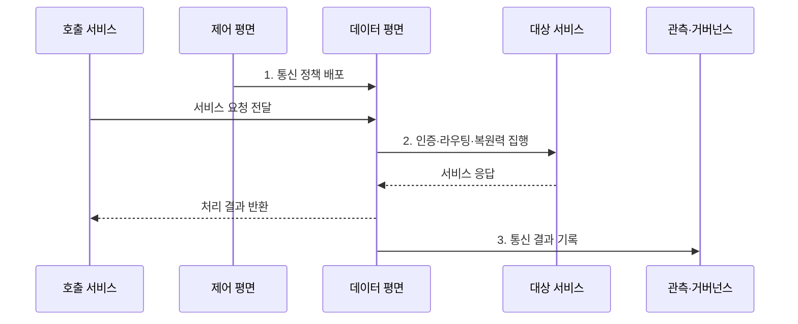

---
sidebar:
  order: 162
  label: "162. 서비스 메시 (Service Mesh)"
  badge:
    text: "기출 · 70%"
    variant: note
title: "서비스 메시 (Service Mesh)"
date: "2026-07-31T08:55:11+09:00"
tags:
  - "notes-latest-tech"
weight: 162
extra:
  question_no: "162"
  source_status: "기출"
  source_history: "123회, 138회"
  priority: 70
  priority_note: "서비스 메시 구조와 통신 통제가 최근 출제됨"
---

## Ⅰ. 개요

핵심 용어

- **서비스 메시(Service Mesh)**: 애플리케이션 밖의 데이터 평면에서 서비스 간 통신 정책을 일관되게 집행하는 인프라 계층이다.
- **동서 트래픽(East-West Traffic)**: 내부 서비스 사이를 오가는 호출 트래픽이다.

- 정의/개념: **서비스 메시(Service Mesh)** 는 애플리케이션 밖의 데이터 평면에서 서비스 간 보안·라우팅·복원력·관측 정책을 일관되게 집행하는 통신 인프라 계층
- 배경/필요성: 서비스별 통신 구현에서 발생하는 **언어 종속·정책 불일치·변경 부담** 완화

#### 한줄 요약

- 모든 서비스가 각자 교통 규칙을 구현하는 대신 공용 교통망이 경로와 보안 및 기록을 맡는다.

## Ⅱ. 특징

핵심 용어

- **데이터 평면(Data Plane)**: 서비스 요청을 중계하며 라우팅·보안·관측 정책을 실제 집행하는 계층이다.
- **제어 평면(Control Plane)**: 서비스 정보와 정책을 데이터 평면에 배포하는 관리 계층이다.

- 제어 평면의 정책 배포와 **데이터 평면의 분산 집행**
- 서비스 간 **상호 전송 계층 보안(mutual Transport Layer Security, mTLS)·인가·트래픽 제어·관측**
- 업무 로직과 통신 정책 분리, 대신 **지연·자원·운영 복잡성 증가**

#### 한줄 요약

- 통신 기능을 공통화할 수 있지만 프록시와 정책 계층 자체도 운영 대상이 된다.

## Ⅲ. 구조 및 구성요소

핵심 용어

- **서비스 레지스트리**: 서비스 인스턴스와 접속 가능한 엔드포인트 정보를 제공하는 저장소이다.
- **거버넌스**: 통신 정책의 승인·변경·감사 이력을 관리하는 운영 체계이다.

| 구성요소 | 책임 |
|:---|:---|
| **서비스 레지스트리** | 서비스·인스턴스·엔드포인트 정보 제공 |
| **제어 평면** | 라우팅·보안·복원력 정책 계산·배포 |
| **데이터 평면** | 요청 중계와 정책 집행 |
| **서비스 워크로드** | 업무 로직 수행과 요청 생성·응답 |
| **관측·거버넌스** | 지표·로그·추적 수집과 정책 이력 관리 |

#### 한줄 요약

- 관제소가 규칙을 내려주면 각 현장 프록시가 실제 요청을 검사하고 경로를 선택한다.

## Ⅳ. 흐름도

핵심 용어

- **상호 전송 계층 보안(mutual Transport Layer Security, mTLS)**: 통신 양쪽이 인증서를 검증하고 전송 구간을 암호화하는 방식이다.
- **복원력 정책**: 시간 제한·재시도·회로 차단으로 일시 장애의 영향을 통제하는 통신 규칙이다.

1. **통신 정책 배포**: 라우팅·**상호 전송 계층 보안(mutual Transport Layer Security, mTLS)·인가·재시도 규칙** 전달
2. **인증·라우팅·복원력 집행**: 신원 검증 후 경로·시간 제한·재시도 적용
3. **통신 결과 기록**: 지연·오류·추적 정보를 관측 계층에 전송

#### 한줄 요약

- 목적지 정보와 교통 규칙을 받은 프록시가 요청을 검사해 보내고 결과를 관제소에 알린다.

## Ⅴ. 종류 및 비교

핵심 용어

- **응용 프로그래밍 인터페이스 게이트웨이**: 외부에서 들어오는 남북 트래픽의 인증·라우팅·요율 제한을 중앙에서 집행하는 경계이다.
- **애플리케이션 라이브러리**: 업무 프로세스 안에 포함되어 서비스 호출과 복원력 기능을 실행하는 코드이다.

서비스 메시와 **응용 프로그래밍 인터페이스(Application Programming Interface, API) 게이트웨이** 는 각각 내부 동서 트래픽과 외부 남북 트래픽 정책에 중점을 둔다.

| 통신 정책 위치 | 서비스 메시 | API 게이트웨이 | 애플리케이션 라이브러리 |
|:---|:---|:---|:---|
| 적용 기준 | 내부 서비스 간 **공통 정책** | 외부 진입 **API 정책** | **소규모·단일 언어** 환경 |
| 핵심 특징 | 분산 **데이터 평면** 집행 | 중앙 경계의 **남북 트래픽** 통제 | 애플리케이션 내부 **호출 제어** |
| 한계 | **프록시 지연·운영 복잡성** | 내부 **동서 트래픽** 통제 한계 | **언어 종속·정책 불일치** |

#### 한줄 요약

- 건물 내부 복도는 메시, 정문은 게이트웨이, 개별 방의 규칙은 라이브러리에 가깝다.

## Ⅵ. 실무 고려사항 및 대책

핵심 용어

- **재시도 예산**: 추가 요청 폭증을 막도록 원본 요청 대비 허용할 재시도 횟수나 비율을 제한한 값이다.
- **점진 배포**: 새 정책을 일부 워크로드에 먼저 적용해 영향을 확인한 뒤 범위를 넓히는 방식이다.

| 문제 | 대책 | 효과 |
|:---|:---|:---|
| **재시도 중첩** 에 따른 요청 폭증 | 계층별 **재시도 책임·예산** 단일화 | **재시도 폭풍** 방지 |
| **프록시 지연·자원 소비** | **서비스 수준 목표(Service Level Objective, SLO)** 기반 샘플링·자원 한도·부하 시험 | **도입 비용** 정량화 |
| 잘못된 **전역 정책** 의 장애 확산 | **점진 배포·정책 검증**·즉시 롤백 | **영향 범위** 제한 |

#### 한줄 요약

- 결제 호출에는 한 계층만 재시도하게 하고 정책을 일부 워크로드부터 적용해 장애 확산을 막는다.

## Ⅶ. 결론

핵심 용어

- **정책 일관성**: 언어와 서비스 구현이 달라도 같은 통신 규칙이 동일하게 집행되는 성질이다.
- **프록시 오버헤드**: 요청 중계로 추가되는 지연·중앙처리장치·메모리·운영 비용이다.

- 공통 **상호 전송 계층 보안(mutual Transport Layer Security, mTLS)·트래픽 정책** 이익이 프록시 지연·운영 복잡성보다 클 때 서비스 메시 도입

#### 한줄 요약

- 공통 교통 규칙의 이점뿐 아니라 프록시 비용과 정책 장애의 운영 책임까지 함께 계산해야 한다.
