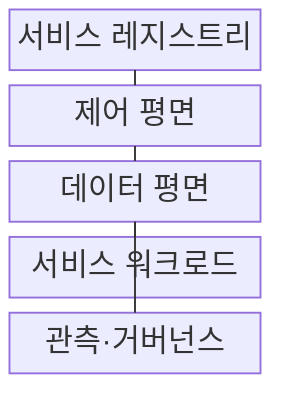
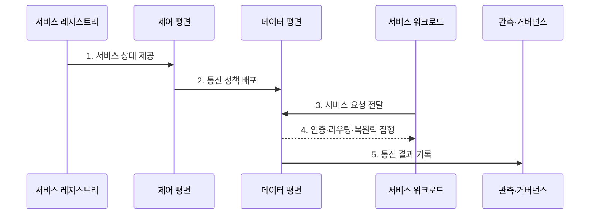

---
sidebar:
  order: 162
  label: "162. 서비스 메시 (Service Mesh)"
  badge:
    text: "기출 · 70%"
    variant: note
title: "서비스 메시 (Service Mesh)"
date: "2026-07-27T23:59:59+09:00"
tags:
  - "notes-latest-tech"
weight: 162
extra:
  question_no: "162"
  source_status: "기출"
  source_history: "123회, 138회"
  priority: 70
  priority_note: "서비스 메시 구조와 통신 통제가 최근 출제됨"
---

## 미리 알고가기

- **동서 트래픽(East-West Traffic)**: 내부 서비스 사이를 오가는 호출 트래픽
- **데이터 평면(Data Plane)**: 서비스 요청을 중계하며 라우팅·보안·관측 정책을 실제 집행하는 계층
- **제어 평면(Control Plane)**: 서비스 정보와 정책을 데이터 평면에 배포하는 관리 계층

## Ⅰ. 개요

- 정의/개념: 애플리케이션 밖의 **데이터 평면**에서 서비스 간 통신 정책을 일관되게 집행하는 인프라 계층
- 배경/필요성: 서비스별 통신 구현에서 발생하는 **언어 종속·정책 불일치·변경 부담** 완화

### 쉽게 이해하기 (학습용)

- 모든 서비스가 각자 교통 규칙을 구현하는 대신 공용 교통망이 경로와 보안 및 기록을 맡는다.

## Ⅱ. 특징

- 제어 평면의 정책 배포와 **데이터 평면의 분산 집행**
- 서비스 간 **mTLS·인가·트래픽 제어·관측**
- 업무 로직과 통신 정책 분리, 대신 **지연·자원·운영 복잡성 증가**

### 쉽게 이해하기 (학습용)

- 통신 기능을 공통화할 수 있지만 프록시와 정책 계층 자체도 운영 대상이 된다.

## Ⅲ. 구조 및 구성요소

| 구성요소 | 책임 |
|:---|:---|
| 서비스 레지스트리 | 서비스·인스턴스·엔드포인트 정보 제공 |
| 제어 평면 | 라우팅·보안·복원력 정책 계산·배포 |
| 데이터 평면 | 요청 중계와 정책 집행 |
| 서비스 워크로드 | 업무 로직 수행과 요청 생성·응답 |
| 관측·거버넌스 | 지표·로그·추적 수집과 정책 이력 관리 |

> 요약: 제어 평면이 계산한 통신 정책을 분산 데이터 평면이 집행한다

### 쉽게 이해하기 (학습용)

- 관제소가 규칙을 내려주면 각 현장 프록시가 실제 요청을 검사하고 경로를 선택한다.

## Ⅳ. 흐름도

### 동작 원리

1. **서비스 상태 제공**: 엔드포인트와 상태 변화 수집
2. **통신 정책 배포**: 라우팅·mTLS·인가·재시도 규칙 전달
3. **서비스 요청 전달**: 워크로드의 인바운드·아웃바운드 요청 포착
4. **인증·라우팅·복원력 집행**: 신원 검증 후 경로·시간 제한·재시도 적용
5. **통신 결과 기록**: 지연·오류·추적 정보를 관측 계층에 전송

> 요약: 상태와 정책을 배포하고 요청 경로에서 집행 결과를 관측한다

### 쉽게 이해하기 (학습용)

- 목적지 정보와 교통 규칙을 받은 프록시가 요청을 검사해 보내고 결과를 관제소에 알린다.

## Ⅴ. 종류 및 비교

| 통신 정책 위치 | 서비스 메시 | API 게이트웨이 | 애플리케이션 라이브러리 |
|:---|:---|:---|:---|
| 적용 기준 | 내부 서비스 간 공통 정책 | 외부 진입 API 정책 | 소규모·단일 언어 환경 |
| 핵심 특징 | 분산 데이터 평면 집행 | 중앙 경계에서 남북 트래픽 통제 | 애플리케이션 내부 호출 제어 |
| 한계 | 프록시 지연·자원·운영 복잡성 | 내부 동서 트래픽 통제 한계 | 언어 종속과 정책 불일치 |

> 요약: 내부 통신은 메시, 외부 진입은 게이트웨이, 단순 환경은 라이브러리를 검토한다

### 쉽게 이해하기 (학습용)

- 건물 내부 복도는 메시, 정문은 게이트웨이, 개별 방의 규칙은 라이브러리에 가깝다.

## Ⅵ. 실무 고려사항 및 대책

| 고려사항 | 대책 | 효과 |
|:---|:---|:---|
| 재시도 중첩에 따른 요청 폭증 | 계층별 재시도 책임·예산 단일화 | 재시도 폭풍 방지 |
| 프록시 추가 지연과 자원 소비 | SLO 기반 샘플링·자원 한도·부하 시험 | 도입 비용 정량화 |
| 잘못된 전역 정책의 장애 확산 | 점진 배포·정책 검증·즉시 롤백 | 영향 범위 제한 |

### 쉽게 이해하기 (학습용)

- 결제 호출에는 한 계층만 재시도하게 하고 정책을 일부 워크로드부터 적용해 장애 확산을 막는다.

## Ⅶ. 결론

- 서비스 간 통신을 일관되게 통제하기 위해 **정책 책임·데이터 평면 배치·mTLS·재시도·관측 비용**을 검토하고, 공통 정책 이익이 추가 복잡성보다 클 때 서비스 메시를 도입한다.

### 쉽게 이해하기 (학습용)

- 공통 교통 규칙의 이점뿐 아니라 프록시 비용과 정책 장애의 운영 책임까지 함께 계산해야 한다.
