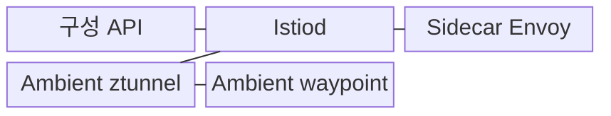
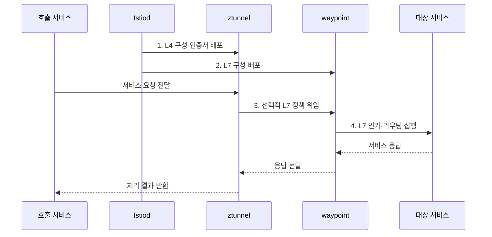

---
sidebar:
  order: 163
  label: "163. 이스티오 (Istio)"
  badge:
    text: "기출 · 50%"
    variant: note
title: "이스티오 (Istio)"
date: "2026-07-31T12:02:33+09:00"
tags:
  - "notes-latest-tech"
weight: 163
extra:
  question_no: "163"
  source_status: "기출"
  source_history: "138회"
  priority: 50
  priority_note: "Istio 제어·데이터 평면 구조가 출제됨"
---

## 미리 알고가기

- **Istio**: Kubernetes 환경에서 트래픽·보안·관측 정책을 제공하는 서비스 메시 구현체
- **Istiod**: 서비스 발견, 정책 계산, 인증서 발급, 데이터 평면 구성 배포를 담당하는 제어 평면
- **Ambient Mesh**: Pod별 사이드카 없이 ztunnel과 선택적 waypoint로 메시 기능을 제공하는 데이터 평면 방식

## Ⅰ. 개요

- 정의/개념: **Istiod 제어 평면**과 Sidecar 또는 Ambient 데이터 평면으로 통신 정책을 집행하는 서비스 메시
- 배경/필요성: 마이크로서비스별 **보안·라우팅·관측 구현 중복과 정책 불일치** 완화

### 쉽게 이해하기 (학습용)

- Istio는 서비스 메시의 교통 규칙을 계산하고 현장 프록시가 이를 실행하게 하는 구현체다.

## Ⅱ. 특징

- Istiod의 **xDS 구성·인증서 배포**
- Sidecar와 Ambient의 **데이터 평면 선택**
- mTLS·L4/L7 라우팅·복원력·관측의 **정책 기반 집행**

### 쉽게 이해하기 (학습용)

- 워크로드마다 프록시를 붙이거나 노드 공유 터널을 쓰고 필요한 구간에 L7 검사를 더할 수 있다.

## Ⅲ. 구조 및 구성요소

| 구성요소 | 책임 |
|:---|:---|
| **구성 API** | 라우팅·보안·텔레메트리 의도 선언 |
| **Istiod** | 구성 변환·xDS 배포·인증서 발급 |
| **Sidecar Envoy** | Pod별 L4·L7 정책 집행 |
| **Ambient ztunnel** | 노드 공유 L4 보안 터널 제공 |
| **Ambient waypoint** | 선택 범위의 L7 정책 집행 |

### 쉽게 이해하기 (학습용)

- 중앙 제어기가 규칙과 신분증을 배포하면 Sidecar 또는 ztunnel·waypoint가 현장에서 검사한다.

## Ⅳ. 흐름도

1. **L4 구성·인증서 배포**: Istiod가 xDS 구성과 워크로드 인증서 전달
2. **L7 구성 배포**: waypoint에 HTTP 인가·라우팅 정책 전달
3. **선택적 L7 정책 위임**: HTTP 검사가 필요한 트래픽만 waypoint 경유
4. **L7 인가·라우팅 집행**: 신원 검증 후 대상 서비스로 요청 전달

### 쉽게 이해하기 (학습용)

- 기본 보안 검사는 공용 터널이 하고 HTTP 내용 검사가 필요한 요청만 별도 검사소로 보낸다.

## Ⅴ. 종류 및 비교

| Istio 데이터 평면 | Sidecar 모드 | Ambient ztunnel | Ambient ztunnel+waypoint |
|:---|:---|:---|:---|
| 적용 기준 | 워크로드별 **L4·L7 격리** | 저비용 **L4 보안 기본망** | 선택 범위의 **L7 정책** |
| 핵심 특징 | Pod별 **Envoy 정책** 집행 | 노드 공유 **mTLS·L4 터널** | waypoint의 **HTTP 인가·라우팅** |
| 한계 | Pod별 **자원·기동·운영 비용** | **L7 정책** 미지원 | **waypoint 경로·용량** 운영 추가 |

### 쉽게 이해하기 (학습용)

- 개별 검사소가 필요하면 Sidecar, 공용 기본 보안은 ztunnel, 선택적 정밀 검사는 waypoint가 맞다.

## Ⅵ. 실무 고려사항 및 대책

| 고려사항 | 대책 | 효과 |
|:---|:---|:---|
| **Sidecar·Ambient 기능 차이** | 정책별 **L4/L7 집행 위치** 표 작성 | **마이그레이션 누락** 방지 |
| **waypoint 과부하·미경유** | 범위별 **용량 산정·경로 검증** | **L7 병목·인가 누락** 방지 |
| 잘못된 **xDS 구성 전파** | **분석 도구·카나리·롤백** 절차 적용 | **메시 전체 장애** 억제 |

### 쉽게 이해하기 (학습용)

- Sidecar에서 Ambient로 옮길 때 각 정책을 ztunnel과 waypoint 중 어디서 실행할지 먼저 확인한다.

## Ⅶ. 결론

- 워크로드별 격리는 Sidecar, L4 기본망은 **ztunnel**, 선택 L7은 **waypoint** 적용

### 쉽게 이해하기 (학습용)

- 제품 이름보다 어떤 요청을 어느 프록시가 검사하는지와 실패 시 영향 범위를 명확히 해야 한다.
