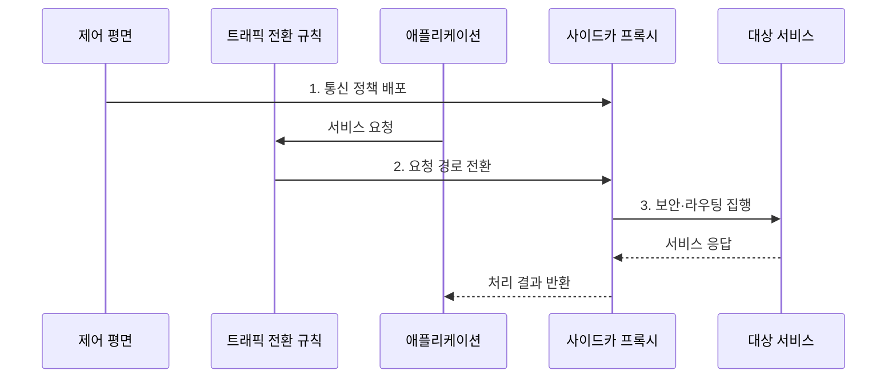

---
sidebar:
  order: 164
  label: "164. 사이드카 프록시 (Sidecar Proxy)"
  badge:
    text: "기출 · 50%"
    variant: note
title: "사이드카 프록시 (Sidecar Proxy)"
date: "2026-07-31T08:56:16+09:00"
tags:
  - "notes-latest-tech"
weight: 164
extra:
  question_no: "164"
  source_status: "기출"
  source_history: "138회"
  priority: 50
  priority_note: "사이드카 프록시의 경로와 자원 비용이 출제됨"
---

## Ⅰ. 개요

핵심 용어

- **사이드카 프록시(Sidecar Proxy)**: 애플리케이션과 같은 배포 단위에서 인바운드·아웃바운드 통신 정책을 대신 집행하는 보조 프록시이다.
- **사이드카 패턴**: 주 애플리케이션과 수명 주기·배포 경계를 공유하는 보조 프로세스로 공통 기능을 분리하는 패턴이다.

- 정의/개념: 애플리케이션과 같은 배포 단위에서 **인바운드·아웃바운드 통신 정책**을 대신 집행하는 보조 프록시
- 배경/필요성: 언어별 통신 라이브러리의 **중복 구현·정책 불일치·업무 코드 결합** 해소

### 쉽게 이해하기 (학습용)

- 애플리케이션 옆에 통신 비서를 두어 라우팅과 보안 및 기록을 맡기는 방식이다.

## Ⅱ. 특징

핵심 용어

- **데이터 평면**: 실제 서비스 요청을 중계하면서 라우팅·보안·관측 정책을 집행하는 계층이다.
- **워크로드 격리**: 각 애플리케이션에 별도 프록시를 배치해 정책·자원·장애 영향을 분리하는 특성이다.

- 애플리케이션과 네트워크를 공유하되 **별도 프로세스로 실행**
- 제어 평면의 구성을 받아 **데이터 평면 정책 집행**
- 워크로드별 격리와 일관성 확보, 대신 **자원·기동·장애 경로 증가**

### 쉽게 이해하기 (학습용)

- 전용 비서라 세밀한 통제가 가능하지만 서비스 수만큼 비서의 비용과 장애 지점도 늘어난다.

## Ⅲ. 구조 및 구성요소

핵심 용어

- **트래픽 인터셉션**: 네트워크 규칙을 사용해 인바운드·아웃바운드 요청을 프록시 경로로 전환하는 방식이다.
- **관측 파이프라인**: 프록시에서 생성한 지표·로그·추적을 수집·전송·저장하는 처리 경로이다.

| 구성요소 | 책임 |
|:---|:---|
| **제어 평면** | 경로·보안·복원력 정책 배포 |
| **트래픽 전환 규칙** | 인바운드·아웃바운드 요청 포착 |
| **사이드카 프록시** | 요청 중계와 통신 정책 집행 |
| **애플리케이션** | 업무 로직 수행과 요청 생성 |
| **관측 파이프라인** | 지표·로그·추적 수집 |

### 쉽게 이해하기 (학습용)

- 애플리케이션의 모든 통신이 옆 프록시를 거치며 규칙을 적용받고 기록된다.

## Ⅳ. 흐름도

핵심 용어

- **상호 TLS(mutual TLS, mTLS)**: 통신 양쪽이 인증서를 검증하고 전송 구간을 암호화하는 방식이다.
- **시간 제한(Timeout)**: 호출이 정한 시간 안에 끝나지 않으면 실패로 중단하는 복원력 정책이다.

1. **통신 정책 배포**: 제어 평면이 경로·인증·재시도 구성 전달
2. **요청 경로 전환**: 네트워크 규칙이 트래픽을 프록시로 포착
3. **보안·라우팅 집행**: 신원·인가를 확인하고 목적지·시간 제한 적용

### 쉽게 이해하기 (학습용)

- 비서가 규칙표를 받은 뒤 모든 외부 통신을 확인해 보내고 처리 결과를 기록한다.

## Ⅴ. 종류 및 비교

핵심 용어

- **노드 공유 프록시**: 한 노드의 여러 워크로드가 공통으로 사용하는 통신 프록시이다.
- **애플리케이션 라이브러리**: 업무 프로세스 안에 포함되어 호출 제어와 보안 기능을 실행하는 코드이다.

| 통신 기능 배치 | 사이드카 프록시 | 노드 공유 프록시 | 애플리케이션 라이브러리 |
|:---|:---|:---|:---|
| 적용 기준 | 워크로드별 **세밀한 격리** | 노드 단위 **자원 절감** | **단순·단일 언어** 환경 |
| 핵심 특징 | Pod별 **독립 프록시** | 여러 워크로드의 **프록시 공유** | 업무 프로세스 내부 **호출 제어** |
| 한계 | **자원·기동·장애 경로** 증가 | **공유 장애·격리 제약** | **언어 결합·일관성 부담** |

### 쉽게 이해하기 (학습용)

- 전담 비서, 층별 공용 비서, 직접 처리 중 어느 방식이 필요한 통제와 비용에 맞는지 고른다.

## Ⅵ. 실무 고려사항 및 대책

핵심 용어

- **readiness**: 프록시가 요청을 안전하게 중계할 준비가 되었는지 나타내는 상태 조건이다.
- **책임 단일화**: 재시도·시간 제한 같은 정책을 애플리케이션과 프록시 중 한 계층만 맡게 하는 설계이다.

| 문제 | 대책 | 효과 |
|:---|:---|:---|
| **프록시 준비 전 요청 유입** | 시작·준비·종료 순서와 **readiness 연동** | **초기 연결 실패** 방지 |
| **재시도·시간 제한 중복** | 애플리케이션과 프록시의 **책임 단일화** | **요청 증폭·긴 대기** 방지 |
| **사이드카 자원 부족** | 워크로드별 **CPU·메모리·연결 수** 산정 | **지연 증가·OOM** 완화 |

### 쉽게 이해하기 (학습용)

- 프록시가 준비된 뒤 애플리케이션 트래픽을 열고 재시도는 한쪽에서만 책임지게 한다.

## Ⅶ. 결론

핵심 용어

- **장애 경로**: 요청 처리 과정에서 실패하거나 지연될 수 있는 추가 구성요소와 연결 단계이다.
- **자원 오버헤드**: 워크로드마다 프록시를 추가하며 발생하는 CPU·메모리·연결 비용이다.

- **워크로드별 격리** 이익이 **프록시 자원·장애 경로** 비용보다 클 때 사이드카 적용

### 쉽게 이해하기 (학습용)

- 공통 기능 분리의 이점과 워크로드마다 추가되는 프록시 비용 및 장애 지점을 함께 판단해야 한다.
