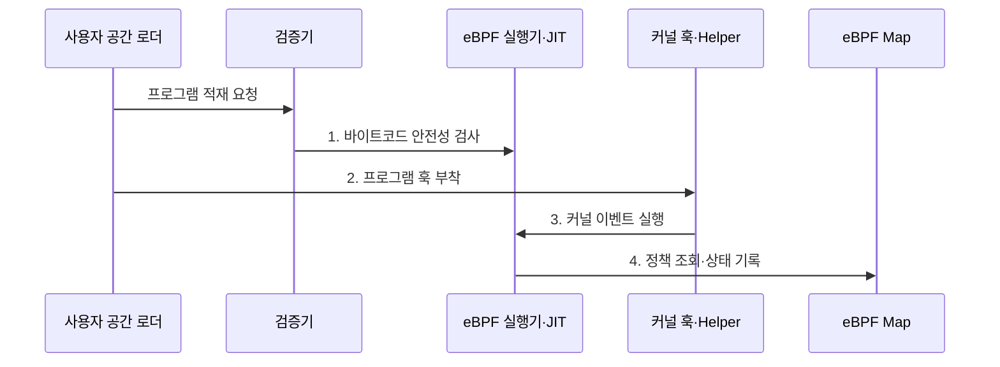

---
sidebar:
  order: 165
  label: "165. eBPF (Extended Berkeley Packet Filter)"
  badge:
    text: "미출 · 50%"
    variant: note
title: "eBPF (Extended Berkeley Packet Filter)"
date: "2026-07-31T08:56:51+09:00"
tags:
  - "notes-latest-tech"
weight: 165
extra:
  question_no: "165"
  source_status: "미출"
  source_history: ""
  priority: 50
  priority_note: "eBPF 검증·훅·맵 기반 구조가 유력"
---

## 미리 알고가기

- **커널 훅(Kernel Hook)**: 네트워크·시스템 호출·추적 등 커널 실행 경로에서 프로그램을 연결하는 지점
- **검증기(Verifier)**: eBPF 바이트코드의 종료 가능성과 메모리·포인터 안전성을 적재 전에 검사하는 커널 구성요소
- **eBPF 맵(Map)**: eBPF 프로그램과 사용자 공간이 상태와 통계를 공유하는 키-값 자료구조

## Ⅰ. 개요

- 정의/개념: 검증된 프로그램을 커널 훅에 동적으로 부착해 **네트워크·보안·관측 기능**을 확장하는 실행 기술
- 배경/필요성: 커널 모듈의 **배포·장애 복구·커널 안정성 위험**을 낮추면서 커널 경로를 확장

### 쉽게 이해하기 (학습용)

- 커널을 다시 만들지 않고 안전 검사를 통과한 작은 프로그램을 필요한 사건 지점에 연결한다.

## Ⅱ. 특징

- **사전 안전성**: 적재 전 제어 흐름·메모리·포인터 안전성을 검증해 커널 실행 위험 제한
- **고속 실행성**: 인터프리터 또는 JIT 네이티브 실행으로 커널 사건을 낮은 부하로 처리
- **제한 확장성**: 훅·프로그램 유형별 Helper 함수와 문맥을 제한하고 Map으로 커널·사용자 공간 상태 공유

### 쉽게 이해하기 (학습용)

- 아무 코드나 실행하는 것이 아니라 정해진 입구와 기능 안에서 검증된 코드만 빠르게 실행한다.

## Ⅲ. 구조 및 구성요소

| 구성요소 | 책임 |
|:---|:---|
| 사용자 공간 로더 | 프로그램 적재·부착·수명 주기 관리 |
| 검증기 | 종료·메모리·포인터·권한 안전성 검사 |
| eBPF 실행기·JIT | 검증된 바이트코드 해석·기계어 실행 |
| 커널 훅·Helper | 실행 문맥 제공과 허용 커널 기능 호출 |
| eBPF Map | 정책·상태·통계의 공유·영속 |

### 쉽게 이해하기 (학습용)

- 관리자가 코드를 제출하면 검사소를 거쳐 지정된 커널 지점에 붙고 결과는 공용 장부에 남는다.

## Ⅳ. 흐름도

1. **바이트코드 안전성 검사**: 검증기가 종료·메모리·포인터 규칙 검사
2. **프로그램 훅 부착**: 네트워크·추적·보안 등 지정 지점에 연결
3. **커널 이벤트 실행**: 이벤트 발생 시 문맥과 Helper 제한 안에서 실행
4. **정책 조회·상태 기록**: Map에서 정책을 읽고 결과·통계를 갱신

### 쉽게 이해하기 (학습용)

- 설치할 때 한 번 안전 검사를 하고 사건이 생길 때마다 연결된 코드를 실행해 결과를 장부에 쓴다.

## Ⅴ. 종류 및 비교

| 커널 기능 확장 방식 | eBPF | 커널 모듈 | 사용자 공간 에이전트 |
|:---|:---|:---|:---|
| 적용 기준 | 빠른 **동적 정책·관측** | 깊은 **커널 기능 변경** | 강한 **격리·개발 편의** |
| 핵심 특징 | 검증 후 **커널 훅**에서 실행 | **커널 코드**로 직접 적재 | 프로세스에서 **시스템 API** 사용 |
| 한계 | **검증·훅·Helper·권한** 제약 | 결함의 **커널 전체 영향** | **문맥 전환·데이터 복사** 비용 |

### 쉽게 이해하기 (학습용)

- eBPF는 검증된 현장 작업자, 커널 모듈은 내부 구조 변경, 에이전트는 외부 관찰자에 가깝다.

## Ⅵ. 실무 고려사항 및 대책

| 고려사항 | 대책 | 효과 |
|:---|:---|:---|
| 커널 버전별 **타입·기능 차이** | **CO-RE·BTF·기능 탐지** 적용 | **이식성·배포 성공률** 향상 |
| 고빈도 훅의 **실행 오버헤드** | **명령·Map 접근 최소화**와 벤치마크 | **커널 경로 지연** 억제 |
| **적재 권한 탈취·정책 변조** | **최소 권한·서명·핀 객체** 접근 통제 | **커널 공격 표면** 축소 |

### 쉽게 이해하기 (학습용)

- Cilium 정책 프로그램은 대상 커널 기능을 먼저 확인하고 패킷당 처리량과 Map 경합을 부하 시험한다.

## Ⅶ. 결론

- **검증기·커널 호환성**을 통과하고 **훅·Map 권한**을 제한한 eBPF만 배포

### 쉽게 이해하기 (학습용)

- 검증 통과만으로 끝내지 않고 누가 어느 훅에 붙이며 Map과 프로그램을 어떻게 회수할지까지 관리해야 한다.
