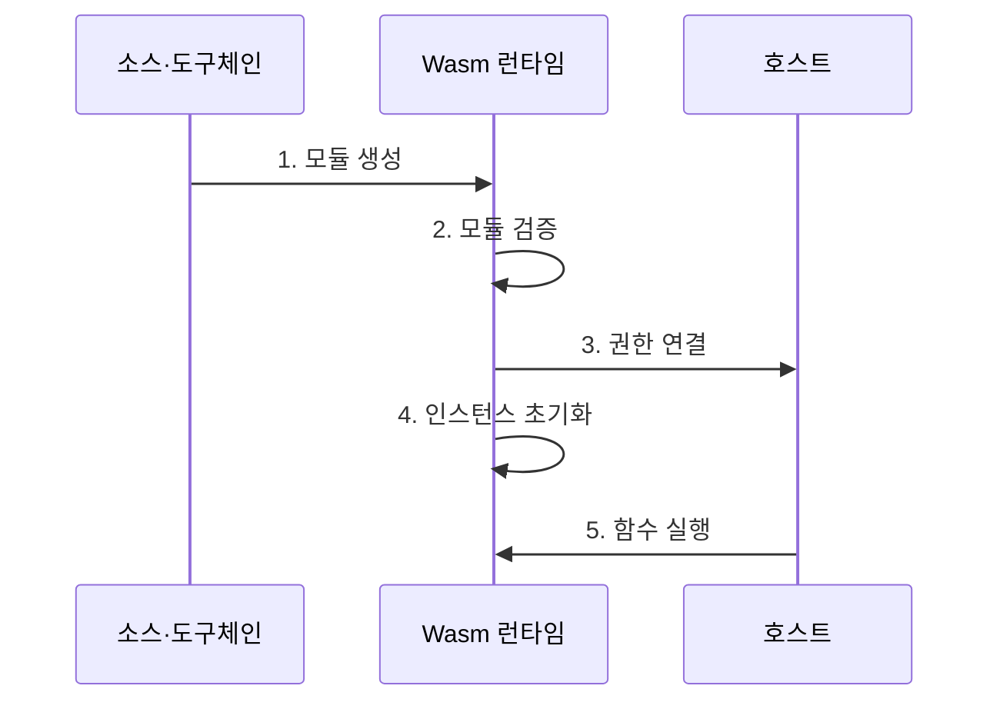

---
sidebar:
  order: 166
  label: "166. WebAssembly (WebAssembly)"
  badge:
    text: "미출 · 60%"
    variant: note
title: "WebAssembly (WebAssembly)"
date: "2026-07-30T11:10:21+09:00"
tags:
  - "notes-latest-tech"
weight: 166
extra:
  question_no: "166"
  source_status: "미출"
  source_history: ""
  priority: 60
  priority_note: "WebAssembly 샌드박스·이식성 비교가 유력"
---

## 미리 알고 가기

- **WebAssembly(Wasm)**: 여러 언어로 작성한 프로그램을 이식 가능한 바이트코드 모듈로 변환해 실행하는 기술
- **런타임(runtime)**: Wasm 모듈을 검증하고 인스턴스화해 명령을 실행하는 환경
- **선형 메모리(linear memory)**: Wasm 인스턴스가 정수 주소로 접근하는 연속된 격리 메모리 공간
- **트랩(trap)**: 범위를 벗어난 메모리 접근처럼 실행 규칙을 위반했을 때 해당 실행을 중단하는 예외
- **가져오기·내보내기(import·export)**: 호스트가 제공하는 기능과 모듈이 외부에 공개하는 기능을 연결하는 명시적 계약
- **WASI(WebAssembly System Interface)**: 파일·네트워크 등 시스템 자원에 접근하기 위한 표준화된 호스트 인터페이스
- **WIT(WebAssembly Interface Type)**: 언어와 런타임이 달라도 컴포넌트 간 함수와 자료형 계약을 표현하는 인터페이스 정의 형식

## Ⅰ. 개요

- **정의**: WebAssembly는 검증 가능한 이식형 바이트코드 모듈을 **샌드박스 런타임**에서 실행하고, 필요한 호스트 기능만 가져오기로 연결하는 실행 기술
- **필요성**: 운영체제와 CPU에 종속된 네이티브 확장은 배포 이식성과 권한 격리를 동시에 확보하기 어려우므로, **명시적 실행 경계**와 표준 인터페이스가 필요

### 쉽게 이해하기

- 다른 작업장에서도 같은 설계도로 부품을 조립하되, 관리자가 허용한 공구만 빌려 쓰게 하는 방식과 같습니다.

## Ⅱ. 특징

- **검증형 바이트코드**: 구조화된 제어 흐름과 자료형을 실행 전에 검사하여 여러 CPU와 운영체제에서 일관된 실행 모델 제공
- **선형 메모리 격리**: 모듈별 주소 공간과 경계 검사를 통해 임의의 호스트 메모리 접근 차단
- **명시적 호스트 계약**: 가져오기·내보내기와 WASI·WIT를 통해 파일, 네트워크, 함수 호출 권한을 필요한 범위로 제한

### 쉽게 이해하기

- 프로그램을 작은 독립 작업실에 넣고, 작업실 밖의 기능은 허가증이 붙은 창구로만 사용하게 합니다.

## Ⅲ. 구조 및 구성요소

| 구성요소 | 책임 |
|:---|:---|
| **Wasm 모듈** | 명령, 함수, 자료형, 가져오기·내보내기 선언 보유 |
| **검증기·컴파일러** | 모듈 형식과 자료형을 검증하고 실행 코드 준비 |
| **런타임 인스턴스** | 모듈 상태를 생성하고 함수 호출과 트랩 처리 |
| **선형 메모리** | 모듈이 사용하는 격리 주소 공간 제공 |
| **호스트 인터페이스** | 허용된 시스템 기능과 외부 함수 연결 |

### 쉽게 이해하기

- 설계도를 검사한 뒤 독립 작업실을 만들고, 작업실의 창고와 외부 공구 대여 창구를 각각 연결하는 구조입니다.

## Ⅳ. 흐름도

### 동작 원리

1. **모듈 생성**: 소스 코드와 인터페이스 정의를 Wasm 모듈로 컴파일
2. **모듈 검증**: 런타임이 형식, 자료형, 제어 흐름의 유효성 검사
3. **권한 연결**: 선언된 가져오기에 허용된 호스트 기능만 바인딩
4. **인스턴스 초기화**: 선형 메모리와 테이블 등 독립 실행 상태 생성
5. **함수 실행**: 내보낸 함수를 호출하고 위반 발생 시 트랩으로 실행 격리

## Ⅴ. 종류 및 비교

| 구분 | WebAssembly | 네이티브 프로세스 | 컨테이너 |
|:---|:---|:---|:---|
| **적용 대상** | 플러그인, 엣지 함수, 다중 언어 모듈 | 직접 시스템 접근이 필요한 고성능 프로그램 | 운영체제 사용자 공간을 포함한 애플리케이션 |
| **핵심 경계** | 런타임, 선형 메모리, 명시적 가져오기 | 운영체제 프로세스와 사용자 권한 | 프로세스 격리, 네임스페이스, 제어 그룹 |
| **주요 한계** | 호스트 인터페이스 호환성과 런타임 기능 제약 | 운영체제·CPU 종속성과 넓은 권한 범위 | 이미지 크기와 운영 복잡도 |

## Ⅵ. 실무 고려사항 및 대책

| 고려사항 | 대책 | 효과 |
|:---|:---|:---|
| **과도한 가져오기 권한** 미검증 시 파일·네트워크 접근 범위가 넓어져 샌드박스 경계 약화 | 기능 허용 목록과 디렉터리·네트워크 범위를 최소 권한으로 제한 | 파일·네트워크의 **샌드박스 이탈 범위** 축소 |
| **WASI·WIT 버전 불일치** 미검증 시 런타임과 모듈의 인터페이스 계약이 달라 실행 실패 | 계약 버전 고정, 호환성 행렬 관리, 배포 전 교차 런타임 시험 | 런타임 간 **실행 호환성** 확보 |
| **메모리 고갈·트랩** 미검증 시 비정상 모듈이 자원을 소진하거나 요청 처리 중단 | 메모리·실행 시간·연산량 한도 설정과 트랩 복구 경로 마련 | 비정상 모듈의 **자원 고갈·중단 영향** 제한 |

## Ⅶ. 결론

- WebAssembly 도입은 **이식성**, **호스트 권한 범위**, **자원 한도**를 함께 설계하여 신뢰할 수 없는 모듈의 실행 경계를 명확히 하는 것이 핵심이다.
